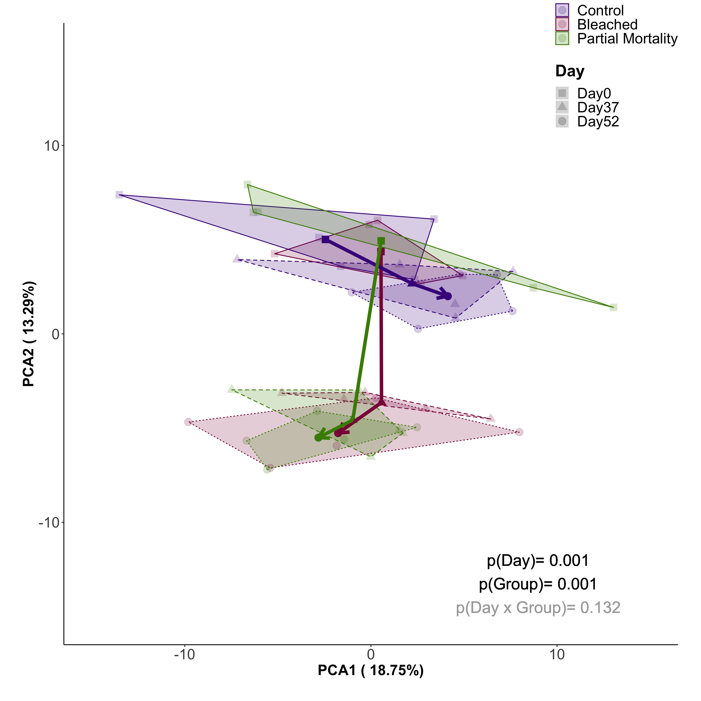

```{r setup, include=FALSE}
knitr::opts_chunk$set(echo = TRUE)
```

# Metabolomics Data Analysis for Porites Bleaching 2019 Experiment 

### Metabolite Polarity Selection 

With untargeted LC-MS, metabolites were detected under both negative and positive polarities. To prevent double counting metabolites in my analysis, I took the mean of each polarities across all samples and selected the metabolite that had the strongest ion intensity under that polarity. 

```{r Polarity Selection, echo=TRUE, warning=FALSE, message=FALSE}

#Read in required libraries
library("reshape")
#library(plyr)
library("dplyr")
library("tidyverse")
library("ggplot2")
library("arsenal")
library("Rmisc")
library(gridExtra)
library(ggpubr)
library(factoextra)
library(ropls)
library(mixOmics)
library(tidyverse)
library(ggplot2)
library(RColorBrewer)
library(lme4)
library(lmerTest)
library(car)
library(effects)
library(ggfortify)
library(cowplot)
library(vegan)
library(corrr)
library(ggcorrplot)
library(GGally)
library(broom)
library(cowplot)
library(RVAideMemoire)
library(arsenal)
library(patchwork)
library(tidyr)
library(ggrepel)
library(MetaboAnalystR)

#Import data

sample.info <- read.csv("../../data/Metabolomics/Porites-Kevin_SampleInfo.csv")
peak.pos <- read.csv("../../data/Metabolomics/Peaks_Pos.csv")
peak.neg <- read.csv("../../data/Metabolomics/Peaks_Neg.csv")
peak.unknown <- read.csv("../../data/Metabolomics/Peaks_Unknown.csv")

#Removing unncessesary columns

peak.pos2 <- peak.pos[ -c(1:9)] 
peak.pos3 <- peak.pos2[ -c(2:9)] # if we need the blanks, change the 9 to 6

peak.neg2 <- peak.neg[ -c(1:9)] 
peak.neg3 <- peak.neg2[ -c(2:9)] # if we need the blanks, change the 9 to 6

peak.unknown2 <- peak.unknown[ -c(1:9)] 
peak.unknown3 <- peak.unknown2[ -c(2:9)] # if we need the blanks, change the 9 to 6

#Removing standards

grep("PosIS", peak.pos3$compound) #5 metabolites with PosIS, need to remove
grep("NegIS", peak.neg3$compound) #9 metabolites with NegIS, need to remove

grep("(HAc+)", peak.pos3$compound) #0 metabolites with HAc+, need to rename
grep("(HAc+)", peak.neg3$compound) #3 metabolites with HAc+, need to rename

grep("(SIM)", peak.pos3$compound) #0 metabolites with SIM, need to rename
grep("(SIM)", peak.neg3$compound) #4 metabolites with SIM, need to rename


peaks_selected<- droplevels(peak.pos3)
peaks_selected<- droplevels(peak.neg3)

length(peak.pos3$compound) #109 metabolites in data set before cleaning
length(peak.neg3$compound) #130 metabolites in data set before cleaning

peaks_pos3_clean<-peak.pos3[!grepl("PosIS", peak.pos3$compound),] #remove POS
length(peaks_pos3_clean$compound) #104 metabolites in data set after cleaning POS_IS

peaks_neg3_clean<-peak.neg3[!grepl("NegIS", peak.neg3$compound),] #remove NEG
length(peaks_neg3_clean$compound) #121 metabolites in data set after cleaning NEG_IS

peaks_neg3_clean<-peaks_neg3_clean%>%
  mutate(compound = str_remove(compound, pattern=fixed(' (+HAc)')))%>% #rename any with +HAc 
  mutate(compound = as.factor(compound))
length(peaks_neg3_clean$compound) #121 metabolites in data set

peaks_neg3_clean<-peaks_neg3_clean%>%
  filter(compound != "NAD+") %>% # Removing the NAD+ without the SIM 
  mutate(compound = str_remove(compound, pattern=fixed(' (SIM)')))%>% #rename any with SIM 
  mutate(compound = as.factor(compound))
length(peaks_neg3_clean$compound) #120 metabolites in data set

#### Selecting polarity based on higher signal intensity ###

#obtain row means 
pos.mean <- data.frame(ID=peaks_pos3_clean[,1], Means=rowMeans(peaks_pos3_clean[,-1]))
neg.mean <- data.frame(ID=peaks_neg3_clean[,1], Means=rowMeans(peaks_neg3_clean[,-1]))

# Comparing polarity means of each metabolite, x = pos, y = neg 
cmp <- comparedf(pos.mean, neg.mean, by = "ID",
                 tol.factor = "labels")        # match only factor labels

n.diffs(cmp) #61 shared metabolites

list.diffs <- as.data.frame(do.call(cbind, diffs(cmp))) #creating a dataframe with shared metabolites as a list

df.diffs <- data.frame(matrix(unlist(list.diffs), nrow=n.diffs(cmp), byrow=F),stringsAsFactors=FALSE) #converting list to dataframe

names(df.diffs)[1:7] <- c("var.x", "var.y", "ID", "values.x", "values.y", "row.x", "row.y") #changing column names

i <- c(4, 5) #specifying values column
df.diffs[ , i] <- apply(df.diffs[ , i], 2,            # changing values column to numeric
                        function(x) as.numeric(as.character(x)))

df.diffs$selected.pol <-  ifelse(df.diffs$values.x > df.diffs$values.y, 'x', 
                                 ifelse(df.diffs$values.x < df.diffs$values.y, 'y', 'tie')) #selecting polarity with highest mean

x.diff.keep <- df.diffs %>% 
  filter(selected.pol == "x") #extracting x selection

y.diff.keep <- df.diffs %>%
  filter(selected.pol == "y") #extracting y selection

x.all.keep <- peaks_pos3_clean[!(peaks_pos3_clean$compound %in% y.diff.keep$ID),] #removing rows where the metabolite is higher in neg df
y.all.keep <- peaks_neg3_clean[!(peaks_neg3_clean$compound %in% x.diff.keep$ID),] #removing rows where the metabolite is higher in pos df

# Re-shaping dataset 
peak.pos4<- melt(x.all.keep, id= "compound") #melting dataset 
peak.neg4<- melt(y.all.keep, id= "compound") #melting dataset 

peak.unknown4 <- melt(peak.unknown3, id="compound")

# adding polarity 
peak.pos4$polarity <- "positive"
peak.neg4$polarity <- "negative"

peak.unknown4$polarity <- "unknown"

# Binding positive, negative, unknown datasets together
peak.all <- rbind(peak.pos4, peak.neg4, peak.unknown4) #All detected metabolites

peak.all.known <- rbind(peak.pos4, peak.neg4) #All detected metabolites that have been identified

```


### Normalization

``` {r Normalization, echo=TRUE, warning=FALSE, message=FALSE}

##### ALL METABOLITES #####
# Renaming column 
names(peak.all)[2] <- "Sample.ID"
names(peak.all)[3] <- "Raw.IonCount"

# Merging weight sample info
peak.all2 <- merge(peak.all, sample.info, by = "Sample.ID")

#Normalization by weight

peak.all2$Raw.IonCount <- as.numeric(as.character(peak.all2$Raw.IonCount))
peak.all2$Norm.IonCount <- peak.all2$Raw.IonCount / peak.all2$Weight.mg

#Selecting columns of interest
peak.all3 <- peak.all2 %>% dplyr::select(Sample.ID, compound, Fragment.ID, Time, Treatment, Norm.IonCount)

#Reformatting dataframe so compounds are listed as column headers
peak.all4 <- peak.all3 %>% spread(compound, Norm.IonCount)

#adding 1000 to all variable to account for 0 values and log normalization 
#Log normalization (https://www.intechopen.com/books/metabolomics-fundamentals-and-applications/processing-and-visualization-of-metabolomics-data-using-r)

peak.all5 <- log((peak.all4[5:ncol(peak.all4)] + 1000), 2)

norm.data.all <- cbind(peak.all4[1:4], peak.all5)

names(norm.data.all)[3] <- "Day"
names(norm.data.all)[4] <- "Group"

write.csv(norm.data.all, "../../output/Metabolomics/Norm_Data_All.csv")

##### KNOWN METABOLITES #####

# Renaming column 
names(peak.all.known)[2] <- "Sample.ID"
names(peak.all.known)[3] <- "Raw.IonCount"

# Merging weight sample info
peak.all.known2 <- merge(peak.all.known, sample.info, by = "Sample.ID")

#Normalization by weight

peak.all.known2$Raw.IonCount <- as.numeric(as.character(peak.all.known2$Raw.IonCount))
peak.all.known2$Norm.IonCount <- peak.all.known2$Raw.IonCount / peak.all.known2$Weight.mg

#Selecting columns of interest
peak.all.known3 <- peak.all.known2 %>% dplyr::select(Sample.ID, compound, Fragment.ID, Time, Treatment, Norm.IonCount)

#Reformatting dataframe so compounds are listed as column headers
peak.all.known4 <- peak.all.known3 %>% spread(compound, Norm.IonCount)

#adding 1000 to all variable to account for 0 values and log normalization 
#Log normalization (https://www.intechopen.com/books/metabolomics-fundamentals-and-applications/processing-and-visualization-of-metabolomics-data-using-r)

peak.all.known5 <- log((peak.all.known4[5:ncol(peak.all.known4)] + 1000), 2)

norm.data.known <- cbind(peak.all.known4[1:4], peak.all.known5)

names(norm.data.known)[3] <- "Day"
names(norm.data.known)[4] <- "Group"

write.csv(norm.data.known, "../../output/Metabolomics/Norm_Data_Known.csv")

```


### Grouped PCA of all detected metabolites

Code inspired by: 
- http://www.sthda.com/english/articles/31-principal-component-methods-in-r-practical-guide/118-principal-component-analysis-in-r-prcomp-vs-princomp/
- https://github.com/urol-e5/timeseries/blob/master/time_series_analysis/integration_biological.Rmd line 2465

``` {r PCA all, echo=TRUE, warning=FALSE, message=FALSE}


scaled_pca_all <-prcomp(norm.data.all[c(5:ncol(norm.data.all))], scale=TRUE, center=TRUE)
fviz_eig(scaled_pca_all)

coral_info <- norm.data.all[c(3,4)]

pca_data_all <- scaled_pca_all%>%
  augment(coral_info)%>%
  group_by(Day, Group)%>%
  mutate(PC1.mean = mean(.fittedPC1),
         PC2.mean = mean(.fittedPC2))

pca.centroids_all<- pca_data_all%>%
  dplyr::select(Day, Group, PC1.mean, PC2.mean)%>%
  dplyr::group_by(Day, Group)%>%
  dplyr::summarise(PC1.mean = mean(PC1.mean), PC2.mean = mean(PC2.mean))


#Examine PERMANOVA results.  

# scale data
vegan_all <- scale(norm.data.all[c(5:ncol(norm.data.all))])

# PerMANOVA 
permanova_all <- adonis(vegan_all ~ Day*Group, data = norm.data.all, method='eu')
z_pca_all <- permanova_all$aov.tab
z_pca_all

#Assemble plot with background points

#1. make plot with dots

#adding percentages on axis

names(pca_data_all)[4] <- "PCA1"
names(pca_data_all)[5] <- "PCA2"
percentage_all <- round((scaled_pca_all$sdev^2) / sum((scaled_pca_all$sdev^2)) * 100, 2)
percentage_all <- paste( colnames(pca_data_all[4:50]), "(", paste(as.character(percentage_all), "%", ")", sep="") )

#setting up data to add polygons
pca_data_all$Day.Group <- paste(pca_data_all$Day, pca_data_all$Group)
find_hull_all <- function(pca_data_all) pca_data_all[chull(pca_data_all$PCA1, pca_data_all$PCA2), ]
hulls_all <- ddply(pca_data_all, "Day.Group", find_hull_all)


PCA_all <- ggplot(pca_data_all, aes(PCA1, PCA2, color=Group)) + 
  geom_point(size = 4, alpha=0.2, aes(shape = Day))+
  scale_colour_manual(values=c("#46008B", "#8B0046", "#468B00")) +
  scale_fill_manual(values=c("#46008B", "#8B0046", "#468B00")) + 
  scale_shape_manual(values=c(15, 17, 19)) +
  theme_classic()+
  ylim(-20,15)+
  xlim(-15,15)+
  ylab(percentage_all[2])+
  xlab(percentage_all[1])+
  geom_text(x=9, y=-12, label=paste("p(Day)=", z_pca_all$`Pr(>F)`[1]), size=7, color=ifelse(z_pca_all$`Pr(>F)`[1] < 0.05, "black", "darkgray")) + 
  geom_text(x=9, y=-13.25, label=paste("p(Group)=", z_pca_all$`Pr(>F)`[2]), size=7, color=ifelse(z_pca_all$`Pr(>F)`[2] < 0.05, "black", "darkgray")) + 
  geom_text(x=9, y=-14.5, label=paste("p(Day x Group)=", z_pca_all$`Pr(>F)`[3]), size=7, color=ifelse(z_pca_all$`Pr(>F)`[3] < 0.05, "black", "darkgray")) +
  theme(legend.text = element_text(size=18), 
        legend.position=c(0.90,0.95),
        plot.background = element_blank(),
        legend.title = element_text(size=20), 
        plot.margin = margin(1, 1, 1, 1, "cm"),
        axis.text = element_text(size=18), 
        title = element_text(size=25, face="bold"), 
        axis.title = element_text(size=18))

#Add centroids  

#2. add centroids 
PCAcen_all <- PCA_all +  geom_polygon(data = hulls_all, alpha = 0.2, aes(color = Group, fill = Group, lty = Day)) +
  geom_point(aes(x=PC1.mean, y=PC2.mean,color=Group, shape = Day), data=pca.centroids_all, size=4, show.legend=FALSE) + 
  scale_linetype_manual(values = c("solid", "dashed", "dotted")) +
  scale_colour_manual(values=c("#46008B", "#8B0046", "#468B00"), breaks = c("Control_Ambient","Bleached_Hot", "Mortality_Hot"), labels = c("Control", "Bleached", "Partial Mortality")) +
  scale_fill_manual(values=c("#46008B", "#8B0046", "#468B00"), breaks = c("Control_Ambient","Bleached_Hot", "Mortality_Hot"), labels = c("Control", "Bleached", "Partial Mortality")) + 
  scale_shape_manual(values=c(15, 17, 19))
#  theme(legend.text = element_text(size=18), 
#         legend.position=c(0.90,0.85),
#         plot.background = element_blank(),
#         legend.title = element_text(size=20), 
#         plot.margin = margin(1, 1, 1, 1, "cm"),
#         axis.text = element_text(size=18), 
#         title = element_text(size=25, face="bold"), 
#         axis.title = element_text(size=18))


#Add segments

#3. add segments
segpoints_all <- pca.centroids_all%>%
  gather(variable, value, -(Day:Group)) %>%
  unite(temp, Day, variable) %>%
  spread(temp, value)

PCAfull_all <- PCAcen_all + 
  geom_segment(aes(x = Day0_PC1.mean, y = Day0_PC2.mean, xend = Day37_PC1.mean, yend = Day37_PC2.mean, colour = Group), data = segpoints_all, size=2, show.legend=FALSE) +
  geom_segment(aes(x = Day37_PC1.mean, y = Day37_PC2.mean, xend = Day52_PC1.mean, yend = Day52_PC2.mean, colour = Group), data = segpoints_all, size=2, arrow = arrow(length=unit(0.5,"cm")), show.legend=FALSE)


ggsave(filename="../../output/Metabolomics/FullPCA_metabolomics_all.jpeg", bg = NULL, plot=PCAfull_all, dpi=300, width=12, height=12, units="in")

```


```{r, echo=FALSE, out.width="100%", fig.cap="PCA Metabolomics Known and Unknown Metabolites"}

```


### Grouped PCA of only idententified metabolites

Code inspired by: 
- http://www.sthda.com/english/articles/31-principal-component-methods-in-r-practical-guide/118-principal-component-analysis-in-r-prcomp-vs-princomp/
- https://github.com/urol-e5/timeseries/blob/master/time_series_analysis/integration_biological.Rmd line 2465

``` {r PCA known, echo=TRUE, warning=FALSE, message=FALSE}

scaled_pca_known <-prcomp(norm.data.known[c(5:ncol(norm.data.known))], scale=TRUE, center=TRUE)
fviz_eig(scaled_pca_known)

coral_info <- norm.data.known[c(3,4)]

pca_data_known <- scaled_pca_known%>%
  augment(coral_info)%>%
  group_by(Day, Group)%>%
  mutate(PC1.mean = mean(.fittedPC1),
         PC2.mean = mean(.fittedPC2))

pca.centroids_known<- pca_data_known%>%
  dplyr::select(Day, Group, PC1.mean, PC2.mean)%>%
  dplyr::group_by(Day, Group)%>%
  dplyr::summarise(PC1.mean = mean(PC1.mean), PC2.mean = mean(PC2.mean))


#Examine PERMANOVA results.  

# scale data
vegan_known <- scale(norm.data.known[c(5:ncol(norm.data.known))])

# PerMANOVA 
permanova_known <- adonis(vegan_known ~ Day*Group, data = norm.data.known, method='eu')
z_pca_known <- permanova_known$aov.tab
z_pca_known

#Assemble plot with background points

#1. make plot with dots

#adding percentages on axis

names(pca_data_known)[4] <- "PCA1"
names(pca_data_known)[5] <- "PCA2"
percentage_known <- round((scaled_pca_known$sdev^2) / sum((scaled_pca_known$sdev^2)) * 100, 2)
percentage_known <- paste( colnames(pca_data_known[4:50]), "(", paste(as.character(percentage_known), "%", ")", sep="") )

#setting up data to add polygons
pca_data_known$Day.Group <- paste(pca_data_known$Day, pca_data_known$Group)
find_hull_known <- function(pca_data_known) pca_data_known[chull(pca_data_known$PCA1, pca_data_known$PCA2), ]
hulls_known <- ddply(pca_data_known, "Day.Group", find_hull_known)


PCA_known <- ggplot(pca_data_known, aes(PCA1, PCA2, color=Group)) + 
  geom_point(size = 4, alpha=0.2, aes(shape = Day))+
  scale_colour_manual(values=c("#46008B", "#8B0046", "#468B00")) +
  scale_fill_manual(values=c("#46008B", "#8B0046", "#468B00")) + 
  scale_shape_manual(values=c(15, 17, 19)) +
  theme_classic()+
  ylim(-15,15)+
  xlim(-15,15)+
  ylab(percentage_known[2])+
  xlab(percentage_known[1])+
  geom_text(x=9, y=-12, label=paste("p(Day)=", z_pca_known$`Pr(>F)`[1]), size=7, color=ifelse(z_pca_known$`Pr(>F)`[1] < 0.05, "black", "darkgray")) + 
  geom_text(x=9, y=-13.25, label=paste("p(Group)=", z_pca_known$`Pr(>F)`[2]), size=7, color=ifelse(z_pca_known$`Pr(>F)`[2] < 0.05, "black", "darkgray")) + 
  geom_text(x=9, y=-14.5, label=paste("p(Day x Group)=", z_pca_known$`Pr(>F)`[3]), size=7, color=ifelse(z_pca_known$`Pr(>F)`[3] < 0.05, "black", "darkgray")) +
  theme(legend.text = element_text(size=18), 
        legend.position=c(0.90,0.95),
        plot.background = element_blank(),
        legend.title = element_text(size=20), 
        plot.margin = margin(1, 1, 1, 1, "cm"),
        axis.text = element_text(size=18), 
        title = element_text(size=25, face="bold"), 
        axis.title = element_text(size=18))

#Add centroids  

#2. add centroids 
PCAcen_known <- PCA_known +  geom_polygon(data = hulls_known, alpha = 0.2, aes(color = Group, fill = Group, lty = Day)) +
  geom_point(aes(x=PC1.mean, y=PC2.mean,color=Group, shape = Day), data=pca.centroids_known, size=4, show.legend=FALSE) + 
  scale_linetype_manual(values = c("solid", "dashed", "dotted")) +
  scale_colour_manual(values=c("#46008B", "#8B0046", "#468B00"), breaks = c("Control_Ambient","Bleached_Hot", "Mortality_Hot"), labels = c("Control", "Bleached", "Partial Mortality")) +
  scale_fill_manual(values=c("#46008B", "#8B0046", "#468B00"), breaks = c("Control_Ambient","Bleached_Hot", "Mortality_Hot"), labels = c("Control", "Bleached", "Partial Mortality")) + 
  scale_shape_manual(values=c(15, 17, 19))
#  theme(legend.text = element_text(size=18), 
#         legend.position=c(0.90,0.85),
#         plot.background = element_blank(),
#         legend.title = element_text(size=20), 
#         plot.margin = margin(1, 1, 1, 1, "cm"),
#         axis.text = element_text(size=18), 
#         title = element_text(size=25, face="bold"), 
#         axis.title = element_text(size=18))


#Add segments

#3. add segments
segpoints_known <- pca.centroids_known%>%
  gather(variable, value, -(Day:Group)) %>%
  unite(temp, Day, variable) %>%
  spread(temp, value)

PCAfull_known <- PCAcen_known + 
  geom_segment(aes(x = Day0_PC1.mean, y = Day0_PC2.mean, xend = Day37_PC1.mean, yend = Day37_PC2.mean, colour = Group), data = segpoints_known, size=2, show.legend=FALSE) +
  geom_segment(aes(x = Day37_PC1.mean, y = Day37_PC2.mean, xend = Day52_PC1.mean, yend = Day52_PC2.mean, colour = Group), data = segpoints_known, size=2, arrow = arrow(length=unit(0.5,"cm")), show.legend=FALSE)


ggsave(filename="../../output/Metabolomics/FullPCA_metabolomics_known.jpeg", plot=PCAfull_known, dpi=300, width=12, height=12, units="in")
```

```{r, echo=FALSE, out.width="100%", fig.cap="PCA Metabolomics Known Metabolites"}

```