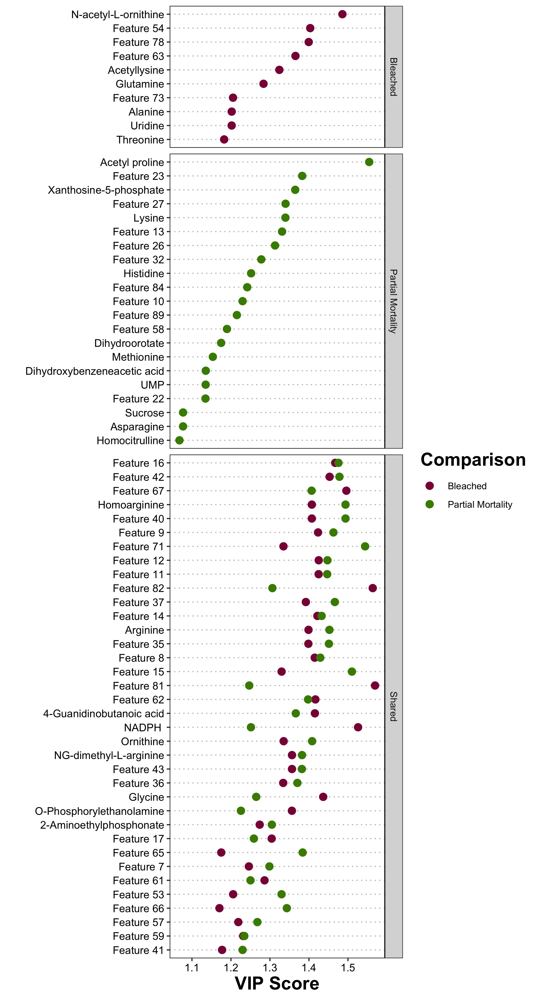
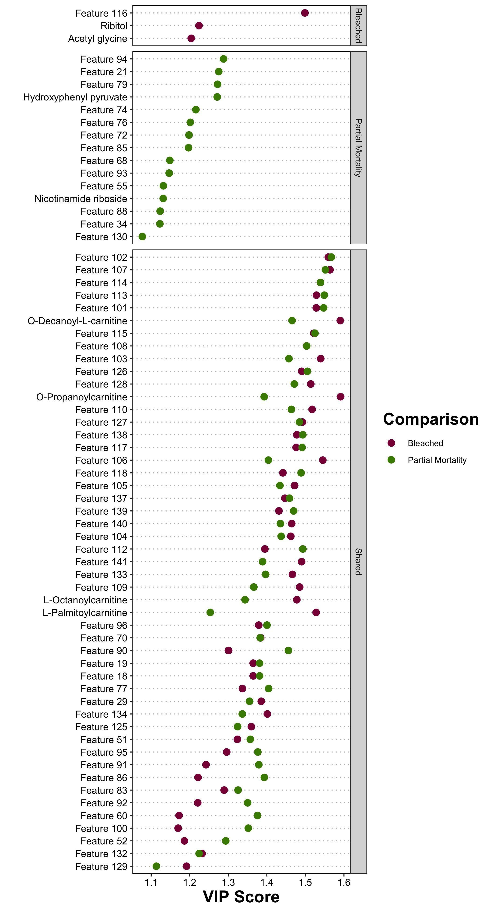
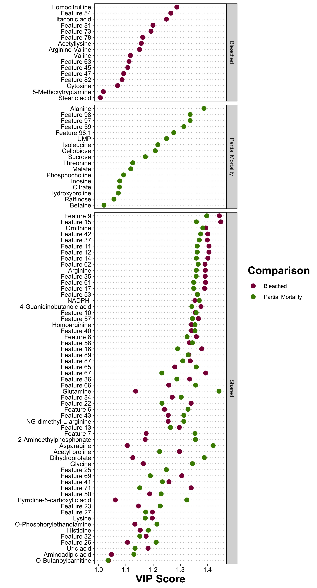
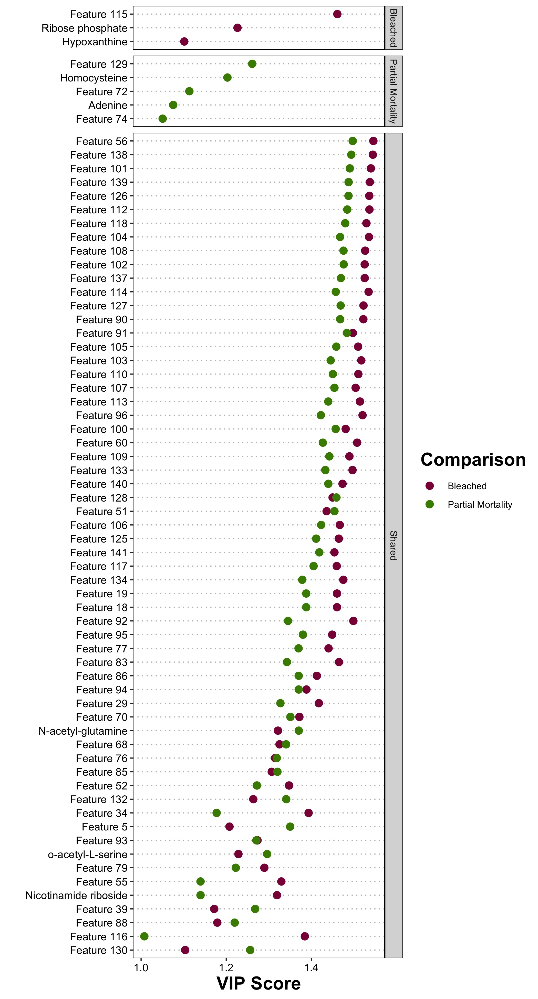

```{r setup, include=FALSE}
knitr::opts_chunk$set(echo = TRUE)
```

# Identification of differentially accumulated or depeleted metabolites 

## Pipeline: 
1. Pairwise comparison using PLS-DA 
2. Extract VIPs >1 
3. T-test with FDR correction

## Data comparisons: 

#### All metabolites:

* Day 0: 
    + Control vs Bleached
    + Control vs Partial Mortality
    + Bleached vs Partial Mortality
* Day 37: 
    + Control vs Bleached
    + Control vs Partial Mortality
    + Bleached vs Partial Mortality
* Day 52: 
    + Control vs Bleached
    + Control vs Partial Mortality
    + Bleached vs Partial Mortality

#### Identified metabolites:

* Day 0: 
    + Control vs Bleached
    + Control vs Partial Mortality
    + Bleached vs Partial Mortality
* Day 37: 
    + Control vs Bleached
    + Control vs Partial Mortality
    + Bleached vs Partial Mortality
* Day 52: 
    + Control vs Bleached
    + Control vs Partial Mortality
    + Bleached vs Partial Mortality


``` {r dependencies, echo=TRUE, warning=FALSE, message=FALSE}

#Read in required libraries
library("reshape")
#library(plyr)
library("dplyr")
library("tidyverse")
library("ggplot2")
library("arsenal")
library("Rmisc")
library(gridExtra)
library(ggpubr)
library(factoextra)
library(ropls)
library(mixOmics)
library(tidyverse)
library(ggplot2)
library(RColorBrewer)
library(lme4)
library(lmerTest)
library(car)
library(effects)
library(ggfortify)
library(cowplot)
library(vegan)
library(corrr)
library(ggcorrplot)
library(GGally)
library(broom)
library(cowplot)
library(RVAideMemoire)
library(arsenal)
library(patchwork)
library(tidyr)
library(ggrepel)
library(MetaboAnalystR)
```


``` {r import data, echo=TRUE, warning=FALSE, message=FALSE}

Norm_Data_All <- read.csv("../../output/Metabolomics/Norm_Data_All.csv", check.names = FALSE)
Norm_Data_Known <- read.csv("../../output/Metabolomics/Norm_Data_Known.csv", check.names = FALSE)

# Removing the first empty column
Norm_Data_All<-Norm_Data_All[-1]
Norm_Data_Known<-Norm_Data_Known[-1]

```

### Creating the PLS-DA function

``` {r plsdaFunction, echo=TRUE, warning=FALSE, message=FALSE}

vip.plsda <- function(data,         # input datas et with only the two variables being compared 
                      Y,            # column of the predictor variable
                      path,         # path to output folder for graphs
                      name          # name of the PLS-DA graphs
                      ) { 

col <- ncol(data)                   # Finding number of columns in data set                                 
X <- data[4:col]                    # assigning metabolites as X data set
Y <- as.factor(Y)                   # assigning groups as Y data set (predictor)

MyResult.plsda <- plsda(X, Y)       # Running PLS-DA

pdf(paste0(path, name, "_plsda.pdf")) 
plotIndiv(MyResult.plsda, ind.names = FALSE, legend=TRUE,ellipse = TRUE) # Plotting PLS-DA
dev.off()

vip <- PLSDA.VIP(MyResult.plsda)                            # VIP Extraction from the PLS=DA
vip.df <- as.data.frame(vip[["tab"]])                       # Creating a readable data frame

vip.table <- rownames_to_column(vip.df, var = "Metabolite") # Creating a table format

vip.table_1 <- vip.table %>%                                # Filtering metabolites with VIPs >= 1
  filter(VIP >= 1)

return(vip.table_1)
}

```

### Creating a t-test and FDR correction function

``` {r testFunction, echo=TRUE, warning=FALSE, message=FALSE}

vip.ttest <- function(data, 
                      VIP_data,
                      est1,
                      est2
                      ) { 

## Gather data frame and group by metabolite 
data_gather <- data %>% gather(key = "Metabolite", value = "Count", -Fragment.ID, -Day, -Group) %>%
  dplyr::select("Group", "Metabolite", "Count")

data_gather$Group <- as.factor(data_gather$Group)
data_gather <- dplyr::group_by(data_gather, Metabolite)

# Select metabolites only present from the PLS-DA with VIPs >1
VIP_Select <- subset(data_gather, data_gather$Metabolite %in% VIP_data$Metabolite)

#Looped t-test for all metabolites with VIPs >1, estimate 1 = Bleached_Hot, estimate 2 = Control
t.test <-do(VIP_Select, tidy(t.test(.$Count ~ .$Group,
                 alternative = "two.sided",
                 mu = 0,
                 paired = FALSE,
                 var.equal = FALSE,
                 conf.level = 0.95
                 )))

#adjust p value for the number of comparisons
t.test$p.adj<-p.adjust(t.test$p.value, method=c("fdr"), n=length(VIP_data$Metabolite)) #length = number of metabolites tested, false discovery rate method

# Filter for significantly different metabolites (p < 0.05)
t.test.fdr <- t.test %>% filter(p.adj <= 0.05)

# Filter for metabolites accumulated for est1
t.test.sig.up <- t.test.fdr %>% filter(estimate1 > estimate2)
t.test.sig.up$Enrichment.dir <- est1

# Filter for metabolites accumulated for est2
t.test.sig.down <- t.test.fdr %>% filter(estimate1 < estimate2)
t.test.sig.down$Enrichment.dir <- est2

#Combining data sets

t.test.sig.final <- rbind(t.test.sig.up, t.test.sig.down)

return(t.test.sig.final)
}

```


### Cleaning datasets and subsetting for analyses

``` {r CleanSubset, echo=TRUE, warning=FALSE, message=FALSE}

Norm_Data_Known_2 <- column_to_rownames(Norm_Data_Known, 'Sample.ID')

D0_BvsC_known <- Norm_Data_Known_2 %>%
  filter(Day == "Day0") %>%
  filter(Group != "Mortality_Hot") %>%
  na.omit()

D0_CvsP_known <- Norm_Data_Known_2 %>%
  filter(Day == "Day0") %>%
  filter(Group != "Bleached_Hot") %>%
  na.omit()

D0_BvsP_known <- Norm_Data_Known_2 %>%
  filter(Day == "Day0") %>%
  filter(Group != "Control_Ambient") %>%
  na.omit()

D37_BvsC_known <- Norm_Data_Known_2 %>%
  filter(Day == "Day37") %>%
  filter(Group != "Mortality_Hot") %>%
  na.omit()

D37_CvsP_known <- Norm_Data_Known_2 %>%
  filter(Day == "Day37") %>%
  filter(Group != "Bleached_Hot") %>%
  na.omit()

D37_BvsP_known <- Norm_Data_Known_2 %>%
  filter(Day == "Day37") %>%
  filter(Group != "Control_Ambient") %>%
  na.omit()

D52_BvsC_known <- Norm_Data_Known_2 %>%
  filter(Day == "Day52") %>%
  filter(Group != "Mortality_Hot") %>%
  na.omit()

D52_CvsP_known <- Norm_Data_Known_2 %>%
  filter(Day == "Day52") %>%
  filter(Group != "Bleached_Hot") %>%
  na.omit()

D52_BvsP_known <- Norm_Data_Known_2 %>%
  filter(Day == "Day52") %>%
  filter(Group != "Control_Ambient") %>%
  na.omit()


Norm_Data_All_2 <- column_to_rownames(Norm_Data_All, 'Sample.ID')

D0_BvsC_all <- Norm_Data_All_2 %>%
  filter(Day == "Day0") %>%
  filter(Group != "Mortality_Hot") %>%
  na.omit()

D0_CvsP_all <- Norm_Data_All_2 %>%
  filter(Day == "Day0") %>%
  filter(Group != "Bleached_Hot") %>%
  na.omit()

D0_BvsP_all <- Norm_Data_All_2 %>%
  filter(Day == "Day0") %>%
  filter(Group != "Control_Ambient") %>%
  na.omit()

D37_BvsC_all <- Norm_Data_All_2 %>%
  filter(Day == "Day37") %>%
  filter(Group != "Mortality_Hot") %>%
  na.omit()

D37_CvsP_all <- Norm_Data_All_2 %>%
  filter(Day == "Day37") %>%
  filter(Group != "Bleached_Hot") %>%
  na.omit()

D37_BvsP_all <- Norm_Data_All_2 %>%
  filter(Day == "Day37") %>%
  filter(Group != "Control_Ambient") %>%
  na.omit()

D52_BvsC_all <- Norm_Data_All_2 %>%
  filter(Day == "Day52") %>%
  filter(Group != "Mortality_Hot") %>%
  na.omit()

D52_CvsP_all <- Norm_Data_All_2 %>%
  filter(Day == "Day52") %>%
  filter(Group != "Bleached_Hot") %>%
  na.omit()

D52_BvsP_all <- Norm_Data_All_2 %>%
  filter(Day == "Day52") %>%
  filter(Group != "Control_Ambient") %>%
  na.omit()

```


### PLD-DA and VIP Extraction

``` {r PLSDA, echo=TRUE, warning=FALSE, message=FALSE}

path <- "../../output/Metabolomics/PLSDA_figs/"

### Known metabolites ###

D0_BvsC_known_VIP_1 <- vip.plsda(D0_BvsC_known, D0_BvsC_known$Group, path, "D0_BvsC_known")
D0_CvsP_known_VIP_1 <- vip.plsda(D0_CvsP_known, D0_CvsP_known$Group, path, "D0_CvsP_known")
D0_BvsP_known_VIP_1 <- vip.plsda(D0_BvsP_known, D0_BvsP_known$Group, path, "D0_BvsP_known")

D37_BvsC_known_VIP_1 <- vip.plsda(D37_BvsC_known, D37_BvsC_known$Group, path, "D37_BvsC_known")
D37_CvsP_known_VIP_1 <- vip.plsda(D37_CvsP_known, D37_CvsP_known$Group, path, "D37_CvsP_known")
D37_BvsP_known_VIP_1 <- vip.plsda(D37_BvsP_known, D37_BvsP_known$Group, path, "D37_BvsP_known")

D52_BvsC_known_VIP_1 <- vip.plsda(D52_BvsC_known, D52_BvsC_known$Group, path, "D52_BvsC_known")
D52_CvsP_known_VIP_1 <- vip.plsda(D52_CvsP_known, D52_CvsP_known$Group, path, "D52_CvsP_known")
D52_BvsP_known_VIP_1 <- vip.plsda(D52_BvsP_known, D52_BvsP_known$Group, path, "D52_BvsP_known")

### All detected metabolites ###

D0_BvsC_all_VIP_1 <- vip.plsda(D0_BvsC_all, D0_BvsC_all$Group, path, "D0_BvsC_all")
D0_CvsP_all_VIP_1 <- vip.plsda(D0_CvsP_all, D0_CvsP_all$Group, path, "D0_CvsP_all")
D0_BvsP_all_VIP_1 <- vip.plsda(D0_BvsP_all, D0_BvsP_all$Group, path, "D0_BvsP_all")

D37_BvsC_all_VIP_1 <- vip.plsda(D37_BvsC_all, D37_BvsC_all$Group, path, "D37_BvsC_all")
D37_CvsP_all_VIP_1 <- vip.plsda(D37_CvsP_all, D37_CvsP_all$Group, path, "D37_CvsP_all")
D37_BvsP_all_VIP_1 <- vip.plsda(D37_BvsP_all, D37_BvsP_all$Group, path, "D37_BvsP_all")

D52_BvsC_all_VIP_1 <- vip.plsda(D52_BvsC_all, D52_BvsC_all$Group, path, "D52_BvsC_all")
D52_CvsP_all_VIP_1 <- vip.plsda(D52_CvsP_all, D52_CvsP_all$Group, path, "D52_CvsP_all")
D52_BvsP_all_VIP_1 <- vip.plsda(D52_BvsP_all, D52_BvsP_all$Group, path, "D52_BvsP_all")

```


### T-test and FDR correction of metabolites with VIPs >1

``` {r ttest, echo=TRUE, warning=FALSE, message=FALSE}

### Known Metabolites ###

D0_BvsC_known_VIP_sig <- vip.ttest(D0_BvsC_known, D0_BvsC_known_VIP_1, "Bleached", "Control")
D0_CvsP_known_VIP_sig <- vip.ttest(D0_CvsP_known, D0_CvsP_known_VIP_1 , "Control", "Partial Mortality")
D0_BvsP_known_VIP_sig <- vip.ttest(D0_BvsP_known, D0_BvsP_known_VIP_1 , "Bleached", "Partial Mortality")

D37_BvsC_known_VIP_sig <- vip.ttest(D37_BvsC_known, D37_BvsC_known_VIP_1, "Bleached", "Control")
D37_CvsP_known_VIP_sig <- vip.ttest(D37_CvsP_known, D37_CvsP_known_VIP_1 , "Control", "Partial Mortality")
D37_BvsP_known_VIP_sig <- vip.ttest(D37_BvsP_known, D37_BvsP_known_VIP_1 , "Bleached", "Partial Mortality")

D52_BvsC_known_VIP_sig <- vip.ttest(D52_BvsC_known, D52_BvsC_known_VIP_1, "Bleached", "Control")
D52_CvsP_known_VIP_sig <- vip.ttest(D52_CvsP_known, D52_CvsP_known_VIP_1 , "Control", "Partial Mortality")
D52_BvsP_known_VIP_sig <- vip.ttest(D52_BvsP_known, D52_BvsP_known_VIP_1 , "Bleached", "Partial Mortality")

### All detected Metabolites ###

D0_BvsC_all_VIP_sig <- vip.ttest(D0_BvsC_all, D0_BvsC_all_VIP_1, "Bleached", "Control")
D0_CvsP_all_VIP_sig <- vip.ttest(D0_CvsP_all, D0_CvsP_all_VIP_1 , "Control", "Partial Mortality")
D0_BvsP_all_VIP_sig <- vip.ttest(D0_BvsP_all, D0_BvsP_all_VIP_1 , "Bleached", "Partial Mortality")

D37_BvsC_all_VIP_sig <- vip.ttest(D37_BvsC_all, D37_BvsC_all_VIP_1, "Bleached", "Control")
D37_CvsP_all_VIP_sig <- vip.ttest(D37_CvsP_all, D37_CvsP_all_VIP_1 , "Control", "Partial Mortality")
D37_BvsP_all_VIP_sig <- vip.ttest(D37_BvsP_all, D37_BvsP_all_VIP_1 , "Bleached", "Partial Mortality")

D52_BvsC_all_VIP_sig <- vip.ttest(D52_BvsC_all, D52_BvsC_all_VIP_1, "Bleached", "Control")
D52_CvsP_all_VIP_sig <- vip.ttest(D52_CvsP_all, D52_CvsP_all_VIP_1 , "Control", "Partial Mortality")
D52_BvsP_all_VIP_sig <- vip.ttest(D52_BvsP_all, D52_BvsP_all_VIP_1 , "Bleached", "Partial Mortality")

```

### Assigning known and unknown values to All detected metabolite datasets

``` {r knownunknown, echo=TRUE, warning=FALSE, message=FALSE}

D0_BvsC_all_VIP_sig$Feature.status <- ifelse(grepl("Feature", D0_BvsC_all_VIP_sig$Metabolite), 'Unknown', 'Identified')
D0_CvsP_all_VIP_sig$Feature.status <- ifelse(grepl("Feature", D0_CvsP_all_VIP_sig$Metabolite), 'Unknown', 'Identified')
D0_BvsP_all_VIP_sig$Feature.status <- ifelse(grepl("Feature", D0_BvsP_all_VIP_sig$Metabolite), 'Unknown', 'Identified')
D37_BvsC_all_VIP_sig$Feature.status <- ifelse(grepl("Feature", D37_BvsC_all_VIP_sig$Metabolite), 'Unknown', 'Identified')
D37_CvsP_all_VIP_sig$Feature.status <- ifelse(grepl("Feature", D37_CvsP_all_VIP_sig$Metabolite), 'Unknown', 'Identified')
D37_BvsP_all_VIP_sig$Feature.status <- ifelse(grepl("Feature", D37_BvsP_all_VIP_sig$Metabolite), 'Unknown', 'Identified')
D52_BvsC_all_VIP_sig$Feature.status <- ifelse(grepl("Feature", D52_BvsC_all_VIP_sig$Metabolite), 'Unknown', 'Identified')
D52_CvsP_all_VIP_sig$Feature.status <- ifelse(grepl("Feature", D52_CvsP_all_VIP_sig$Metabolite), 'Unknown', 'Identified')
D52_BvsP_all_VIP_sig$Feature.status <- ifelse(grepl("Feature", D52_BvsP_all_VIP_sig$Metabolite), 'Unknown', 'Identified')


write.csv(D0_BvsC_all_VIP_sig, "../../output/Metabolomics/VIP/D0_BvsC_all_VIP_sig.csv")
write.csv(D0_CvsP_all_VIP_sig, "../../output/Metabolomics/VIP/D0_CvsP_all_VIP_sig.csv")
write.csv(D0_BvsP_all_VIP_sig, "../../output/Metabolomics/VIP/D0_BvsP_all_VIP_sig.csv")
write.csv(D37_BvsC_all_VIP_sig, "../../output/Metabolomics/VIP/D37_BvsC_all_VIP_sig.csv")
write.csv(D37_CvsP_all_VIP_sig, "../../output/Metabolomics/VIP/D37_CvsP_all_VIP_sig.csv")
write.csv(D37_BvsP_all_VIP_sig, "../../output/Metabolomics/VIP/D37_BvsP_all_VIP_sig.csv")
write.csv(D52_BvsC_all_VIP_sig, "../../output/Metabolomics/VIP/D52_BvsC_all_VIP_sig.csv")
write.csv(D52_CvsP_all_VIP_sig, "../../output/Metabolomics/VIP/D52_CvsP_all_VIP_sig.csv")
write.csv(D52_BvsP_all_VIP_sig, "../../output/Metabolomics/VIP/D52_BvsP_all_VIP_sig.csv")

```


### Summary statsitics of known vs unknown metabolites

``` {r Knownstats, echo=TRUE, warning=FALSE, message=FALSE}

path2 <- "../../output/Metabolomics/VIP/"
filenames <- list.files(path = path2, pattern="csv$") #figure out how to loop this

D0_BvsC_all_VIP_table <- as.data.frame(t(table(D0_BvsC_all_VIP_sig['Feature.status'])))
D0_CvsP_all_VIP_table <- as.data.frame(t(table(D0_CvsP_all_VIP_sig['Feature.status'])))
D0_BvsP_all_VIP_table <- as.data.frame(t(table(D0_BvsP_all_VIP_sig['Feature.status'])))
D37_BvsC_all_VIP_table <- as.data.frame(t(table(D37_BvsC_all_VIP_sig[,'Feature.status'])))
D37_CvsP_all_VIP_table <- as.data.frame(t(table(D37_CvsP_all_VIP_sig['Feature.status'])))
D37_BvsP_all_VIP_table <- as.data.frame(t(table(D37_BvsP_all_VIP_sig['Feature.status'])))
D52_BvsC_all_VIP_table <- as.data.frame(t(table(D52_BvsC_all_VIP_sig['Feature.status'])))
D52_CvsP_all_VIP_table <- as.data.frame(t(table(D52_CvsP_all_VIP_sig['Feature.status'])))
D52_BvsP_all_VIP_table <- as.data.frame(t(table(D52_BvsP_all_VIP_sig['Feature.status'])))

#D0_BvsC_all_VIP_table$Comparison <- "D0_BvsC"
#D0_CvsP_all_VIP_table$Comparison <- "D0_CvsP"
#D0_BvsP_all_VIP_table$Comparison <- "D0_BvsP"
D37_BvsC_all_VIP_table$Comparison <- "D37_BvsC"
D37_CvsP_all_VIP_table$Comparison <- "D37_CvsP"
#D37_BvsP_all_VIP_table$Comparison <- "D37_BvsP"
D52_BvsC_all_VIP_table$Comparison <- "D52_BvsC"
D52_CvsP_all_VIP_table$Comparison <- "D52_CvsP"
#D52_BvsP_all_VIP_table$Comparison <- "D52_BvsP"

feat.stat.table <- rbind(D37_BvsC_all_VIP_table,
                         D37_CvsP_all_VIP_table,
                         D52_BvsC_all_VIP_table,
                         D52_CvsP_all_VIP_table)

feat.stat.table2 <- feat.stat.table %>%
  spread(key = Var2, value = Freq)

feat.stat.table2

write.csv(feat.stat.table2, "../../output/Metabolomics/VIP/feat.stat.table.csv")
```

### VIP plotting after t-test validation

``` {r VIPPlot, echo=TRUE, warning=FALSE, message=FALSE}

# Attaching VIPs to t-test dataframes

D37_BvsC_all_VIP_sig2 <- merge(D37_BvsC_all_VIP_sig, D37_BvsC_all_VIP_1, by = "Metabolite")
D37_CvsP_all_VIP_sig2 <- merge(D37_CvsP_all_VIP_sig, D37_CvsP_all_VIP_1, by = "Metabolite")
D52_BvsC_all_VIP_sig2 <- merge(D52_BvsC_all_VIP_sig, D52_BvsC_all_VIP_1, by = "Metabolite")
D52_CvsP_all_VIP_sig2 <- merge(D52_CvsP_all_VIP_sig, D52_CvsP_all_VIP_1, by = "Metabolite")

# Adding comparison column to keep track of data sets

D37_BvsC_all_VIP_sig2$Comparison <- "Bleached"
D37_CvsP_all_VIP_sig2$Comparison <- "Partial Mortality"
D52_BvsC_all_VIP_sig2$Comparison <- "Bleached"
D52_CvsP_all_VIP_sig2$Comparison <- "Partial Mortality"

#subsetting accumulated and depleted metabolites

D37_BvsC_all_VIP_sig_accumulated <- D37_BvsC_all_VIP_sig2 %>%
  filter(Enrichment.dir != "Control")

D37_BvsC_all_VIP_sig_depleted <- D37_BvsC_all_VIP_sig2 %>%
  filter(Enrichment.dir == "Control")

D37_CvsP_all_VIP_sig_accumulated <- D37_CvsP_all_VIP_sig2 %>%
  filter(Enrichment.dir != "Control")

D37_CvsP_all_VIP_sig_depleted <- D37_CvsP_all_VIP_sig2 %>%
  filter(Enrichment.dir == "Control")

D52_BvsC_all_VIP_sig_accumulated <- D52_BvsC_all_VIP_sig2 %>%
  filter(Enrichment.dir != "Control")

D52_BvsC_all_VIP_sig_depleted <- D52_BvsC_all_VIP_sig2 %>%
  filter(Enrichment.dir == "Control")

D52_CvsP_all_VIP_sig_accumulated <- D52_CvsP_all_VIP_sig2 %>%
  filter(Enrichment.dir != "Control")

D52_CvsP_all_VIP_sig_depleted <- D52_CvsP_all_VIP_sig2 %>%
  filter(Enrichment.dir == "Control")

# Assigning shared or unique labels 
D37_BvsC_all_VIP_sig_accumulated$Shared <- ifelse(D37_BvsC_all_VIP_sig_accumulated$Metabolite %in%
                                                  D37_CvsP_all_VIP_sig_accumulated$Metabolite, 'Shared', 'Bleached')

D37_BvsC_all_VIP_sig_depleted$Shared <- ifelse(D37_BvsC_all_VIP_sig_depleted$Metabolite %in%
                                                  D37_CvsP_all_VIP_sig_depleted$Metabolite, 'Shared', 'Bleached')

D37_CvsP_all_VIP_sig_accumulated$Shared <- ifelse(D37_CvsP_all_VIP_sig_accumulated$Metabolite %in%
                                                  D37_BvsC_all_VIP_sig_accumulated$Metabolite, 'Shared', 'Partial Mortality')

D37_CvsP_all_VIP_sig_depleted$Shared <- ifelse(D37_CvsP_all_VIP_sig_depleted$Metabolite %in%
                                                  D37_BvsC_all_VIP_sig_depleted$Metabolite, 'Shared', 'Partial Mortality')

D52_BvsC_all_VIP_sig_accumulated$Shared <- ifelse(D52_BvsC_all_VIP_sig_accumulated$Metabolite %in%
                                                  D52_CvsP_all_VIP_sig_accumulated$Metabolite, 'Shared', 'Bleached')

D52_BvsC_all_VIP_sig_depleted$Shared <- ifelse(D52_BvsC_all_VIP_sig_depleted$Metabolite %in%
                                                  D52_CvsP_all_VIP_sig_depleted$Metabolite, 'Shared', 'Bleached')

D52_CvsP_all_VIP_sig_accumulated$Shared <- ifelse(D52_CvsP_all_VIP_sig_accumulated$Metabolite %in%
                                                  D52_BvsC_all_VIP_sig_accumulated$Metabolite, 'Shared', 'Partial Mortality')

D52_CvsP_all_VIP_sig_depleted$Shared <- ifelse(D52_CvsP_all_VIP_sig_depleted$Metabolite %in%
                                                  D52_BvsC_all_VIP_sig_depleted$Metabolite, 'Shared', 'Partial Mortality')

#subsetting accumulated and depleted metabolites

D37_all_comp_accumulated  <- rbind(D37_BvsC_all_VIP_sig_accumulated, D37_CvsP_all_VIP_sig_accumulated)
D37_all_comp_depleted     <- rbind(D37_BvsC_all_VIP_sig_depleted, D37_CvsP_all_VIP_sig_depleted)
D52_all_comp_accumulated  <- rbind(D52_BvsC_all_VIP_sig_accumulated, D52_CvsP_all_VIP_sig_accumulated)
D52_all_comp_depleted     <- rbind(D52_BvsC_all_VIP_sig_depleted, D52_CvsP_all_VIP_sig_depleted)

# Plotting
library(forcats)

D37_accum <- D37_all_comp_accumulated %>%
  mutate(Metabolite = fct_reorder(Metabolite, VIP)) %>%
  ggplot(aes(x = VIP, y = Metabolite, fill = Comparison)) +
  geom_hline(aes(yintercept = Metabolite), linetype = "dotted", color = "grey") +
  geom_point(size = 3, aes(color = Comparison)) +
#  xlim(1.2, 2) +
  scale_colour_manual(values=c("#8B0046", "#468B00")) +
  scale_fill_manual(values=c("#8B0046", "#468B00")) +
  ylab("") +
  xlab("VIP Score") +
#  ggtitle("Bleached Unique") +
  theme_bw() + theme(panel.border = element_rect(linetype = "solid", color = "black"), 
                     panel.grid.major = element_blank(),
                     panel.grid.minor = element_blank(),
                     axis.text = element_text(size=10, color="black"), 
                     title = element_text(size=17, face="bold"), 
                     axis.title = element_text(size=17)) +
  facet_grid(Shared ~ ., scales = "free_y", space = "free")

ggsave(filename="../../output/Metabolomics/Day37_accumulated_VIP.jpeg", plot=D37_accum, dpi=300, width=7, height=13, units="in")

D37_dep <- D37_all_comp_depleted %>%
  mutate(Metabolite = fct_reorder(Metabolite, VIP)) %>%
  ggplot(aes(x = VIP, y = Metabolite, fill = Comparison)) +
  geom_hline(aes(yintercept = Metabolite), linetype = "dotted", color = "grey") +
  geom_point(size = 3, aes(color = Comparison)) +
#  xlim(1.2, 2) +
  scale_colour_manual(values=c("#8B0046", "#468B00")) +
  scale_fill_manual(values=c("#8B0046", "#468B00")) +
  ylab("") +
  xlab("VIP Score") +
#  ggtitle("Bleached Unique") +
  theme_bw() + theme(panel.border = element_rect(linetype = "solid", color = "black"), 
                     panel.grid.major = element_blank(),
                     panel.grid.minor = element_blank(),
                     axis.text = element_text(size=10, color="black"), 
                     title = element_text(size=17, face="bold"), 
                     axis.title = element_text(size=17)) +
  facet_grid(Shared ~ ., scales = "free_y", space = "free")

ggsave(filename="../../output/Metabolomics/Day37_depleted_VIP.jpeg", plot=D37_dep, dpi=300, width=7, height=13, units="in")

D52_accum <- D52_all_comp_accumulated %>%
  mutate(Metabolite = fct_reorder(Metabolite, VIP)) %>%
  ggplot(aes(x = VIP, y = Metabolite, fill = Comparison)) +
  geom_hline(aes(yintercept = Metabolite), linetype = "dotted", color = "grey") +
  geom_point(size = 3, aes(color = Comparison)) +
#  xlim(1.2, 2) +
  scale_colour_manual(values=c("#8B0046", "#468B00")) +
  scale_fill_manual(values=c("#8B0046", "#468B00")) +
  ylab("") +
  xlab("VIP Score") +
#  ggtitle("Bleached Unique") +
  theme_bw() + theme(panel.border = element_rect(linetype = "solid", color = "black"), 
                     panel.grid.major = element_blank(),
                     panel.grid.minor = element_blank(),
                     axis.text = element_text(size=10, color="black"), 
                     title = element_text(size=17, face="bold"), 
                     axis.title = element_text(size=17)) +
  facet_grid(Shared ~ ., scales = "free_y", space = "free")

ggsave(filename="../../output/Metabolomics/Day52_accumulated_VIP.jpeg", plot=D52_accum, dpi=300, width=7, height=13, units="in")

D52_dep <- D52_all_comp_depleted %>%
  mutate(Metabolite = fct_reorder(Metabolite, VIP)) %>%
  ggplot(aes(x = VIP, y = Metabolite, fill = Comparison)) +
  geom_hline(aes(yintercept = Metabolite), linetype = "dotted", color = "grey") +
  geom_point(size = 3, aes(color = Comparison)) +
#  xlim(1.2, 2) +
  scale_colour_manual(values=c("#8B0046", "#468B00")) +
  scale_fill_manual(values=c("#8B0046", "#468B00")) +
  ylab("") +
  xlab("VIP Score") +
#  ggtitle("Bleached Unique") +
  theme_bw() + theme(panel.border = element_rect(linetype = "solid", color = "black"), 
                     panel.grid.major = element_blank(),
                     panel.grid.minor = element_blank(),
                     axis.text = element_text(size=10, color="black"), 
                     title = element_text(size=17, face="bold"), 
                     axis.title = element_text(size=17)) +
  facet_grid(Shared ~ ., scales = "free_y", space = "free")

ggsave(filename="../../output/Metabolomics/Day52_depleted_VIP.jpeg", plot=D52_dep, dpi=300, width=7, height=13, units="in")

```

```{r, echo=FALSE, out.width="100%", fig.cap="Significantly accumulated VIPs on Day 37 compared to control"}

```

```{r, echo=FALSE, out.width="100%", fig.cap="Significantly depleted VIPs on Day 37 compared to control"}

```

```{r, echo=FALSE, out.width="100%", fig.cap="Significantly accumulated VIPs on Day 52 compared to control"}

```

```{r, echo=FALSE, out.width="100%", fig.cap="Significantly depleted VIPs on Day 52 compared to control"}

```
