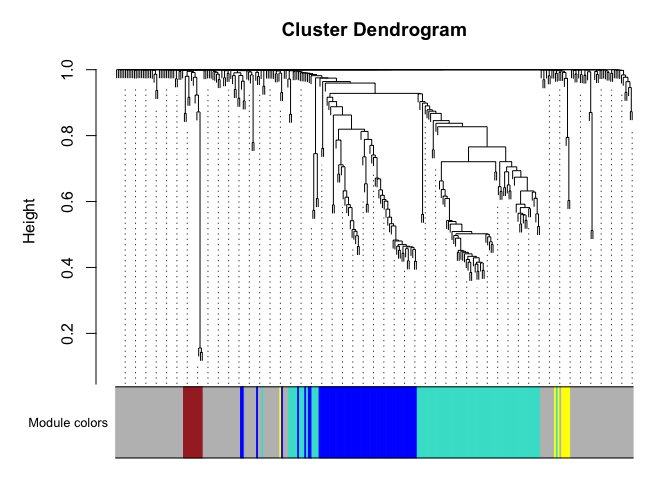
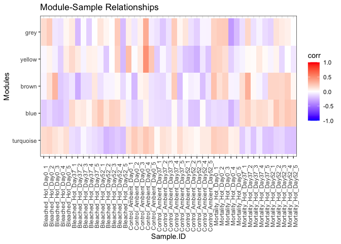
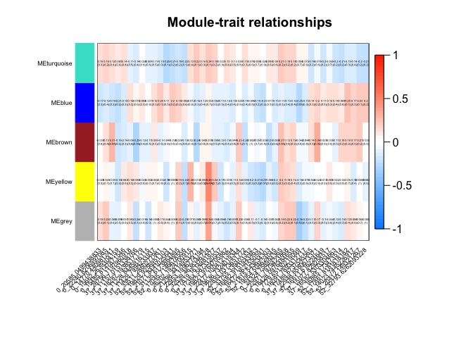
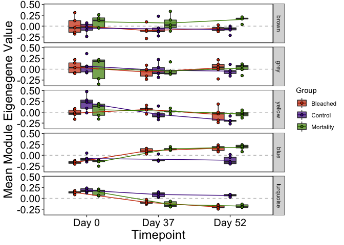

Metabolomics WGCNA
================
Author: Kevin Wong; <kevinhwong1@gmail.com>

## Pipeline Overview

1.  Data preparation

<!-- end list -->

  - Load and format clean data
  - Data filtering: PoverA and genefilter
  - Outlier detection

<!-- end list -->

2.  Network construction and consensus modlue detection

<!-- end list -->

  - Choosing a soft-thresholding power: Analysis of a network topology β
  - Co-expression adjacency and topological overlap matrix similarity
  - Clustering using TOM
  - Module idenification using dynamicTreeCut

<!-- end list -->

3.  Correlate groups/timepoints
4.  Plot module-trait associations
5.  Plot eigennene over groupings
6.  Calculating gene significance and module membership

This pipeline is modified from AH: \*
<https://github.com/AHuffmyer/EarlyLifeHistory_Energetics/blob/master/Mcap2020/Scripts/Metabolomics/metabolomics_WGCNA.Rmd>

Initial thoughts:

  - First I will run this with 9 different groupings (3x3 design). Not
    sure if this is correct, but it will give us an overall idea
  - Second I will run this with 3 times for each time point, or 3 time
    for each grouping
  - Third I will think about how to use the WGCNA to correlate other
    datasets (i.e. phys or tag-seq modules)

<!-- end list -->

``` r
## install packages if you dont already have them in your library
if ("tidyverse" %in% rownames(installed.packages()) == 'FALSE') install.packages('tidyverse') 
if ("vegan" %in% rownames(installed.packages()) == 'FALSE') install.packages('vegan') 
if ("ggplot2" %in% rownames(installed.packages()) == 'FALSE') install.packages('ggplot2') 
if ("factoextra" %in% rownames(installed.packages()) == 'FALSE') install.packages('factoextra') 
if ("ggfortify" %in% rownames(installed.packages()) == 'FALSE') install.packages('ggfortify') 
if ("naniar" %in% rownames(installed.packages()) == 'FALSE') install.packages('naniar') 
if ("cowplot" %in% rownames(installed.packages()) == 'FALSE') install.packages('cowplot') 
if (!requireNamespace("BiocManager", quietly = TRUE))
    install.packages("BiocManager")
if ("mixOmics" %in% rownames(installed.packages()) == 'FALSE') BiocManager::install("mixOmics") 
if ("RVAideMemoire" %in% rownames(installed.packages()) == 'FALSE') install.packages('RVAideMemoire') 
if ("VennDiagram" %in% rownames(installed.packages()) == 'FALSE') install.packages('VennDiagram') 
if ("broom" %in% rownames(installed.packages()) == 'FALSE') install.packages('broom') 

#load packages
library("ggplot2")
library('vegan')
library('factoextra')
library('ggfortify')
library('naniar')
library('cowplot')
library("mixOmics")
library("tidyverse")
library("RVAideMemoire")
library("VennDiagram")
library("broom")

if ("genefilter" %in% rownames(installed.packages()) == 'FALSE') install.packages('genefilter') 
if ("DESeq2" %in% rownames(installed.packages()) == 'FALSE') install.packages('DESeq2') 
if ("RColorBrewer" %in% rownames(installed.packages()) == 'FALSE') install.packages('RColorBrewer') 
if ("WGCNA" %in% rownames(installed.packages()) == 'FALSE') install.packages('WGCNA') 
if ("flashClust" %in% rownames(installed.packages()) == 'FALSE') install.packages('flashClust') 
if ("gridExtra" %in% rownames(installed.packages()) == 'FALSE') install.packages('gridExtra') 
if ("ComplexHeatmap" %in% rownames(installed.packages()) == 'FALSE') install.packages('ComplexHeatmap') 
if ("goseq" %in% rownames(installed.packages()) == 'FALSE') install.packages('goseq') 
if ("dplyr" %in% rownames(installed.packages()) == 'FALSE') install.packages('dplyr') 
if ("clusterProfiler" %in% rownames(installed.packages()) == 'FALSE') install.packages('clusterProfiler') 
if ("pheatmap" %in% rownames(installed.packages()) == 'FALSE') install.packages('pheatmap') 
if ("magrittr" %in% rownames(installed.packages()) == 'FALSE') install.packages('magrittr') 

library("genefilter")
library("DESeq2")
library("RColorBrewer")
library("WGCNA")
library("flashClust")
library("gridExtra")
library("ComplexHeatmap")
library("goseq")
library("dplyr")
library("clusterProfiler")
library("pheatmap")
library("magrittr")
library("reshape2")
```

# 1\. Data preparation

## Load and format clean data

``` r
data <- read.csv("../../output/Metabolomics/Norm_Data_All.csv", check.names = FALSE)

data$Grouping <- paste(data$Day, data$Group, sep= "_")

metadata <- data %>%
  select(Sample.ID, Grouping)

#removing metadata columns except the Sample ID
data2 <-data[-c(1, 3:5, 301)]

#melting dataset 
data3 <- melt(data2, id= "Sample.ID") 
names(data3)[2] <- 'Metabolite'
data3$value <- as.numeric(data3$value)

#Convert the data table to a wide format with samples in columns and metabolites in rows.  
data4 <- data3%>% 
  spread(Sample.ID, value)

#Turning metabolite names into rownames
head(data4) 
```

    ##                 Metabolite Bleached_Hot_Day0_1 Bleached_Hot_Day0_2
    ## 1        1-Methylhistidine           12.597712            12.45653
    ## 2  11a-Hydroxyprogesterone            9.965784            10.08482
    ## 3  2-Aminoethylphosphonate           11.524967            13.46846
    ## 4     3-Phenylbutyric acid           10.468841            10.14285
    ## 5 4-Guanidinobutanoic acid           13.070959            13.45111
    ## 6   5- Methylthioadenosine           12.890673            12.85048
    ##   Bleached_Hot_Day0_3 Bleached_Hot_Day0_4 Bleached_Hot_Day0_5
    ## 1           11.223564            10.67207           11.067707
    ## 2            9.965784            10.03222            9.965784
    ## 3           10.910512            11.26006           11.214512
    ## 4           10.467501            10.11306           10.231109
    ## 5           13.265545            12.65919           13.426164
    ## 6           11.631488            12.15494           12.242451
    ##   Bleached_Hot_Day37_1 Bleached_Hot_Day37_2 Bleached_Hot_Day37_3
    ## 1             13.09867            12.434193             11.20166
    ## 2             10.10697             9.965784             10.07936
    ## 3             14.55739            14.103625             13.86497
    ## 4             10.49561            10.123549             10.21767
    ## 5             17.15076            17.449956             16.78640
    ## 6             11.94547            11.623888             11.49924
    ##   Bleached_Hot_Day37_4 Bleached_Hot_Day37_5 Bleached_Hot_Day52_1
    ## 1            11.155944            11.790661            13.641482
    ## 2             9.965784             9.965784             9.965784
    ## 3            13.227127            14.598870            18.426094
    ## 4            10.075345            10.112277            10.290379
    ## 5            16.338571            17.358437            17.764649
    ## 6            11.390960            11.477447            12.306653
    ##   Bleached_Hot_Day52_2 Bleached_Hot_Day52_3 Bleached_Hot_Day52_4
    ## 1             13.06932            11.504846            11.198416
    ## 2             10.18085             9.965784             9.965784
    ## 3             12.98047            17.030764            15.132732
    ## 4             10.11771            10.359917            10.243437
    ## 5             16.52937            17.654034            17.386170
    ## 6             11.63714            10.777782            12.355321
    ##   Bleached_Hot_Day52_5 Control_Ambient_Day0_1 Control_Ambient_Day0_2
    ## 1            10.693107              11.874834              10.981757
    ## 2             9.965784               9.965784               9.965784
    ## 3            13.167649              11.041341              10.641278
    ## 4            10.444121              10.231107              10.111661
    ## 5            17.752851              14.119781              13.467085
    ## 6            11.487710              12.569633              12.689617
    ##   Control_Ambient_Day0_3 Control_Ambient_Day0_4 Control_Ambient_Day0_5
    ## 1              12.307444               13.39785              11.165323
    ## 2               9.965784               10.68841               9.965784
    ## 3              11.988482               11.41120              11.707787
    ## 4               9.965784               10.17753              11.336875
    ## 5              13.588915               15.82489              14.824642
    ## 6              12.391319               12.69146              11.927125
    ##   Control_Ambient_Day37_1 Control_Ambient_Day37_2 Control_Ambient_Day37_3
    ## 1                12.03864                11.45159                10.98305
    ## 2                10.04280                10.05212                10.13149
    ## 3                14.00341                10.96123                12.08055
    ## 4                10.37905                10.52734                10.47289
    ## 5                10.26165                13.90328                14.11948
    ## 6                10.53667                12.77790                12.32065
    ##   Control_Ambient_Day37_4 Control_Ambient_Day37_5 Control_Ambient_Day52_1
    ## 1                13.11526               11.591870               12.144157
    ## 2                10.18495                9.965784                9.965784
    ## 3                12.69577               11.373990               12.073953
    ## 4                11.33834               11.052258               10.198460
    ## 5                15.24834               13.505879               13.571864
    ## 6                12.12426               11.932748               12.294176
    ##   Control_Ambient_Day52_2 Control_Ambient_Day52_3 Control_Ambient_Day52_4
    ## 1               12.140118                10.64289               12.128701
    ## 2                9.965784                10.05331                9.965784
    ## 3               11.317854                11.04728               13.033953
    ## 4               10.255997                10.51280               10.364575
    ## 5               11.923839                13.23852               16.049903
    ## 6               11.398923                11.43119               12.069323
    ##   Control_Ambient_Day52_5 Mortality_Hot_Day0_1 Mortality_Hot_Day0_2
    ## 1                11.25959            11.919570            11.279059
    ## 2                10.13387             9.965784             9.965784
    ## 3                10.89616            10.973437            11.007827
    ## 4                10.13793            10.130097            10.956526
    ## 5                13.01820            13.900909            14.222642
    ## 6                11.55718            12.549565            12.341889
    ##   Mortality_Hot_Day0_3 Mortality_Hot_Day0_4 Mortality_Hot_Day0_5
    ## 1            10.647180            10.693535            11.101694
    ## 2             9.965784             9.965784             9.965784
    ## 3            10.984177            10.408966            10.667809
    ## 4            10.193514            10.326160            10.170767
    ## 5            13.430643            12.728095            14.723080
    ## 6            12.815226            11.676783            11.982479
    ##   Mortality_Hot_Day37_1 Mortality_Hot_Day37_2 Mortality_Hot_Day37_3
    ## 1             11.237045              11.89667             10.704296
    ## 2              9.965784              10.14357              9.965784
    ## 3             14.900443              14.95310             14.115951
    ## 4             10.367237              10.63383             10.111753
    ## 5             17.567827              17.37831             16.821055
    ## 6             11.693344              12.07882             11.509099
    ##   Mortality_Hot_Day37_4 Mortality_Hot_Day37_5 Mortality_Hot_Day52_1
    ## 1              11.75233             12.437081              10.81388
    ## 2              10.25728              9.965784              10.07446
    ## 3              13.86464             16.155558              14.01578
    ## 4              10.35245             10.204496              10.54020
    ## 5              17.20494             16.669725              17.23857
    ## 6              11.63181             11.244025              11.72972
    ##   Mortality_Hot_Day52_2 Mortality_Hot_Day52_3 Mortality_Hot_Day52_4
    ## 1             12.205503             11.707765              11.90522
    ## 2              9.965784              9.965784              10.11439
    ## 3             17.302700             15.120161              17.21365
    ## 4             10.823112             10.513305              10.31026
    ## 5             17.702928             16.955704              17.58663
    ## 6             11.639018             11.896253              12.36261
    ##   Mortality_Hot_Day52_5
    ## 1              12.78441
    ## 2              10.12015
    ## 3              16.88336
    ## 4              10.16901
    ## 5              18.46008
    ## 6              12.05385

``` r
rownames(data4)<-data4$Metabolite 
data5 <-data4 %>%
  select(-Metabolite)


#Check that there are no metabolites with 0 counts for all samples. Should return TRUE.  
rowSums(dplyr::count(data5)) > 0
```

    ## [1] TRUE

## Data filtering: PoverA and genefilter

Conduct data filtering, this includes:

*pOverA*: Specifying the minimum count for a proportion of samples for
each metabolite. Here, we are using a pOverA of 0.11. This is because we
have 45 samples with a minimum of n=5 samples per group Therefore, we
will accept genes that are present in 5/45 = 0.11 of the samples because
we expect different metabolites by groups as demonstrated by PLSDA
analysis. We are further setting the minimum value of metabolites to 1
(median normalized), such that 4% of the samples must have a non-zero
normalized metabolite presence in order for the metabolite to remain in
the data set.

Filter in the package “genefilter”. Pre-filtering our dataset to reduce
the memory size dataframe, increase the speed of the transformation and
testing functions, and improve quality of statistical analysis by
removing low-coverage counts. Removed counts could represent outliers in
the data and removing these improves sensitivity of statistical tests.

``` r
filt <- filterfun(pOverA(0.11,0.01))
#create filter for the counts data
gfilt <- genefilter(data5, filt)
#identify genes to keep by count filter
keep <- data5[gfilt,]
#identify genes to keep by count filter
keep <- data5[gfilt,]
#identify gene lists
n.keep <- rownames(keep)
#gene count data filtered in PoverA, P percent of the samples have counts over A
data_filt <- as.data.frame(data5[which(rownames(data5) %in% n.keep),])
#How many rows do we have before and after filtering?
nrow(data5) #Before
```

    ## [1] 291

``` r
nrow(data_filt) #After
```

    ## [1] 290

``` r
#Filtering removed 1 metabolite, 291 metabolites are used in analysis.  
```

\#\#Outlier detection

``` r
#Checking that all row and column names match. Should return "TRUE"
all(rownames(metadata$Sample.ID) %in% colnames(data_filt))
```

    ## [1] TRUE

``` r
all(rownames(metadata$Sample.ID) == colnames(data_filt))
```

    ## [1] TRUE

``` r
sampleTree = hclust(dist(data_filt), method = "average");
# Plot the sample tree: Open a graphic output window of size 12 by 9 inches
# The user should change the dimensions if the window is too large or too small.
pdf("../../output/Metabolomics/WGCNA/outliers_metabolites.pdf")
plot(sampleTree, main = "Sample clustering to detect outliers", sub="", xlab="", cex.lab = 1.5, cex.axis = 1.5, cex.main = 2)
dev.off()
```

    ## quartz_off_screen 
    ##                 2

``` r
#no metabolite outliers

#Transpose such that samples are in rows and metabolites are in columns.

tdata_filt <- t(data_filt) 

#Look for outliers by examining tree of samples  
sampleTree = hclust(dist(tdata_filt), method = "average");
# Plot the sample tree: Open a graphic output window of size 12 by 9 inches
# The user should change the dimensions if the window is too large or too small.
pdf("../../output/Metabolomics/WGCNA/outliers_samples.pdf")
plot(sampleTree, main = "Sample clustering to detect outliers", sub="", xlab="", cex.lab = 1.5, cex.axis = 1.5, cex.main = 2)
dev.off()
```

    ## quartz_off_screen 
    ##                 2

``` r
# Maybe Control_Ambient_day37_4? 
```

# 2\. Network construction and consensus modlue detection

## Choosing a soft-thresholding power: Analysis of a network topology β

``` r
# Choose a set of soft-thresholding powers
#powers <- c(seq(from = 1, to=200, by=2), c(21:30)) #Create a string of numbers from 1 through 10, and even numbers from 10 through 20

allowWGCNAThreads() 
```

    ## Allowing multi-threading with up to 8 threads.

``` r
powers <- c(c(1:20), seq(from = 12, to=20, by=2)) #Create a string of numbers from 1 through 10, and even numbers from 10 through 20

# Call the network topology analysis function
sft <-pickSoftThreshold(tdata_filt, powerVector = powers, verbose = 5)
```

    ## pickSoftThreshold: will use block size 290.
    ##  pickSoftThreshold: calculating connectivity for given powers...
    ##    ..working on genes 1 through 290 of 290
    ##    Power SFT.R.sq  slope truncated.R.sq mean.k. median.k. max.k.
    ## 1      1    0.134  0.521         -0.108   89.40   86.2000  140.0
    ## 2      2    0.179 -0.381          0.388   45.70   33.1000   98.3
    ## 3      3    0.310 -0.479          0.860   29.20   14.8000   77.5
    ## 4      4    0.383 -0.480          0.897   21.00    7.1600   64.3
    ## 5      5    0.413 -0.520          0.819   16.10    3.5500   54.9
    ## 6      6    0.535 -0.528          0.864   12.90    2.0400   47.8
    ## 7      7    0.650 -0.562          0.857   10.70    1.3100   42.3
    ## 8      8    0.736 -0.573          0.937    9.06    0.9250   37.8
    ## 9      9    0.742 -0.562          0.932    7.81    0.6290   34.2
    ## 10    10    0.700 -0.597          0.817    6.83    0.4630   31.2
    ## 11    11    0.789 -0.600          0.935    6.05    0.3270   28.8
    ## 12    12    0.807 -0.600          0.927    5.41    0.2250   26.6
    ## 13    12    0.807 -0.600          0.927    5.41    0.2250   26.6
    ## 14    13    0.798 -0.611          0.921    4.89    0.1730   24.8
    ## 15    14    0.778 -0.624          0.901    4.45    0.1350   23.3
    ## 16    14    0.778 -0.624          0.901    4.45    0.1350   23.3
    ## 17    15    0.827 -0.626          0.936    4.08    0.1090   21.9
    ## 18    16    0.860 -0.634          0.961    3.76    0.0862   20.7
    ## 19    16    0.860 -0.634          0.961    3.76    0.0862   20.7
    ## 20    17    0.826 -0.640          0.917    3.48    0.0674   19.6
    ## 21    18    0.847 -0.654          0.928    3.24    0.0540   18.6
    ## 22    18    0.847 -0.654          0.928    3.24    0.0540   18.6
    ## 23    19    0.847 -0.678          0.911    3.03    0.0436   17.8
    ## 24    20    0.886 -0.677          0.921    2.85    0.0353   17.0
    ## 25    20    0.886 -0.677          0.921    2.85    0.0353   17.0

``` r
#Plot the results.  
sizeGrWindow(9, 5)
par(mfrow = c(1,2));
cex1 = 0.9;
# # # Scale-free topology fit index as a function of the soft-thresholding power
plot(sft$fitIndices[,1], -sign(sft$fitIndices[,3])*sft$fitIndices[,2],
      xlab="Soft Threshold (power)",ylab="Scale Free Topology Model Fit,signed R^2",type="n",
     main = paste("Scale independence"));
 text(sft$fitIndices[,1], -sign(sft$fitIndices[,3])*sft$fitIndices[,2],
     labels=powers,cex=cex1,col="red");
# # # this line corresponds to using an R^2 cut-off
 abline(h=0.8,col="red")
# # # Mean connectivity as a function of the soft-thresholding power
 plot(sft$fitIndices[,1], sft$fitIndices[,5],
     xlab="Soft Threshold (power)",ylab="Mean Connectivity", type="n",
     main = paste("Mean connectivity"))
 text(sft$fitIndices[,1], sft$fitIndices[,5], labels=powers, cex=cex1,col="red")

 # Soft Threshold power is 12, 11 is close and reduced the number of modules to 4 instead of 5
```

## Departing from AH script here

<https://bioinformaticsworkbook.org/tutorials/wgcna.html#gsc.tab=0>

``` r
picked_power = 12
temp_cor <- cor       
cor <- WGCNA::cor                                             # Force it to use WGCNA cor function (fix a namespace conflict issue)
netwk <- blockwiseModules(tdata_filt,                         # <= input here

                          # == Adjacency Function ==
                          power = picked_power,               # <= power here
                          networkType = "unsigned",

                          # == Tree and Block Options ==
                          deepSplit = 2,
                          pamRespectsDendro = F,
                          # detectCutHeight = 0.75,
                          minModuleSize = 5,                  #condsider inreasing or decreasing this
                          maxBlockSize = 4000,

                          # == Module Adjustments ==
                          reassignThreshold = 0,
                          mergeCutHeight = 0.25,

                          # == TOM == Archive the run results in TOM file (saves time)
                          saveTOMs = T,
                          saveTOMFileBase = "ER",

                          # == Output Options
                          numericLabels = T,
                          verbose = 3)
```

    ##  Calculating module eigengenes block-wise from all genes
    ##    Flagging genes and samples with too many missing values...
    ##     ..step 1
    ##  ..Working on block 1 .
    ##     TOM calculation: adjacency..
    ##     ..will use 8 parallel threads.
    ##      Fraction of slow calculations: 0.000000
    ##     ..connectivity..
    ##     ..matrix multiplication (system BLAS)..
    ##     ..normalization..
    ##     ..done.
    ##    ..saving TOM for block 1 into file ER-block.1.RData
    ##  ....clustering..
    ##  ....detecting modules..
    ##  ....calculating module eigengenes..
    ##  ....checking kME in modules..
    ##  ..merging modules that are too close..
    ##      mergeCloseModules: Merging modules whose distance is less than 0.25
    ##        Calculating new MEs...

``` r
cor <- temp_cor     # Return cor function to original namespace

# Convert labels to colors for plotting
mergedColors = labels2colors(netwk$colors)
# Plot the dendrogram and the module colors underneath
plotDendroAndColors(
  netwk$dendrograms[[1]],
  mergedColors[netwk$blockGenes[[1]]],
  "Module colors",
  dendroLabels = FALSE,
  hang = 0.03,
  addGuide = TRUE,
  guideHang = 0.05 )
```

<!-- -->

## Relate Module (cluster) Assignments to SampleID

``` r
module_df <- data.frame(
  Metabolite = names(netwk$colors),
  colors = labels2colors(netwk$colors)
)

module_df[1:5,]
```

    ##                 Metabolite colors
    ## 1        1-Methylhistidine   grey
    ## 2  11a-Hydroxyprogesterone   grey
    ## 3  2-Aminoethylphosphonate   blue
    ## 4     3-Phenylbutyric acid   grey
    ## 5 4-Guanidinobutanoic acid   blue

``` r
write.csv(module_df, "../../output/Metabolomics/WGCNA/metabolite_modules.csv")

# Get Module Eigengenes per cluster
MEs <- moduleEigengenes(tdata_filt, mergedColors)$eigengenes

# Reorder modules so similar modules are next to each other
MEs <- orderMEs(MEs)
module_order = names(MEs) %>% gsub("ME","", .)

# Add Sample names
MEs0 <- MEs
MEs0$Sample.ID = row.names(MEs)

# tidy & plot data
mME = MEs0 %>%
  pivot_longer(-Sample.ID) %>%
  mutate(
    name = gsub("ME", "", name),
    name = factor(name, levels = module_order)
  )

mME %>% ggplot(., aes(x=Sample.ID, y=name, fill=value)) +
  geom_tile() +
  theme_bw() +
  scale_fill_gradient2(
    low = "blue",
    high = "red",
    mid = "white",
    midpoint = 0,
    limit = c(-1,1)) +
  theme(axis.text.x = element_text(angle=90)) +
  labs(title = "Module-Sample Relationships", y = "Modules", fill="corr")
```

<!-- -->

## Relate Module (cluster) Assignments to Groupings

Prepare trait data. Data has to be numeric, so I will substitute time
points/developmental stages for numeric values. The “trait” we are
considering here is Grouping

Make a dataframe that has a column for each lifestage name and a row for
samples. Populate a 1 for samples that match each Group and a 0 for
samples not matching respective Groups

This process changes Groups from a categorical variable into a binary
variable. This will allow for correlations between mean eigengenes and
Groups

``` r
metadata$num <- c("1")
allTraits <- as.data.frame(pivot_wider(metadata, names_from = Grouping, values_from = num, id_cols = Sample.ID))
allTraits[is.na(allTraits)] <- c("0")
rownames(allTraits) <- allTraits$Sample.ID
datTraits <- allTraits[,c(-1)]
head(datTraits)
```

    ##                      0_20585.0499438833 0_22240.8206997085 0_14770.440981241
    ## Bleached_Hot_Day0_1                   1                  0                 0
    ## Bleached_Hot_Day0_2                   0                  1                 0
    ## Bleached_Hot_Day0_3                   0                  0                 1
    ## Bleached_Hot_Day0_4                   0                  0                 0
    ## Bleached_Hot_Day0_5                   0                  0                 0
    ## Bleached_Hot_Day37_1                  0                  0                 0
    ##                      0_15662.2639304159 0_15485.8147871546 37_28756.1197960918
    ## Bleached_Hot_Day0_1                   0                  0                   0
    ## Bleached_Hot_Day0_2                   0                  0                   0
    ## Bleached_Hot_Day0_3                   0                  0                   0
    ## Bleached_Hot_Day0_4                   1                  0                   0
    ## Bleached_Hot_Day0_5                   0                  1                   0
    ## Bleached_Hot_Day37_1                  0                  0                   1
    ##                      37_11157.0151338766 37_18287.1938517179
    ## Bleached_Hot_Day0_1                    0                   0
    ## Bleached_Hot_Day0_2                    0                   0
    ## Bleached_Hot_Day0_3                    0                   0
    ## Bleached_Hot_Day0_4                    0                   0
    ## Bleached_Hot_Day0_5                    0                   0
    ## Bleached_Hot_Day37_1                   0                   0
    ##                      37_11228.8445916115 37_11429.7994233937
    ## Bleached_Hot_Day0_1                    0                   0
    ## Bleached_Hot_Day0_2                    0                   0
    ## Bleached_Hot_Day0_3                    0                   0
    ## Bleached_Hot_Day0_4                    0                   0
    ## Bleached_Hot_Day0_5                    0                   0
    ## Bleached_Hot_Day37_1                   0                   0
    ##                      52_33511.2860277981 52_19829.9256951103
    ## Bleached_Hot_Day0_1                    0                   0
    ## Bleached_Hot_Day0_2                    0                   0
    ## Bleached_Hot_Day0_3                    0                   0
    ## Bleached_Hot_Day0_4                    0                   0
    ## Bleached_Hot_Day0_5                    0                   0
    ## Bleached_Hot_Day37_1                   0                   0
    ##                      52_21071.8441025641 52_31135.6173864895
    ## Bleached_Hot_Day0_1                    0                   0
    ## Bleached_Hot_Day0_2                    0                   0
    ## Bleached_Hot_Day0_3                    0                   0
    ## Bleached_Hot_Day0_4                    0                   0
    ## Bleached_Hot_Day0_5                    0                   0
    ## Bleached_Hot_Day37_1                   0                   0
    ##                      52_17045.7146678556 0_26202.1924700915 0_21298.4414953271
    ## Bleached_Hot_Day0_1                    0                  0                  0
    ## Bleached_Hot_Day0_2                    0                  0                  0
    ## Bleached_Hot_Day0_3                    0                  0                  0
    ## Bleached_Hot_Day0_4                    0                  0                  0
    ## Bleached_Hot_Day0_5                    0                  0                  0
    ## Bleached_Hot_Day37_1                   0                  0                  0
    ##                      0_22953.1996774194 0_32539.4638346728 0_17819.1614981877
    ## Bleached_Hot_Day0_1                   0                  0                  0
    ## Bleached_Hot_Day0_2                   0                  0                  0
    ## Bleached_Hot_Day0_3                   0                  0                  0
    ## Bleached_Hot_Day0_4                   0                  0                  0
    ## Bleached_Hot_Day0_5                   0                  0                  0
    ## Bleached_Hot_Day37_1                  0                  0                  0
    ##                      37_17364.5873320537 37_19821.9764705882
    ## Bleached_Hot_Day0_1                    0                   0
    ## Bleached_Hot_Day0_2                    0                   0
    ## Bleached_Hot_Day0_3                    0                   0
    ## Bleached_Hot_Day0_4                    0                   0
    ## Bleached_Hot_Day0_5                    0                   0
    ## Bleached_Hot_Day37_1                   0                   0
    ##                      37_22477.1004121394 37_19636.7324019344
    ## Bleached_Hot_Day0_1                    0                   0
    ## Bleached_Hot_Day0_2                    0                   0
    ## Bleached_Hot_Day0_3                    0                   0
    ## Bleached_Hot_Day0_4                    0                   0
    ## Bleached_Hot_Day0_5                    0                   0
    ## Bleached_Hot_Day37_1                   0                   0
    ##                      37_22893.0373651772 52_33755.339403332 52_16882.9151943463
    ## Bleached_Hot_Day0_1                    0                  0                   0
    ## Bleached_Hot_Day0_2                    0                  0                   0
    ## Bleached_Hot_Day0_3                    0                  0                   0
    ## Bleached_Hot_Day0_4                    0                  0                   0
    ## Bleached_Hot_Day0_5                    0                  0                   0
    ## Bleached_Hot_Day37_1                   0                  0                   0
    ##                      52_16472.3621550591 52_21815.543634303 52_19054.504624045
    ## Bleached_Hot_Day0_1                    0                  0                  0
    ## Bleached_Hot_Day0_2                    0                  0                  0
    ## Bleached_Hot_Day0_3                    0                  0                  0
    ## Bleached_Hot_Day0_4                    0                  0                  0
    ## Bleached_Hot_Day0_5                    0                  0                  0
    ## Bleached_Hot_Day37_1                   0                  0                  0
    ##                      0_24324.758994365 0_22971.7979423868 0_18428.0976484655
    ## Bleached_Hot_Day0_1                  0                  0                  0
    ## Bleached_Hot_Day0_2                  0                  0                  0
    ## Bleached_Hot_Day0_3                  0                  0                  0
    ## Bleached_Hot_Day0_4                  0                  0                  0
    ## Bleached_Hot_Day0_5                  0                  0                  0
    ## Bleached_Hot_Day37_1                 0                  0                  0
    ##                      0_7779.65130219099 0_18091.7893312717 37_17489.6737545565
    ## Bleached_Hot_Day0_1                   0                  0                   0
    ## Bleached_Hot_Day0_2                   0                  0                   0
    ## Bleached_Hot_Day0_3                   0                  0                   0
    ## Bleached_Hot_Day0_4                   0                  0                   0
    ## Bleached_Hot_Day0_5                   0                  0                   0
    ## Bleached_Hot_Day37_1                  0                  0                   0
    ##                      37_22948.6580673371 37_16611.616224649 37_15077.829258517
    ## Bleached_Hot_Day0_1                    0                  0                  0
    ## Bleached_Hot_Day0_2                    0                  0                  0
    ## Bleached_Hot_Day0_3                    0                  0                  0
    ## Bleached_Hot_Day0_4                    0                  0                  0
    ## Bleached_Hot_Day0_5                    0                  0                  0
    ## Bleached_Hot_Day37_1                   0                  0                  0
    ##                      37_16582.5303304663 52_16885.173473514 52_17861.8181818182
    ## Bleached_Hot_Day0_1                    0                  0                   0
    ## Bleached_Hot_Day0_2                    0                  0                   0
    ## Bleached_Hot_Day0_3                    0                  0                   0
    ## Bleached_Hot_Day0_4                    0                  0                   0
    ## Bleached_Hot_Day0_5                    0                  0                   0
    ## Bleached_Hot_Day37_1                   0                  0                   0
    ##                      52_14023.7445226917 52_20412.149321267 52_32793.6262093228
    ## Bleached_Hot_Day0_1                    0                  0                   0
    ## Bleached_Hot_Day0_2                    0                  0                   0
    ## Bleached_Hot_Day0_3                    0                  0                   0
    ## Bleached_Hot_Day0_4                    0                  0                   0
    ## Bleached_Hot_Day0_5                    0                  0                   0
    ## Bleached_Hot_Day37_1                   0                  0                   0

``` r
# Define numbers of genes and samples and print. 
nMetabolites = ncol(tdata_filt)
nSamples = nrow(tdata_filt)
nMetabolites #295
```

    ## [1] 290

``` r
nSamples#45
```

    ## [1] 45

``` r
# Correlations of traits with eigengenes
moduleTraitCor = cor(MEs, datTraits, use = "p");
moduleTraitPvalue = corPvalueStudent(moduleTraitCor, nSamples);
Colors=sub("ME","", names(MEs))
moduleTraitTree = hclust(dist(t(moduleTraitCor)), method = "average")
pdf(file="../../output/Metabolomics/WGCNA/ModuleTraitClusterTree.pdf", height=8, width=22)
plot(moduleTraitTree)
dev.off()
```

    ## quartz_off_screen 
    ##                 2

``` r
# Correlations of metabolites with eigengenes. Calculate correlations between ME's and groups 
moduleGeneCor=cor(MEs,tdata_filt)
moduleGenePvalue = corPvalueStudent(moduleGeneCor, nSamples);
head(moduleGenePvalue)
```

    ##             1-Methylhistidine 11a-Hydroxyprogesterone 2-Aminoethylphosphonate
    ## MEturquoise      0.4829912229              0.62185088            3.369090e-11
    ## MEblue           0.0098017329              0.26430532            7.429427e-17
    ## MEbrown          0.6818101475              0.29970963            2.942392e-01
    ## MEyellow         0.0665878908              0.03047721            9.911918e-01
    ## MEgrey           0.0004723837              0.01756658            4.235790e-01
    ##             3-Phenylbutyric acid 4-Guanidinobutanoic acid
    ## MEturquoise            0.4651070             2.616181e-10
    ## MEblue                 0.9502474             1.437750e-19
    ## MEbrown                0.2411768             2.805225e-01
    ## MEyellow               0.4369822             1.864789e-01
    ## MEgrey                 0.3343392             6.683639e-01
    ##             5- Methylthioadenosine 5-Hydroxytryptophan 5-Methoxytryptamine
    ## MEturquoise           0.0001018016          0.23231196          0.63202097
    ## MEblue                0.1142341296          0.01452423          0.31384536
    ## MEbrown               0.2351940627          0.13544371          0.62428563
    ## MEyellow              0.0040821879          0.11240629          0.50357011
    ## MEgrey                0.0002025987          0.04389486          0.02825555
    ##             5-Methylcytosine 5-Phenylvaleric acid a-ketoglutarate
    ## MEturquoise     5.425554e-01            0.6962981    5.916595e-02
    ## MEblue          1.219596e-01            0.6969996    7.197789e-01
    ## MEbrown         2.074899e-01            0.6247444    6.836916e-02
    ## MEyellow        3.388463e-02            0.8007541    3.327363e-01
    ## MEgrey          5.790101e-07            0.5791618    8.171871e-06
    ##             Acetyl glycine Acetyl proline Acetyl-arginine Acetyllysine
    ## MEturquoise     0.03127673   6.458618e-09    0.7945472166   0.14247506
    ## MEblue          0.10821009   1.844281e-09    0.7473537333   0.08958575
    ## MEbrown         0.66937031   2.552112e-01    0.0008713313   0.58012314
    ## MEyellow        0.42313075   8.065385e-01    0.3183634443   0.46088916
    ## MEgrey          0.33144471   9.254232e-01    0.0479417036   0.15635800
    ##                Aconitate      Adenine   Adenosine         ADP ADP-D-Glucose
    ## MEturquoise 3.345376e-01 1.096932e-05 0.136183941 0.723778078   0.448426734
    ## MEblue      6.460602e-01 5.578334e-03 0.343767250 0.429631607   0.156241530
    ## MEbrown     2.473959e-06 8.707972e-01 0.288490709 0.045005912   0.880689089
    ## MEyellow    2.385689e-01 2.416185e-02 0.676205860 0.819780006   0.718135086
    ## MEgrey      1.446929e-02 1.008037e-02 0.001868858 0.003202283   0.009902212
    ##                  Alanine Aminoadipic acid          AMP Androstenedione
    ## MEturquoise 1.232198e-01     8.961525e-01 3.936463e-01      0.29638051
    ## MEblue      3.673113e-01     2.217113e-02 1.492690e-02      0.90231201
    ## MEbrown     4.981612e-03     2.472690e-03 3.613154e-03      0.07487784
    ## MEyellow    1.621616e-14     2.010701e-03 1.465269e-01      0.10969935
    ## MEgrey      3.595063e-05     3.366417e-06 1.324690e-06      0.37725524
    ##                 Arginine Arginine-Alanine Arginine-Glutamine Arginine-Valine
    ## MEturquoise 5.551030e-12       0.54337848        0.965968108    4.257038e-01
    ## MEblue      1.338467e-36       0.56205976        0.304435572    3.451470e-01
    ## MEbrown     1.587293e-01       0.02888087        0.008308123    4.494719e-04
    ## MEyellow    2.492956e-01       0.01765379        0.018412184    5.782704e-05
    ## MEgrey      2.347772e-01       0.01507239        0.029108146    4.480092e-04
    ##             Ascorbic acid   Asparagine    Aspartate      Betaine
    ## MEturquoise    0.19388614 8.617526e-02 1.066364e-04 0.0989599782
    ## MEblue         0.68910171 8.011113e-04 2.153138e-01 0.0004192346
    ## MEbrown        0.92196900 8.017632e-09 8.569322e-02 0.0029161157
    ## MEyellow       0.52466304 1.063089e-02 9.025573e-04 0.0163547865
    ## MEgrey         0.00172145 5.755963e-04 1.127944e-07 0.0013661548
    ##             Carbamoyl phosphate    Carnitine   Carnosine  CDP-Choline
    ## MEturquoise        2.972703e-01 8.071238e-01 0.001407150 1.143978e-05
    ## MEblue             6.115771e-01 4.065267e-02 0.003640942 3.577745e-04
    ## MEbrown            2.830880e-02 4.062147e-01 0.150890768 9.028999e-01
    ## MEyellow           2.167870e-01 1.091081e-01 0.338610914 1.194455e-01
    ## MEgrey             1.157645e-07 1.115002e-05 0.386077340 6.576088e-01
    ##               Cellobiose Cholesteryl sulfate Citramalic acid      Citrate
    ## MEturquoise 2.638463e-01          0.52547177     0.001631826 6.147812e-01
    ## MEblue      9.322023e-01          0.20382810     0.032869771 8.278090e-02
    ## MEbrown     2.093771e-12          0.03269647     0.116349419 1.806653e-04
    ## MEyellow    3.068810e-02          0.87333764     0.561213410 4.069811e-02
    ## MEgrey      3.463909e-05          0.78683088     0.012172231 6.961064e-05
    ##              Citrulline        CMP     Creatine   Creatinine Cystathionine
    ## MEturquoise 0.570665134 0.85165069 2.560459e-02 0.1590857061  5.583281e-05
    ## MEblue      0.725414924 0.21923631 5.553093e-01 0.5044354004  1.422944e-02
    ## MEbrown     0.006671585 0.08127822 1.388010e-01 0.1197247508  1.736120e-01
    ## MEyellow    0.009385959 0.02100577 7.057728e-05 0.0002218880  2.070206e-03
    ## MEgrey      0.065780717 0.00127526 4.537638e-03 0.0001925618  5.990355e-03
    ##                 Cystine     Cytidine     Cytosine D-2-Aminobutyric acid
    ## MEturquoise 0.564752322 7.856370e-01 0.0669707991          5.380423e-01
    ## MEblue      0.029044385 5.969452e-02 0.0002174064          2.725988e-04
    ## MEbrown     0.760138725 2.319424e-02 0.5644413698          3.847041e-01
    ## MEyellow    0.041536841 2.526154e-05 0.0266150347          5.671553e-05
    ## MEgrey      0.009568022 9.952566e-04 0.0018023574          3.164409e-04
    ##             Deoxycytidine Deoxyguanosine Dihydroorotate
    ## MEturquoise   0.140746599   0.5589867883   2.269345e-01
    ## MEblue        0.000806860   0.0790973201   5.790442e-03
    ## MEbrown       0.385510573   0.0166776755   8.015027e-05
    ## MEyellow      0.005635921   0.9840680549   3.077691e-02
    ## MEgrey        0.009814647   0.0002515939   3.942853e-02
    ##             Dihydroxyacetone phosphate Dihydroxybenzeneacetic acid   Feature 10
    ## MEturquoise                  0.9173154                 0.415711718 7.887172e-06
    ## MEblue                       0.7973981                 0.023166311 1.122150e-10
    ## MEbrown                      0.9925316                 0.211023268 3.558475e-01
    ## MEyellow                     0.6483069                 0.040140950 2.154571e-01
    ## MEgrey                       0.7067463                 0.007981521 3.135325e-01
    ##              Feature 100  Feature 101  Feature 102  Feature 103  Feature 104
    ## MEturquoise 3.219254e-21 4.666122e-29 9.020406e-29 2.060835e-26 1.405503e-24
    ## MEblue      2.814313e-10 8.449216e-13 5.896529e-13 1.109259e-09 1.233031e-09
    ## MEbrown     9.074521e-02 5.831883e-01 5.599215e-01 9.529676e-01 9.737491e-01
    ## MEyellow    4.271668e-01 1.591830e-01 1.854216e-01 4.678808e-02 3.606093e-02
    ## MEgrey      4.149606e-01 1.924020e-01 1.977086e-01 6.568222e-02 8.291725e-02
    ##              Feature 105  Feature 106  Feature 107  Feature 108  Feature 109
    ## MEturquoise 3.164262e-22 2.123736e-23 1.147966e-27 2.369901e-26 6.750879e-20
    ## MEblue      1.102740e-08 9.566928e-09 4.231667e-12 9.224218e-12 2.064895e-08
    ## MEbrown     8.312786e-01 7.686375e-01 6.417901e-01 7.007748e-01 9.695564e-01
    ## MEyellow    2.198911e-02 2.854574e-02 1.367411e-01 1.078550e-01 1.692289e-02
    ## MEgrey      4.173139e-02 3.354136e-02 1.258626e-01 1.347257e-01 5.796838e-02
    ##               Feature 11  Feature 110  Feature 112  Feature 113  Feature 114
    ## MEturquoise 3.368751e-12 9.490229e-23 7.025943e-31 3.499044e-29 9.071767e-32
    ## MEblue      8.366250e-32 7.810804e-09 4.490517e-13 1.346886e-11 1.035545e-12
    ## MEbrown     2.540303e-01 9.691350e-01 4.437274e-01 8.481476e-01 7.376052e-01
    ## MEyellow    2.726569e-01 2.779518e-02 1.454473e-01 1.296732e-01 1.800067e-01
    ## MEgrey      3.527973e-01 4.743365e-02 3.094885e-01 1.378249e-01 2.266258e-01
    ##              Feature 115  Feature 116  Feature 117  Feature 118   Feature 12
    ## MEturquoise 8.331534e-16 6.938338e-12 1.146146e-24 2.867617e-31 3.213893e-12
    ## MEblue      7.054064e-08 4.984243e-05 2.030565e-10 1.273880e-12 8.477470e-32
    ## MEbrown     8.422140e-01 5.329659e-03 6.432761e-01 4.897608e-01 2.550754e-01
    ## MEyellow    1.028332e-01 1.509617e-02 1.031223e-01 1.389787e-01 2.727512e-01
    ## MEgrey      9.938025e-02 6.033336e-03 9.166269e-02 2.257828e-01 3.597651e-01
    ##             Feature 120 Feature 121  Feature 122  Feature 123 Feature 124
    ## MEturquoise 0.005396347 0.010956497 1.915267e-03 5.661472e-02 0.163531376
    ## MEblue      0.026162819 0.056923618 3.011036e-02 3.289448e-01 0.658172041
    ## MEbrown     0.008967553 0.005035603 1.414533e-05 6.154413e-09 0.001852709
    ## MEyellow    0.121942007 0.054679865 1.697963e-01 2.549643e-02 0.079227616
    ## MEgrey      0.020692735 0.027424632 5.026630e-02 4.376621e-03 0.021136898
    ##              Feature 125  Feature 126  Feature 127  Feature 128  Feature 129
    ## MEturquoise 5.226149e-19 2.143136e-26 3.153276e-25 4.190995e-30 4.010070e-14
    ## MEblue      6.530313e-11 1.753403e-14 1.891244e-13 1.424755e-11 1.587318e-05
    ## MEbrown     8.535145e-01 4.403083e-01 5.116948e-01 7.769463e-01 5.985751e-01
    ## MEyellow    1.910243e-01 4.416054e-01 3.869873e-01 1.824937e-01 5.168214e-03
    ## MEgrey      3.190221e-01 3.553667e-01 2.836405e-01 1.621032e-01 3.831094e-02
    ##               Feature 13  Feature 130  Feature 132  Feature 133  Feature 134
    ## MEturquoise 7.030164e-08 2.352999e-14 8.007489e-15 1.863569e-23 2.688648e-22
    ## MEblue      2.305747e-24 2.331839e-05 4.499675e-06 7.707954e-12 1.286116e-11
    ## MEbrown     9.344420e-02 5.361898e-01 3.050491e-01 6.948180e-01 6.921768e-01
    ## MEyellow    4.977337e-02 3.751815e-03 5.922431e-03 1.719904e-01 2.956682e-01
    ## MEgrey      5.755695e-02 2.535471e-02 1.981324e-02 4.416410e-01 5.062370e-01
    ##              Feature 137  Feature 138  Feature 139   Feature 14  Feature 140
    ## MEturquoise 7.621039e-27 2.903440e-28 3.149229e-28 3.397159e-12 3.222605e-27
    ## MEblue      1.041292e-13 3.080840e-13 9.661796e-14 5.406265e-31 1.252042e-09
    ## MEbrown     5.110406e-01 5.514529e-01 3.975350e-01 2.595107e-01 9.228481e-01
    ## MEyellow    2.948149e-01 2.235043e-01 2.642079e-01 2.491992e-01 4.303445e-02
    ## MEgrey      3.685922e-01 2.899090e-01 4.256213e-01 3.813640e-01 7.516334e-02
    ##              Feature 141   Feature 15   Feature 16   Feature 17   Feature 18
    ## MEturquoise 1.218761e-28 1.219930e-11 2.856446e-11 2.052095e-09 3.371738e-23
    ## MEblue      6.176006e-10 4.294070e-19 1.241110e-25 4.284521e-18 1.870823e-09
    ## MEbrown     9.804210e-01 8.856384e-02 3.189298e-01 2.469674e-01 4.201809e-01
    ## MEyellow    5.943444e-02 7.515945e-01 2.261640e-01 1.655248e-01 1.168159e-01
    ## MEgrey      9.025727e-02 4.284918e-01 4.017138e-01 4.785221e-01 1.694171e-01
    ##               Feature 19  Feature 21   Feature 22   Feature 23  Feature 24
    ## MEturquoise 3.363000e-23 0.001605105 3.945993e-09 5.932100e-06 0.954729771
    ## MEblue      1.869807e-09 0.028369363 4.808445e-18 5.421326e-14 0.287972239
    ## MEbrown     4.200799e-01 0.392306991 6.391934e-02 9.040743e-02 0.205203482
    ## MEyellow    1.168333e-01 0.242754654 4.686832e-01 2.029365e-01 0.741175163
    ## MEgrey      1.694709e-01 0.006537496 2.235853e-01 6.289072e-03 0.001044964
    ##               Feature 25   Feature 26   Feature 27   Feature 28   Feature 29
    ## MEturquoise 4.481675e-04 3.769871e-06 7.087540e-07 1.454377e-08 4.758137e-22
    ## MEblue      2.596782e-07 6.740820e-14 1.938237e-21 5.023664e-07 9.270023e-09
    ## MEbrown     2.280161e-01 9.429267e-02 8.703862e-02 6.981689e-01 8.960488e-01
    ## MEyellow    1.541303e-01 1.845818e-01 4.592575e-02 1.880743e-02 1.142263e-01
    ## MEgrey      2.434946e-01 1.391076e-02 2.057492e-02 8.108769e-01 6.095508e-02
    ##              Feature 30  Feature 31   Feature 32   Feature 33   Feature 34
    ## MEturquoise 0.351706624 0.001454038 1.696691e-09 0.0008317169 8.018326e-16
    ## MEblue      0.002579083 0.036007442 2.585174e-09 0.0059129709 1.839631e-06
    ## MEbrown     0.443286344 0.500400828 4.969659e-01 0.0100786669 6.211453e-01
    ## MEyellow    0.300301157 0.118063829 7.955253e-01 0.0123698179 3.540184e-02
    ## MEgrey      0.001073036 0.008151061 7.975671e-01 0.0400070460 1.948668e-02
    ##               Feature 35   Feature 36   Feature 37   Feature 38   Feature 39
    ## MEturquoise 5.634404e-12 9.833009e-11 1.111814e-12 0.5017479518 3.073972e-11
    ## MEblue      2.063399e-36 5.096543e-25 8.582701e-37 0.4152764983 1.466531e-05
    ## MEbrown     1.575983e-01 3.829394e-01 1.414325e-01 0.0464688560 6.759004e-01
    ## MEyellow    2.484216e-01 5.019302e-01 3.253608e-01 0.2336991950 3.868808e-02
    ## MEgrey      2.355948e-01 2.605331e-01 2.720241e-01 0.0001777962 2.279845e-01
    ##               Feature 40   Feature 41   Feature 42   Feature 43   Feature 45
    ## MEturquoise 1.058092e-08 1.684180e-09 3.298556e-13 1.427224e-07 1.455971e-05
    ## MEblue      2.470159e-20 4.714514e-21 2.200667e-34 1.706462e-23 3.414497e-08
    ## MEbrown     9.388243e-02 5.752181e-02 2.363240e-01 5.260110e-02 3.158236e-01
    ## MEyellow    3.526487e-01 4.173460e-01 3.847878e-01 2.851219e-02 6.781352e-01
    ## MEgrey      2.213154e-01 1.722063e-01 4.044286e-01 2.656828e-02 2.518119e-02
    ##               Feature 47 Feature 48    Feature 5   Feature 50   Feature 51
    ## MEturquoise 1.636939e-04 0.07809760 4.138781e-11 4.106763e-07 9.629482e-24
    ## MEblue      2.976848e-07 0.02973257 8.861855e-06 7.023801e-11 2.179877e-10
    ## MEbrown     7.013315e-01 0.14516708 4.152568e-01 4.185944e-01 2.525154e-01
    ## MEyellow    8.045337e-01 0.76874590 5.550429e-02 9.254805e-01 2.184486e-01
    ## MEgrey      4.286467e-01 0.55619058 3.335505e-01 8.792390e-02 3.574621e-01
    ##               Feature 52   Feature 53   Feature 54   Feature 55   Feature 56
    ## MEturquoise 1.776843e-18 1.831861e-10 1.181844e-06 2.567685e-09 1.364676e-13
    ## MEblue      1.904245e-08 2.261181e-15 2.227597e-12 1.162574e-05 1.576431e-14
    ## MEbrown     9.430287e-01 1.319936e-01 8.169187e-01 1.702185e-01 3.539352e-01
    ## MEyellow    2.793913e-01 3.432956e-01 1.923796e-01 3.505973e-01 5.493963e-01
    ## MEgrey      9.297040e-02 9.383588e-01 3.225874e-01 4.054141e-01 7.962795e-01
    ##               Feature 57   Feature 58   Feature 59    Feature 6   Feature 60
    ## MEturquoise 2.591356e-09 2.023775e-08 1.811743e-08 3.412924e-09 1.010529e-23
    ## MEblue      1.826417e-17 7.216748e-14 9.900345e-12 2.352407e-11 7.064660e-11
    ## MEbrown     1.805926e-01 1.184012e-01 2.791488e-01 2.287343e-01 2.233377e-01
    ## MEyellow    1.790552e-01 2.084106e-01 9.951883e-01 7.644862e-01 1.741090e-01
    ## MEgrey      5.860415e-01 6.095432e-01 4.002104e-01 5.750785e-01 2.146422e-01
    ##               Feature 61   Feature 62   Feature 63   Feature 64   Feature 65
    ## MEturquoise 8.678163e-09 1.624511e-10 6.204012e-06 8.376968e-07 9.789904e-11
    ## MEblue      2.459468e-16 4.661790e-19 7.593521e-11 3.443241e-07 1.835758e-16
    ## MEbrown     3.126883e-01 3.879537e-01 8.283872e-01 9.617466e-01 2.848058e-01
    ## MEyellow    1.283699e-01 2.289779e-01 1.737095e-01 1.172293e-01 5.733289e-01
    ## MEgrey      6.017698e-01 8.311589e-01 2.766352e-01 8.269656e-01 7.149614e-01
    ##               Feature 66   Feature 67   Feature 68   Feature 69    Feature 7
    ## MEturquoise 4.450551e-09 2.298450e-10 7.809788e-12 1.441163e-06 4.475716e-11
    ## MEblue      2.025778e-14 1.070352e-14 3.171496e-05 7.601711e-12 1.043325e-16
    ## MEbrown     3.172036e-01 6.835962e-01 9.887693e-02 2.894031e-01 2.758680e-01
    ## MEyellow    3.995667e-01 7.720323e-01 1.129281e-01 2.955774e-01 9.931373e-01
    ## MEgrey      7.000134e-01 2.412654e-01 1.700046e-01 2.335893e-01 4.158652e-01
    ##               Feature 70   Feature 71   Feature 72   Feature 73   Feature 74
    ## MEturquoise 3.321946e-20 1.545224e-10 2.738771e-10 5.512169e-06 8.490777e-12
    ## MEblue      3.689409e-09 1.846641e-11 1.142444e-05 7.466695e-06 1.493776e-05
    ## MEbrown     5.725329e-01 6.055878e-01 7.793333e-01 7.603419e-01 6.569852e-01
    ## MEyellow    1.780782e-01 5.193650e-01 1.875372e-01 7.628828e-01 1.599595e-01
    ## MEgrey      2.775354e-01 9.923695e-01 1.143942e-01 3.964623e-01 1.093305e-01
    ##               Feature 75   Feature 76   Feature 77   Feature 78   Feature 79
    ## MEturquoise 5.660716e-06 1.251951e-14 1.377608e-23 1.898841e-07 5.923294e-16
    ## MEblue      3.081790e-07 1.442852e-05 5.953558e-10 6.641901e-07 5.866872e-08
    ## MEbrown     5.488667e-01 4.233403e-01 2.911102e-01 9.776922e-01 9.923432e-01
    ## MEyellow    5.640042e-01 1.067322e-01 2.206358e-01 4.966022e-01 3.906560e-01
    ## MEgrey      8.597096e-01 7.586431e-02 2.311238e-01 6.661185e-01 1.117636e-01
    ##                Feature 8  Feature 80   Feature 81   Feature 82   Feature 83
    ## MEturquoise 1.035895e-11 0.009906688 1.270358e-06 3.454591e-06 6.493230e-21
    ## MEblue      7.007128e-32 0.134781031 5.282428e-07 6.894241e-06 8.671740e-10
    ## MEbrown     1.871278e-01 0.312812472 9.870865e-01 5.764135e-01 5.987808e-01
    ## MEyellow    2.253138e-01 0.226598547 9.440993e-01 9.585697e-01 2.731976e-01
    ## MEgrey      2.693427e-01 0.019849495 8.805440e-01 6.515779e-01 2.133029e-01
    ##               Feature 84   Feature 85   Feature 86   Feature 87   Feature 88
    ## MEturquoise 1.267024e-09 1.152819e-13 6.192012e-22 4.354842e-08 5.633286e-11
    ## MEblue      7.151108e-19 3.621614e-05 4.047576e-10 2.267591e-08 1.509284e-06
    ## MEbrown     9.478124e-02 4.921013e-01 2.804904e-01 5.043378e-01 5.749036e-01
    ## MEyellow    2.888305e-01 1.070600e-01 3.149909e-01 6.990032e-01 5.597721e-01
    ## MEgrey      5.734237e-01 6.927031e-02 2.968561e-01 5.586500e-01 1.806951e-01
    ##               Feature 89    Feature 9   Feature 90   Feature 91   Feature 92
    ## MEturquoise 2.402147e-08 1.189832e-12 5.745815e-26 1.340669e-22 1.882726e-22
    ## MEblue      6.765194e-17 2.969789e-32 4.683674e-14 8.291977e-11 3.817697e-11
    ## MEbrown     1.684060e-01 2.486634e-01 2.302958e-01 8.769637e-02 6.711094e-01
    ## MEyellow    1.102879e-01 3.066986e-01 3.643549e-01 3.281164e-01 3.982288e-01
    ## MEgrey      4.489585e-01 3.480680e-01 4.015664e-01 4.050532e-01 2.752822e-01
    ##               Feature 93   Feature 94   Feature 95   Feature 96   Feature 97
    ## MEturquoise 3.006565e-12 1.244816e-18 5.537379e-15 9.953353e-26 3.577946e-01
    ## MEblue      6.201486e-05 4.680052e-11 1.591371e-07 1.836271e-10 8.710979e-02
    ## MEbrown     4.298782e-01 2.924548e-01 8.870961e-02 5.987494e-01 1.027294e-18
    ## MEyellow    1.685167e-01 5.341940e-01 2.249110e-01 1.117093e-01 1.944765e-01
    ## MEgrey      1.331315e-01 4.130203e-01 2.664571e-01 2.736179e-01 2.196703e-02
    ##               Feature 98 Feature 98.1    Fructose Fructose-6-phosphate
    ## MEturquoise 3.577946e-01 5.126125e-01 0.654114414         6.022376e-02
    ## MEblue      8.710979e-02 1.009324e-01 0.462806156         9.221847e-01
    ## MEbrown     1.027294e-18 1.347160e-18 0.001216039         3.469293e-02
    ## MEyellow    1.944765e-01 2.005765e-01 0.311482813         2.422612e-03
    ## MEgrey      2.196703e-02 8.632461e-03 0.267949656         1.407467e-07
    ##             gamma-amino butyrate      Glucose Glucose-6-phosphate
    ## MEturquoise         5.937692e-01 4.198723e-01        0.0117792875
    ## MEblue              1.068531e-01 4.966622e-01        0.0001158736
    ## MEbrown             1.104711e-01 6.764581e-11        0.1278827657
    ## MEyellow            6.318043e-06 1.680550e-01        0.4158236464
    ## MEgrey              3.815218e-02 6.284884e-05        0.0005608186
    ##             Glucuronic acid    Glutamate    Glutamine Glutaryl-carnitine
    ## MEturquoise     0.001356073 1.130491e-02 4.063143e-01       0.5378468742
    ## MEblue          0.126395661 9.042511e-01 1.187446e-03       0.5096736994
    ## MEbrown         0.191157207 6.425556e-04 1.002661e-03       0.8134384893
    ## MEyellow        0.208279592 1.592548e-04 1.921846e-08       0.5510551925
    ## MEgrey          0.002000686 3.761400e-10 1.834715e-05       0.0003824841
    ##             Glutathione Glutathione disulfide  Glycerate Glycerol-3-phosphate
    ## MEturquoise   0.5172798          1.825382e-02 0.69949325         4.117937e-04
    ## MEblue        0.6212626          1.646689e-03 0.54414180         9.839135e-02
    ## MEbrown       0.7661070          2.835219e-02 0.09420028         8.938038e-02
    ## MEyellow      0.6292208          4.197226e-01 0.44833790         1.119380e-01
    ## MEgrey        0.1275200          9.680007e-05 0.12461857         1.022395e-05
    ##             Glycerophosphocholine      Glycine          GMP      Guanine
    ## MEturquoise          9.522577e-05 1.508434e-02 0.8871216518 6.046040e-04
    ## MEblue               8.458790e-02 5.191686e-06 0.1162530649 7.412542e-01
    ## MEbrown              1.643721e-02 6.665478e-02 0.0044242352 1.121907e-02
    ## MEyellow             6.129136e-04 1.824494e-05 0.0493188208 3.125351e-09
    ## MEgrey               1.236358e-05 9.746580e-04 0.0001806578 4.972798e-06
    ##                Guanosine Hippuric acid  Histamine    Histidine Homoarginine
    ## MEturquoise 1.423008e-01    0.17088986 0.66187837 1.390635e-04 1.058092e-08
    ## MEblue      7.151422e-01    0.54601390 0.98329177 2.080135e-12 2.470159e-20
    ## MEbrown     8.793686e-01    0.21927813 0.03685559 3.943422e-01 9.388243e-02
    ## MEyellow    2.624004e-02    0.15800257 0.79534372 4.541225e-03 3.526487e-01
    ## MEgrey      2.080574e-05    0.02552333 0.35904406 9.234361e-02 2.213154e-01
    ##             Homocitrulline Homocysteine Hydroxyoctanoic acid
    ## MEturquoise   0.0019494209  0.010047083           0.34075159
    ## MEblue        0.0003529081  0.336535112           0.88743658
    ## MEbrown       0.2552789167  0.011423429           0.15619966
    ## MEyellow      0.6540404331  0.004282214           0.22320712
    ## MEgrey        0.1977534452  0.076910789           0.04265156
    ##             Hydroxyphenyl pyruvate Hydroxyproline  Hypotaurine Hypoxanthine
    ## MEturquoise              0.1432032   5.833094e-01 2.145360e-02 7.685455e-05
    ## MEblue                   0.5168909   8.127446e-02 8.981874e-01 1.567260e-01
    ## MEbrown                  0.5230877   6.064140e-04 1.780794e-02 5.448300e-01
    ## MEyellow                 0.3585684   1.433338e-05 1.000847e-02 5.313506e-05
    ## MEgrey                   0.6595544   9.043960e-06 5.841240e-09 1.165827e-02
    ##                 Indole    Inosine     Inositol  Isocitrate   Isoleucine
    ## MEturquoise 0.57712133 0.37190939 0.6262121654 0.661423161 3.450961e-01
    ## MEblue      0.56690270 0.58238235 0.0048437660 0.274678328 2.263260e-01
    ## MEbrown     0.08606566 0.07768480 0.6155645370 0.003823384 2.469458e-01
    ## MEyellow    0.47163897 0.01662020 0.0445388196 0.466388863 6.714900e-19
    ## MEgrey      0.22252695 0.01518426 0.0001976533 0.091946045 2.819141e-03
    ##             Itaconic acid L-Octanoylcarnitine L-Palmitoylcarnitine    Lactate
    ## MEturquoise    0.35563035         0.039615408          0.000106602 0.11292692
    ## MEblue         0.05967679         0.262277814          0.026833262 0.28122275
    ## MEbrown        0.45327055         0.307324347          0.356118404 0.10901012
    ## MEyellow       0.52113413         0.960592936          0.047082103 0.62957954
    ## MEgrey         0.08799035         0.009355771          0.000617116 0.01908402
    ##             Leucic acid      Leucine Levulinic Acid       Lysine
    ## MEturquoise 0.004394677 2.906973e-02   0.7711703305 7.545362e-07
    ## MEblue      0.004153183 8.612096e-01   0.3537175488 2.288345e-21
    ## MEbrown     0.739251503 3.762891e-01   0.1289418224 8.576400e-02
    ## MEyellow    0.520618581 7.159330e-19   0.4854688670 4.593827e-02
    ## MEgrey      0.386666495 2.329552e-03   0.0001032165 1.970915e-02
    ##             Lysine-Glutamine       Malate Mandelic acid Mannose-6-phosphate
    ## MEturquoise       0.03371333 2.909897e-01     0.6271768        1.304215e-01
    ## MEblue            0.28088338 3.801242e-02     0.7287426        7.700714e-01
    ## MEbrown           0.03087217 4.384284e-12     0.9403390        1.201317e-02
    ## MEyellow          0.05405267 6.617094e-02     0.6105743        1.102071e-01
    ## MEgrey            0.02856997 9.056943e-04     0.5314725        1.778468e-07
    ##               Methionine Methionine sulfoxide
    ## MEturquoise 3.615170e-01           0.87753365
    ## MEblue      1.229539e-01           0.15998886
    ## MEbrown     9.723381e-01           0.70283602
    ## MEyellow    3.394947e-11           0.01990994
    ## MEgrey      3.024879e-02           0.10287719
    ##             Methyloxovaleric acid (Ketoleucine) Methylphenyllactate
    ## MEturquoise                          0.01289465          0.89932595
    ## MEblue                               0.23036362          0.16312264
    ## MEbrown                              0.32951695          0.81654599
    ## MEyellow                             0.01666184          0.16198801
    ## MEgrey                               0.01721865          0.02599461
    ##             N N N-Trimethyllysine N-acetyl-glutamate N-acetyl-glutamine
    ## MEturquoise          0.0234842576       0.0003821035       1.341014e-09
    ## MEblue               0.0003358305       0.0005751543       2.609545e-06
    ## MEbrown              0.1153463989       0.3797593583       1.645130e-01
    ## MEyellow             0.7397821161       0.2255525095       6.179436e-01
    ## MEgrey               0.0487818022       0.8110111805       1.901580e-01
    ##             N-Acetyl-L-alanine N-acetyl-L-ornithine        NAD+        NADH
    ## MEturquoise          0.1541821         4.906797e-05 0.255721870 0.317909789
    ## MEblue               0.4414703         5.915241e-07 0.052668818 0.803087078
    ## MEbrown              0.6908766         9.954942e-02 0.006602556 0.947236740
    ## MEyellow             0.1371471         7.633965e-01 0.997629661 0.955627927
    ## MEgrey               0.6874945         5.997441e-01 0.001833096 0.003038271
    ##                   NADP+        NADPH NG-dimethyl-L-arginine
    ## MEturquoise 0.498628143 3.066313e-09           1.424552e-07
    ## MEblue      0.097148206 3.942259e-14           1.671596e-23
    ## MEbrown     0.015911713 6.124844e-02           5.265514e-02
    ## MEyellow    0.259616970 9.458305e-01           2.855313e-02
    ## MEgrey      0.000039071 4.043610e-01           2.660235e-02
    ##             Nicotinamide riboside   Nicotinate o-acetyl-L-serine
    ## MEturquoise          2.427390e-09 1.940303e-07      2.813383e-05
    ## MEblue               1.430252e-05 1.494884e-03      3.698329e-04
    ## MEbrown              1.893895e-01 2.875885e-01      6.528296e-03
    ## MEyellow             3.098632e-01 7.620557e-03      8.436085e-01
    ## MEgrey               3.568236e-01 1.848509e-02      8.252319e-01
    ##             O-Acylcarnitine O-Butanoylcarnitine O-Decanoyl-L-carnitine
    ## MEturquoise    1.123477e-01        0.9061221095            0.001480493
    ## MEblue         8.977360e-01        0.1633655279            0.028681180
    ## MEbrown        9.897031e-03        0.1245753727            0.505275756
    ## MEyellow       7.781477e-02        0.0001814012            0.590634459
    ## MEgrey         7.115401e-07        0.0048301544            0.002368444
    ##             O-Phosphorylethanolamine O-Propanoylcarnitine    Ornithine
    ## MEturquoise             3.878859e-11         0.0008445973 7.600815e-11
    ## MEblue                  7.821932e-18         0.0897330984 1.502833e-30
    ## MEbrown                 5.543153e-01         0.6711259310 1.401848e-01
    ## MEyellow                7.403362e-01         0.0033150171 1.955699e-01
    ## MEgrey                  5.546314e-01         0.0102293317 1.078026e-01
    ##             Pantothenate Phenylalanine Phenylpropanolamine Phosphocholine
    ## MEturquoise    0.9194732  5.281824e-03        6.040441e-03   1.727047e-07
    ## MEblue         0.5888216  8.823765e-01        1.589059e-06   5.623862e-10
    ## MEbrown        0.4278609  2.523113e-01        5.123116e-01   4.102669e-01
    ## MEyellow       0.9738762  3.238781e-13        6.745492e-02   8.728406e-01
    ## MEgrey         0.3200309  3.166759e-05        1.607104e-02   3.294664e-01
    ##                  Proline       Purine Pyroglutamate Pyrroline-5-carboxylic acid
    ## MEturquoise 3.305977e-02 2.545596e-01    0.18663907                  0.04535405
    ## MEblue      6.387239e-01 3.969813e-01    0.04933683                  0.02556572
    ## MEbrown     5.592958e-05 6.196174e-01    0.48850645                  0.04751866
    ## MEyellow    1.689829e-03 5.739036e-02    0.02604910                  0.89246097
    ## MEgrey      4.517159e-06 5.181748e-07    0.52126195                  0.33646130
    ##                 Pyruvate    Raffinose     Ribitol Ribose phosphate
    ## MEturquoise 8.802349e-03 9.710036e-02 0.011475744      0.001543507
    ## MEblue      2.673204e-01 3.279706e-02 0.214124636      0.009052375
    ## MEbrown     3.025611e-01 6.462080e-12 0.119976099      0.874351151
    ## MEyellow    1.844688e-01 6.093225e-01 0.256677933      0.371182886
    ## MEgrey      1.344006e-06 3.865202e-02 0.001535508      0.082952280
    ##             S-adenosyl-L-methionine       Serine   Sorbitol     Spermine
    ## MEturquoise               0.3684425 4.278223e-01 0.04494893 6.400475e-01
    ## MEblue                    0.2543766 1.733009e-01 0.06406195 4.021318e-01
    ## MEbrown                   0.5936316 1.984351e-02 0.04718445 2.808395e-01
    ## MEyellow                  0.2138297 2.404721e-05 0.88368391 3.446067e-01
    ## MEgrey                    0.6105612 3.005076e-07 0.23834577 7.521698e-06
    ##             Stearic acid Succinate      Sucrose      Taurine     Thiamine
    ## MEturquoise  0.679881019 0.4760392 2.020941e-02 3.124732e-05 0.4371046040
    ## MEblue       0.599420353 0.5713762 4.617233e-02 6.152513e-03 0.4800086805
    ## MEbrown      0.963078240 0.5433517 2.835045e-12 1.301021e-01 0.1727438747
    ## MEyellow     0.114440043 0.1847882 8.498003e-01 1.118751e-02 0.4574033239
    ## MEgrey       0.002297324 0.9634354 2.190893e-01 3.202511e-02 0.0001772522
    ##             Threonic acid    Threonine    Thymidine Tridecanoic acid
    ## MEturquoise    0.99124579 5.847347e-01 0.6044038060       0.66925576
    ## MEblue         0.63957031 1.435887e-02 0.1246346843       0.73314588
    ## MEbrown        0.40713454 9.589414e-07 0.0009868319       0.16422233
    ## MEyellow       0.84839491 1.111752e-04 0.3724736714       0.09473846
    ## MEgrey         0.01394312 2.269500e-04 0.0478726956       0.02955656
    ##             Trigonelline   Tryptamine   Tryptophan     Tyramine     Tyrosine
    ## MEturquoise 2.491054e-01 4.788739e-02 8.840397e-01 0.0064966486 7.761540e-01
    ## MEblue      7.186330e-01 9.399808e-01 2.301274e-03 0.3122973642 9.840286e-03
    ## MEbrown     8.948933e-01 7.817442e-02 1.797698e-02 0.0993210651 8.501698e-01
    ## MEyellow    5.336012e-01 4.438346e-05 1.708768e-05 0.0182446746 8.198057e-05
    ## MEgrey      8.792617e-05 1.012315e-03 1.648410e-05 0.0004514894 1.024306e-03
    ##             UDP-D-Glucose UDP-N-acetyl-glucosamine          UMP       Uracil
    ## MEturquoise   0.932842840             1.117560e-04 4.877598e-02 4.937115e-03
    ## MEblue        0.429489039             2.667391e-06 1.236123e-05 5.309958e-01
    ## MEbrown       0.364201944             3.344388e-01 7.558760e-03 9.872944e-01
    ## MEyellow      0.328197013             6.325050e-01 2.937905e-04 1.640849e-07
    ## MEgrey        0.001355465             6.565306e-02 1.212787e-05 6.831533e-03
    ##                Uric acid      Uridine       Valine   Xanthine
    ## MEturquoise 1.149127e-04 2.334566e-01 9.104634e-01 0.01830399
    ## MEblue      7.224914e-09 4.346751e-01 1.002358e-01 0.71901208
    ## MEbrown     1.695640e-02 1.338699e-01 8.913970e-01 0.73473985
    ## MEyellow    9.434680e-02 4.861047e-06 5.434803e-09 0.00308024
    ## MEgrey      2.471063e-02 1.314475e-04 2.105601e-01 0.10495912
    ##             Xanthosine-5-phosphate
    ## MEturquoise           1.428212e-03
    ## MEblue                1.512031e-05
    ## MEbrown               1.804507e-01
    ## MEyellow              2.887712e-01
    ## MEgrey                1.432354e-01

``` r
#Calculate kME values (module membership). 
#datKME = signedKME(tdata_filt, MEs0, outputColumnName = "kME")
#head(datKME)

#Save module colors and labels for use in subsequent analyses.  
#save(MEs, moduleLabels, moduleColors, geneTree, file = "Mcap2020/Output/Metabolomics/NetworkConstructionWGCNA.RData") 
```

## Plot module-trait associations

Represent module trait correlations as a heatmap

``` r
textMatrix = paste(signif(moduleTraitCor, 2), "\n(",signif(moduleTraitPvalue, 1), ")", sep = "")
dim(textMatrix) = dim(moduleTraitCor)
head(textMatrix)
```

    ##      [,1]            [,2]           [,3]            [,4]           
    ## [1,] "0.16\n(0.3)"   "0.18\n(0.2)"  "0.12\n(0.4)"   "0.085\n(0.6)" 
    ## [2,] "-0.17\n(0.3)"  "-0.12\n(0.4)" "-0.19\n(0.2)"  "-0.21\n(0.2)" 
    ## [3,] "-0.039\n(0.8)" "0.13\n(0.4)"  "0.31\n(0.04)"  "-0.18\n(0.2)" 
    ## [4,] "-0.025\n(0.9)" "0.049\n(0.7)" "-0.05\n(0.7)"  "-0.16\n(0.3)" 
    ## [5,] "0.15\n(0.3)"   "0.22\n(0.1)"  "-0.083\n(0.6)" "-0.099\n(0.5)"
    ##      [,5]           [,6]           [,7]            [,8]           
    ## [1,] "0.14\n(0.4)"  "-0.11\n(0.5)" "-0.14\n(0.4)"  "-0.028\n(0.9)"
    ## [2,] "-0.15\n(0.3)" "0.16\n(0.3)"  "0.076\n(0.6)"  "0.094\n(0.5)" 
    ## [3,] "-0.14\n(0.3)" "-0.09\n(0.6)" "-0.29\n(0.06)" "-0.12\n(0.4)" 
    ## [4,] "0.082\n(0.6)" "0.16\n(0.3)"  "0.088\n(0.6)"  "-0.043\n(0.8)"
    ## [5,] "0.037\n(0.8)" "0.092\n(0.5)" "-0.24\n(0.1)"  "-0.019\n(0.9)"
    ##      [,9]            [,10]          [,11]           [,12]          
    ## [1,] "-0.081\n(0.6)" "-0.11\n(0.5)" "-0.15\n(0.3)"  "-0.25\n(0.1)" 
    ## [2,] "0.031\n(0.8)"  "0.16\n(0.3)"  "0.24\n(0.1)"   "0.11\n(0.5)"  
    ## [3,] "-0.11\n(0.5)"  "0.099\n(0.5)" "-0.1\n(0.5)"   "-0.041\n(0.8)"
    ## [4,] "0.064\n(0.7)"  "0.052\n(0.7)" "-0.034\n(0.8)" "-0.19\n(0.2)" 
    ## [5,] "-0.16\n(0.3)"  "-0.0052\n(1)" "0.11\n(0.5)"   "0.044\n(0.8)" 
    ##      [,13]           [,14]          [,15]          [,16]          
    ## [1,] "-0.21\n(0.2)"  "-0.18\n(0.2)" "-0.22\n(0.1)" "0.13\n(0.4)"  
    ## [2,] "0.2\n(0.2)"    "0.18\n(0.2)"  "0.082\n(0.6)" "-0.072\n(0.6)"
    ## [3,] "-0.038\n(0.8)" "0.028\n(0.9)" "-0.13\n(0.4)" "-0.023\n(0.9)"
    ## [4,] "0.00085\n(1)"  "0.19\n(0.2)"  "-0.24\n(0.1)" "0.28\n(0.06)" 
    ## [5,] "-0.0061\n(1)"  "0.22\n(0.1)"  "-0.23\n(0.1)" "0.071\n(0.6)" 
    ##      [,17]           [,18]          [,19]           [,20]          
    ## [1,] "0.22\n(0.1)"   "0.16\n(0.3)"  "0.24\n(0.1)"   "0.18\n(0.2)"  
    ## [2,] "-0.16\n(0.3)"  "-0.12\n(0.4)" "0.05\n(0.7)"   "-0.092\n(0.5)"
    ## [3,] "-0.24\n(0.1)"  "0.043\n(0.8)" "0.075\n(0.6)"  "-0.095\n(0.5)"
    ## [4,] "-0.014\n(0.9)" "0.093\n(0.5)" "0.48\n(8e-04)" "0.24\n(0.1)"  
    ## [5,] "-0.083\n(0.6)" "0.059\n(0.7)" "0.36\n(0.01)"  "-0.063\n(0.7)"
    ##      [,21]           [,22]           [,23]           [,24]         
    ## [1,] "0.023\n(0.9)"  "0.13\n(0.4)"   "0.1\n(0.5)"    "0.038\n(0.8)"
    ## [2,] "-0.11\n(0.5)"  "-0.12\n(0.4)"  "-0.13\n(0.4)"  "0.028\n(0.9)"
    ## [3,] "-0.12\n(0.4)"  "-0.13\n(0.4)"  "-0.044\n(0.8)" "0.23\n(0.1)" 
    ## [4,] "-0.17\n(0.3)"  "-0.031\n(0.8)" "-0.11\n(0.5)"  "0.14\n(0.3)" 
    ## [5,] "-0.096\n(0.5)" "-0.19\n(0.2)"  "-0.097\n(0.5)" "0.22\n(0.1)" 
    ##      [,25]           [,26]           [,27]           [,28]          
    ## [1,] "0.15\n(0.3)"   "0.076\n(0.6)"  "0.058\n(0.7)"  "0.026\n(0.9)" 
    ## [2,] "-0.14\n(0.4)"  "-0.046\n(0.8)" "-0.19\n(0.2)"  "-0.2\n(0.2)"  
    ## [3,] "-0.23\n(0.1)"  "-0.0027\n(1)"  "-0.057\n(0.7)" "-0.039\n(0.8)"
    ## [4,] "-0.095\n(0.5)" "-0.2\n(0.2)"   "-0.21\n(0.2)"  "-0.27\n(0.07)"
    ## [5,] "0.038\n(0.8)"  "0.11\n(0.5)"   "-0.1\n(0.5)"   "-0.16\n(0.3)" 
    ##      [,29]           [,30]           [,31]          [,32]         
    ## [1,] "0.088\n(0.6)"  "0.09\n(0.6)"   "0.21\n(0.2)"  "0.19\n(0.2)" 
    ## [2,] "0.017\n(0.9)"  "-0.15\n(0.3)"  "-0.11\n(0.5)" "-0.13\n(0.4)"
    ## [3,] "-0.21\n(0.2)"  "-0.088\n(0.6)" "0.27\n(0.08)" "0.13\n(0.4)" 
    ## [4,] "-0.088\n(0.6)" "-0.2\n(0.2)"   "0.2\n(0.2)"   "0.19\n(0.2)" 
    ## [5,] "-0.037\n(0.8)" "-0.042\n(0.8)" "0.19\n(0.2)"  "0.22\n(0.2)" 
    ##      [,33]          [,34]           [,35]           [,36]          
    ## [1,] "0.18\n(0.2)"  "0.056\n(0.7)"  "0.072\n(0.6)"  "-0.18\n(0.2)" 
    ## [2,] "-0.12\n(0.4)" "-0.25\n(0.09)" "-0.15\n(0.3)"  "0.14\n(0.3)"  
    ## [3,] "0.19\n(0.2)"  "-0.042\n(0.8)" "-0.044\n(0.8)" "0.14\n(0.3)"  
    ## [4,] "0.14\n(0.4)"  "-0.16\n(0.3)"  "-0.073\n(0.6)" "-0.044\n(0.8)"
    ## [5,] "0.22\n(0.1)"  "-0.35\n(0.02)" "-0.22\n(0.1)"  "-0.11\n(0.5)" 
    ##      [,37]           [,38]          [,39]           [,40]         
    ## [1,] "-0.078\n(0.6)" "-0.2\n(0.2)"  "-0.069\n(0.7)" "-0.2\n(0.2)" 
    ## [2,] "0.2\n(0.2)"    "0.11\n(0.5)"  "0.16\n(0.3)"   "0.14\n(0.4)" 
    ## [3,] "0.34\n(0.02)"  "0.025\n(0.9)" "-0.035\n(0.8)" "-0.11\n(0.5)"
    ## [4,] "0.024\n(0.9)"  "0.015\n(0.9)" "0.093\n(0.5)"  "0.022\n(0.9)"
    ## [5,] "0.17\n(0.3)"   "-0.1\n(0.5)"  "-0.044\n(0.8)" "-0.12\n(0.4)"
    ##      [,41]          [,42]          [,43]          [,44]         
    ## [1,] "-0.21\n(0.2)" "-0.15\n(0.3)" "-0.14\n(0.4)" "-0.2\n(0.2)" 
    ## [2,] "0.084\n(0.6)" "0.25\n(0.1)"  "0.17\n(0.3)"  "0.23\n(0.1)" 
    ## [3,] "0.18\n(0.2)"  "0.18\n(0.2)"  "0.17\n(0.3)"  "0.21\n(0.2)" 
    ## [4,] "-0.04\n(0.8)" "0.05\n(0.7)"  "-0.13\n(0.4)" "0.00035\n(1)"
    ## [5,] "-0.15\n(0.3)" "0.12\n(0.4)"  "0.086\n(0.6)" "0.063\n(0.7)"
    ##      [,45]          
    ## [1,] "-0.21\n(0.2)" 
    ## [2,] "0.2\n(0.2)"   
    ## [3,] "0.039\n(0.8)" 
    ## [4,] "-0.082\n(0.6)"
    ## [5,] "-0.006\n(1)"

``` r
labeledHeatmap(Matrix = moduleTraitCor, xLabels = names(datTraits),  yLabels = names(MEs), ySymbols = names(MEs), cex.lab.y= 0.55, cex.lab.x= 0.55, colors = blueWhiteRed(50), textMatrix = textMatrix, setStdMargins = TRUE, cex.text = 0.25, textAdj = , zlim = c(-1,1), main = paste("Module-trait relationships"))
```

<!-- -->

``` r
pdf(file="../../output/Metabolomics/WGCNA/Module-trait-relationships.pdf")
labeledHeatmap(Matrix = moduleTraitCor, xLabels = names(datTraits),  yLabels = names(MEs), ySymbols = names(MEs), cex.lab.y= 0.55, cex.lab.x= 0.55, colors = blueWhiteRed(50), textMatrix = textMatrix, setStdMargins = TRUE, cex.text = 0.25, textAdj = , zlim = c(-1,1), main = paste("Module-trait relationships"))
dev.off()
```

    ## quartz_off_screen 
    ##                 2

# Generate a complex heatmap of module-trait relationships.

``` r
#bold sig p-values
#dendrogram with WGCNA MEtree cut-off
#colored y-axis
#Create list of pvalues for eigengene correlation with specific life stages
heatmappval <- signif(moduleTraitPvalue, 1)
#Make list of heatmap row colors
htmap.colors <- names(MEs)
htmap.colors <- gsub("ME", "", htmap.colors)
library(dendsort)
row_dend = dendsort(hclust(dist(moduleTraitCor)))
col_dend = dendsort(hclust(dist(t(moduleTraitCor))))


#row_ha = rowAnnotation(ModuleSize = anno_text("11", "127", "8", "64", "85"), just = "left", 
#        location = unit(0.5, "npc"), show_name = TRUE)
# brown (11), grey (127), yellow (8), blue (64), turqoise (85) #figure out how to do row annotations to add sample sizes

pdf(file = "../../output/Metabolomics/WGCNA/Module-trait-relationship-heatmap.pdf", height = 8, width = 8)
ht=Heatmap(moduleTraitCor, name = "Eigengene", column_title = "Module-Group Eigengene Correlation", 
        col = blueWhiteRed(50), 
        row_names_side = "left", 
        row_dend_side = "left",
        width = unit(5, "in"), 
        height = unit(4.5, "in"), 
        column_dend_reorder = TRUE, 
        #cluster_columns = hclust(dist(t(moduleTraitCor)), method = "average"),
        cluster_columns = col_dend,
        row_dend_reorder = FALSE,
        column_split = 6, 
        column_dend_height = unit(.5, "in"),
        #cluster_rows = METree, 
        cluster_rows = row_dend, 
        row_gap = unit(2.5, "mm"), 
        border = TRUE,
        cell_fun = function(j, i, x, y, w, h, col) {
        if(heatmappval[i, j] < 0.05) {
            grid.text(sprintf("%s", heatmappval[i, j]), x, y, gp = gpar(fontsize = 10, fontface = "bold"))
        }
        else {
            grid.text(sprintf("%s", heatmappval[i, j]), x, y, gp = gpar(fontsize = 10, fontface = "plain"))
        }},
        column_names_gp =  gpar(fontsize = 12, border=FALSE),
        row_names_gp = gpar(fontsize = 12, alpha = 0.75, border = FALSE))
draw(ht)
dev.off()
```

    ## quartz_off_screen 
    ##                 2

# Plot mean eigengene values for each module

``` r
# Number of each metabolites in each module 
row_mod_num <- data.frame(table(module_df$colors)) 

# Bring in additional metadata

sample_metadata <- read.csv("../../data/Metabolomics/Porites-Kevin_SampleInfo2.csv") 
sample_metadata <- sample_metadata %>% select(Sample.ID, Day, Group)
sample_metadata$Day <- as.factor(sample_metadata$Day)

mME_meta <- merge(mME, sample_metadata, by = "Sample.ID") %>%
  rename(Module = name)

mME_meta$Module <- factor(mME_meta$Module, levels = c("brown", "grey", "yellow", "blue", "turquoise"))

module_order <- c("brown", "grey", "yellow", "blue", "turquoise")

mME_meta2 <- mME_meta %>% arrange(match(Module, module_order))

expression_plots<-mME_meta%>%
#  group_by(Module) %>%
  ggplot(aes(x=Day, y=value, fill=Group)) +
  facet_grid(Module ~.)+
  ylab("Mean Module Eigenegene Value") +
  geom_hline(yintercept = 0, linetype="dashed", color = "grey")+
  geom_boxplot(width=.5, outlier.shape= NA, position = position_dodge(width = 0.5), alpha = 0.7) +
  stat_summary(fun=mean, geom="line", aes(group=Group, color = Group), position = position_dodge(width = 0.5))  + 
  geom_point(pch = 21, position = position_dodge(width = 0.5)) +
  scale_fill_manual(values=c("#CC3300", "#46008B", "#468B00")) +
  scale_color_manual(values=c("#CC3300", "#46008B", "#468B00")) + 
  scale_x_discrete(labels=c("0" = "Day 0", "37" = "Day 37", "52" = "Day 52")) +
  xlab("Timepoint") + #Axis titles
  theme_bw() + theme(panel.border = element_rect(color="black", fill=NA, size=0.75), panel.grid.major = element_blank(), #Makes background theme white
                     panel.grid.minor = element_blank(), axis.line = element_blank()) +
  theme(axis.text = element_text(size = 15, color = "black"),
        axis.title = element_text(size = 18, color = "black")); expression_plots
```

<!-- -->

``` r
ggsave(filename="../../output/Metabolomics/WGCNA/expression_eigengene.jpeg", plot=expression_plots, dpi=300, width=7, height=10, units="in")
```

# Pathway Analysis for each module

``` r
module_df <- read.csv("../../output/Metabolomics/WGCNA/metabolite_modules.csv")

module_df <- module_df %>% rename(Module = colors)

# Select metabolites for each module 
#brown (n=11), yellow (n=8), blue (n=64), turquoise (n=85), grey (n=127), 

module_brown <- module_df %>% filter(Module == "brown")  %>% select(Metabolite)
module_yellow <- module_df %>% filter(Module == "yellow")  %>% select(Metabolite)
module_blue <- module_df %>% filter(Module == "blue")  %>% select(Metabolite)
module_turquoise <- module_df %>% filter(Module == "turquoise")  %>% select(Metabolite)
module_grey <- module_df %>% filter(Module == "grey")  %>% select(Metabolite)

library(MetaboAnalystR)

# Enrichment analysis for Brown module

mSet_brown <-InitDataObjects("conc", "msetora", FALSE)
```

    ## [1] "Please download the sqlite zipped folder from Google Drive (link in vignette) and \n          create an R objected named url.pre with the path to the sqlite folder."
    ## [1] "MetaboAnalyst R objects initialized ..."

``` r
cmpd.vec<-c(module_brown$Metabolite)
mSet_brown<-Setup.MapData(mSet_brown, cmpd.vec)
mSet_brown<-CrossReferencing(mSet_brown, "name")
```

    ## [1] "Loaded files from MetaboAnalyst web-server."
    ## [1] "Loaded files from MetaboAnalyst web-server."
    ## [1] "1"                                                                              
    ## [2] "Name matching OK, please inspect (and manual correct) the results then proceed."

``` r
mSet_brown<-CreateMappingResultTable(mSet_brown)
```

    ## [1] "Loaded files from MetaboAnalyst web-server."

``` r
mSet_brown<-GetCandidateList(mSet_brown)
mSet_brown[["name.map"]][["hit.values"]]
```

    ##  [1] "L-Asparagine" "Cellobiose"   NA             NA             NA            
    ##  [6] NA             NA             "D-Glucose"    "L-Malic acid" "Raffinose"   
    ## [11] "Sucrose"

``` r
mSet_brown<-SetMetabolomeFilter(mSet_brown, F)

mSet_brown_dataset <- mSet_brown$dataSet #extracting input dataframe
mSet_brown_KEGG <- as.data.frame(mSet_brown_dataset$map.table) #extracting KEGG terms
write.csv(mSet_brown_KEGG, "../../output/Metabolomics/MetaboAnalyst/mSet_brown_KEGG.csv")

mSet_brown<-SetCurrentMsetLib(mSet_brown, "kegg_pathway", 2)
mSet_brown<-CalculateHyperScore(mSet_brown)
```

    ## [1] "Loaded files from MetaboAnalyst web-server."
    ## [1] "http://api.xialab.ca/msetora"
    ## [1] "Mset ORA via api.metaboanalyst.ca successful!"

``` r
mSet_brown_Path_KEGG <- mSet_brown$api
mSet_brown_ora <- as.data.frame(mSet_brown_Path_KEGG$ora.results)
write.csv(mSet_brown_ora, "../../output/Metabolomics/MetaboAnalyst/mSet_brown_ora.csv")

#Figure out how to print associated metabolites for each pathway. Ideally print a column in the mSet_brown_ora with a metabolites column
#mSet_brown[["analSet"]][["ora.hits"]][["Galactose metabolism"]]

# Enrichment analysis for Yellow module

mSet_yellow <-InitDataObjects("conc", "msetora", FALSE)
```

    ## [1] "Please download the sqlite zipped folder from Google Drive (link in vignette) and \n          create an R objected named url.pre with the path to the sqlite folder."
    ## [1] "MetaboAnalyst R objects initialized ..."

``` r
cmpd.vec.yellow<-c(module_yellow$Metabolite)
mSet_yellow<-Setup.MapData(mSet_yellow, cmpd.vec.yellow)
mSet_yellow<-CrossReferencing(mSet_yellow, "name")
```

    ## [1] "Loaded files from MetaboAnalyst web-server."
    ## [1] "Loaded files from MetaboAnalyst web-server."
    ## [1] "1"                                                                              
    ## [2] "Name matching OK, please inspect (and manual correct) the results then proceed."

``` r
mSet_yellow<-CreateMappingResultTable(mSet_yellow)
```

    ## [1] "Loaded files from MetaboAnalyst web-server."

``` r
mSet_yellow<-GetCandidateList(mSet_yellow)
mSet_yellow[["name.map"]][["hit.values"]]
```

    ## [1] "L-Alanine"       "L-Glutamine"     "Guanine"         "L-Isoleucine"   
    ## [5] "L-Leucine"       "L-Methionine"    "L-Phenylalanine" "L-Valine"

``` r
mSet_yellow<-SetMetabolomeFilter(mSet_yellow, F)

mSet_yellow_dataset <- mSet_yellow$dataSet #extracting input dataframe
mSet_yellow_KEGG <- as.data.frame(mSet_yellow_dataset$map.table) #extracting KEGG terms
write.csv(mSet_yellow_KEGG, "../../output/Metabolomics/MetaboAnalyst/mSet_yellow_KEGG.csv")

mSet_yellow<-SetCurrentMsetLib(mSet_yellow, "kegg_pathway", 2)
mSet_yellow<-CalculateHyperScore(mSet_yellow)
```

    ## [1] "Loaded files from MetaboAnalyst web-server."
    ## [1] "http://api.xialab.ca/msetora"
    ## [1] "Mset ORA via api.metaboanalyst.ca successful!"

``` r
mSet_yellow_Path_KEGG <- mSet_yellow$api
mSet_yellow_ora <- as.data.frame(mSet_yellow_Path_KEGG$ora.results)
write.csv(mSet_yellow_ora, "../../output/Metabolomics/MetaboAnalyst/mSet_yellow_ora.csv")

# Enrichment analysis for blue module

mSet_blue <-InitDataObjects("conc", "msetora", FALSE)
```

    ## [1] "Please download the sqlite zipped folder from Google Drive (link in vignette) and \n          create an R objected named url.pre with the path to the sqlite folder."
    ## [1] "MetaboAnalyst R objects initialized ..."

``` r
cmpd.vec.blue<-c(module_blue$Metabolite)
mSet_blue<-Setup.MapData(mSet_blue, cmpd.vec.blue)
mSet_blue<-CrossReferencing(mSet_blue, "name")
```

    ## [1] "Loaded files from MetaboAnalyst web-server."
    ## [1] "Loaded files from MetaboAnalyst web-server."
    ## [1] "0"                                                                                                                                                                                      
    ## [2] "Over half of the compound IDs could not be matched to our database. Please make \n                                    sure that correct compound IDs or common compound names are used."

``` r
mSet_blue<-CreateMappingResultTable(mSet_blue)
```

    ## [1] "Loaded files from MetaboAnalyst web-server."

``` r
mSet_blue<-GetCandidateList(mSet_blue)

mSet_blue<-PerformDetailMatch(mSet_blue, "N-acetyl-L-ornithine")
```

    ## [1] "Loaded files from MetaboAnalyst web-server."
    ## [1] "Loaded files from MetaboAnalyst web-server."

``` r
mSet_blue<-SetCandidate(mSet_blue, "N-acetyl-L-ornithine", "N-Acetylornithine")
```

    ## [1] "Loaded files from MetaboAnalyst web-server."

``` r
mSet_blue<-PerformDetailMatch(mSet_blue, "NG-dimethyl-L-arginine")
```

    ## [1] "Loaded files from MetaboAnalyst web-server."
    ## [1] "Loaded files from MetaboAnalyst web-server."

``` r
mSet_blue<-SetCandidate(mSet_blue, "NG-dimethyl-L-arginine", "Asymmetric dimethylarginine")
```

    ## [1] "Loaded files from MetaboAnalyst web-server."

``` r
# mSet_blue<-PerformDetailMatch(mSet_blue, "Xanthosine-5-phosphate")
# mSet_blue<-GetCandidateList(mSet_blue)
# mSet_blue<-SetCandidate(mSet_blue, "Xanthosine-5-phosphate", "Xanthylic acid") #not working for some reason

mSet_blue[["name.map"]][["hit.values"]]
```

    ##  [1] "Ciliatine"                              
    ##  [2] "4-Guanidinobutanoic acid"               
    ##  [3] "L-Arginine"                             
    ##  [4] "D-Alpha-aminobutyric acid"              
    ##  [5] NA                                       
    ##  [6] NA                                       
    ##  [7] NA                                       
    ##  [8] NA                                       
    ##  [9] NA                                       
    ## [10] NA                                       
    ## [11] NA                                       
    ## [12] NA                                       
    ## [13] NA                                       
    ## [14] NA                                       
    ## [15] NA                                       
    ## [16] NA                                       
    ## [17] NA                                       
    ## [18] NA                                       
    ## [19] NA                                       
    ## [20] NA                                       
    ## [21] NA                                       
    ## [22] NA                                       
    ## [23] NA                                       
    ## [24] NA                                       
    ## [25] NA                                       
    ## [26] NA                                       
    ## [27] NA                                       
    ## [28] NA                                       
    ## [29] NA                                       
    ## [30] NA                                       
    ## [31] NA                                       
    ## [32] NA                                       
    ## [33] NA                                       
    ## [34] NA                                       
    ## [35] NA                                       
    ## [36] NA                                       
    ## [37] NA                                       
    ## [38] NA                                       
    ## [39] NA                                       
    ## [40] NA                                       
    ## [41] NA                                       
    ## [42] NA                                       
    ## [43] NA                                       
    ## [44] NA                                       
    ## [45] NA                                       
    ## [46] NA                                       
    ## [47] NA                                       
    ## [48] "Glucose 6-phosphate"                    
    ## [49] "Glycine"                                
    ## [50] "L-Histidine"                            
    ## [51] "Homo-L-arginine"                        
    ## [52] "L-Lysine"                               
    ## [53] "N-Acetylornithine"                      
    ## [54] "NADPH"                                  
    ## [55] "Asymmetric dimethylarginine"            
    ## [56] "O-Phosphoethanolamine"                  
    ## [57] "Ornithine"                              
    ## [58] "Phenylpropanolamine"                    
    ## [59] "Phosphorylcholine"                      
    ## [60] "Uridine diphosphate-N-acetylglucosamine"
    ## [61] "Uridine 5'-monophosphate"               
    ## [62] "Uric acid"                              
    ## [63] NA

``` r
mSet_blue<-SetMetabolomeFilter(mSet_blue, F)

mSet_blue_dataset <- mSet_blue$dataSet #extracting input dataframe
mSet_blue_KEGG <- as.data.frame(mSet_blue_dataset$map.table) #extracting KEGG terms
write.csv(mSet_blue_KEGG, "../../output/Metabolomics/MetaboAnalyst/mSet_blue_KEGG.csv") #Invesrigate KEGG matching further

mSet_blue<-SetCurrentMsetLib(mSet_blue, "kegg_pathway", 2)
mSet_blue<-CalculateHyperScore(mSet_blue)
```

    ## [1] "Loaded files from MetaboAnalyst web-server."
    ## [1] "http://api.xialab.ca/msetora"
    ## [1] "Mset ORA via api.metaboanalyst.ca successful!"

``` r
mSet_blue_Path_KEGG <- mSet_blue$api
mSet_blue_ora <- as.data.frame(mSet_blue_Path_KEGG$ora.results)
write.csv(mSet_blue_ora, "../../output/Metabolomics/MetaboAnalyst/mSet_blue_ora.csv")


# Enrichment analysis for turquoise module

mSet_turquoise <-InitDataObjects("conc", "msetora", FALSE)
```

    ## [1] "Please download the sqlite zipped folder from Google Drive (link in vignette) and \n          create an R objected named url.pre with the path to the sqlite folder."
    ## [1] "MetaboAnalyst R objects initialized ..."

``` r
cmpd.vec.turquoise<-c(module_turquoise$Metabolite)
mSet_turquoise<-Setup.MapData(mSet_turquoise, cmpd.vec.turquoise)
mSet_turquoise<-CrossReferencing(mSet_turquoise, "name")
```

    ## [1] "Loaded files from MetaboAnalyst web-server."
    ## [1] "Loaded files from MetaboAnalyst web-server."
    ## [1] "0"                                                                                                                                                                                      
    ## [2] "Over half of the compound IDs could not be matched to our database. Please make \n                                    sure that correct compound IDs or common compound names are used."

``` r
mSet_turquoise<-CreateMappingResultTable(mSet_turquoise)
```

    ## [1] "Loaded files from MetaboAnalyst web-server."

``` r
mSet_turquoise<-PerformDetailMatch(mSet_turquoise, "5- Methylthioadenosine")
```

    ## [1] "Loaded files from MetaboAnalyst web-server."
    ## [1] "Loaded files from MetaboAnalyst web-server."

``` r
mSet_turquoise<-GetCandidateList(mSet_turquoise)
```

    ## [1] "Loaded files from MetaboAnalyst web-server."

``` r
mSet_turquoise<-SetCandidate(mSet_turquoise, "5- Methylthioadenosine", "5'-Methylthioadenosine")
```

    ## [1] "Loaded files from MetaboAnalyst web-server."

``` r
mSet_turquoise<-PerformDetailMatch(mSet_turquoise, "Acetyl proline")
```

    ## [1] "Loaded files from MetaboAnalyst web-server."
    ## [1] "Loaded files from MetaboAnalyst web-server."

``` r
mSet_turquoise<-GetCandidateList(mSet_turquoise)
```

    ## [1] "Loaded files from MetaboAnalyst web-server."

``` r
mSet_turquoise<-PerformDetailMatch(mSet_turquoise, "N-acetyl-glutamine")
```

    ## [1] "Loaded files from MetaboAnalyst web-server."
    ## [1] "Loaded files from MetaboAnalyst web-server."

``` r
mSet_turquoise<-GetCandidateList(mSet_turquoise)
```

    ## [1] "Loaded files from MetaboAnalyst web-server."

``` r
mSet_turquoise<-SetCandidate(mSet_turquoise, "N-acetyl-glutamine", "N-Acetylglutamine")
```

    ## [1] "Loaded files from MetaboAnalyst web-server."

``` r
mSet_turquoise<-GetCandidateList(mSet_turquoise)
```

    ## [1] "Loaded files from MetaboAnalyst web-server."

``` r
mSet_turquoise[["name.map"]][["hit.values"]]
```

    ##  [1] "5'-Methylthioadenosine" NA                       "Adenine"               
    ##  [4] "L-Aspartic acid"        "Citicoline"             "L-Cystathionine"       
    ##  [7] NA                       NA                       NA                      
    ## [10] NA                       NA                       NA                      
    ## [13] NA                       NA                       NA                      
    ## [16] NA                       NA                       NA                      
    ## [19] NA                       NA                       NA                      
    ## [22] NA                       NA                       NA                      
    ## [25] NA                       NA                       NA                      
    ## [28] NA                       NA                       NA                      
    ## [31] NA                       NA                       NA                      
    ## [34] NA                       NA                       NA                      
    ## [37] NA                       NA                       NA                      
    ## [40] NA                       NA                       NA                      
    ## [43] NA                       NA                       NA                      
    ## [46] NA                       NA                       NA                      
    ## [49] NA                       NA                       NA                      
    ## [52] NA                       NA                       NA                      
    ## [55] NA                       NA                       NA                      
    ## [58] NA                       NA                       NA                      
    ## [61] NA                       NA                       NA                      
    ## [64] NA                       NA                       NA                      
    ## [67] NA                       NA                       NA                      
    ## [70] NA                       NA                       NA                      
    ## [73] NA                       NA                       NA                      
    ## [76] "Glycerophosphocholine"  "Hypoxanthine"           "L-Palmitoylcarnitine"  
    ## [79] "N-Acetylglutamine"      "Nicotinamide riboside"  "Nicotinic acid"        
    ## [82] "O-Acetylserine"         "O-decanoyl-L-carnitine" "Taurine"

``` r
mSet_turquoise<-SetMetabolomeFilter(mSet_turquoise, F)

mSet_turquoise_dataset <- mSet_turquoise$dataSet #extracting input dataframe
mSet_turquoise_KEGG <- as.data.frame(mSet_turquoise_dataset$map.table) #extracting KEGG terms
write.csv(mSet_turquoise_KEGG, "../../output/Metabolomics/MetaboAnalyst/mSet_turquoise_KEGG.csv") #Invesrigate KEGG matching further

mSet_turquoise<-SetCurrentMsetLib(mSet_turquoise, "kegg_pathway", 2)
mSet_turquoise<-CalculateHyperScore(mSet_turquoise)
```

    ## [1] "Loaded files from MetaboAnalyst web-server."
    ## [1] "http://api.xialab.ca/msetora"
    ## [1] "Mset ORA via api.metaboanalyst.ca successful!"

``` r
mSet_turquoise_Path_KEGG <- mSet_turquoise$api
mSet_turquoise_ora <- as.data.frame(mSet_turquoise_Path_KEGG$ora.results)
write.csv(mSet_turquoise_ora, "../../output/Metabolomics/MetaboAnalyst/mSet_turquoise_ora.csv")


# Enrichment analysis for grey module

mSet_grey <-InitDataObjects("conc", "msetora", FALSE)
```

    ## [1] "Please download the sqlite zipped folder from Google Drive (link in vignette) and \n          create an R objected named url.pre with the path to the sqlite folder."
    ## [1] "MetaboAnalyst R objects initialized ..."

``` r
cmpd.vec.grey<-c(module_grey$Metabolite)
mSet_grey<-Setup.MapData(mSet_grey, cmpd.vec.grey)
mSet_grey<-CrossReferencing(mSet_grey, "name")
```

    ## [1] "Loaded files from MetaboAnalyst web-server."
    ## [1] "Loaded files from MetaboAnalyst web-server."
    ## [1] "2"                                                                                                                           
    ## [2] "There are >15 compounds without matches. You can either proceed or if necessary, update these compound IDs and upload again."

``` r
mSet_grey<-CreateMappingResultTable(mSet_grey)
```

    ## [1] "Loaded files from MetaboAnalyst web-server."

``` r
mSet_grey<-PerformDetailMatch(mSet_grey, "1 3-Dimethyluric acid")
```

    ## [1] "Loaded files from MetaboAnalyst web-server."
    ## [1] "Loaded files from MetaboAnalyst web-server."

``` r
mSet_grey<-GetCandidateList(mSet_grey)
```

    ## [1] "Loaded files from MetaboAnalyst web-server."

``` r
mSet_grey<-SetCandidate(mSet_grey, "1 3-Dimethyluric acid", "1,3-Dimethyluric acid")
```

    ## [1] "Loaded files from MetaboAnalyst web-server."

``` r
mSet_grey<-PerformDetailMatch(mSet_grey, "Acetyl glycine")
```

    ## [1] "Loaded files from MetaboAnalyst web-server."
    ## [1] "Loaded files from MetaboAnalyst web-server."

``` r
mSet_grey<-GetCandidateList(mSet_grey)
```

    ## [1] "Loaded files from MetaboAnalyst web-server."

``` r
mSet_grey<-SetCandidate(mSet_grey, "Acetyl glycine", "Phenylacetylglycine")
```

    ## [1] "Loaded files from MetaboAnalyst web-server."

``` r
mSet_grey<-PerformDetailMatch(mSet_grey, "Acetyl-arginine")
```

    ## [1] "Loaded files from MetaboAnalyst web-server."
    ## [1] "Loaded files from MetaboAnalyst web-server."

``` r
mSet_grey<-GetCandidateList(mSet_grey)
```

    ## [1] "Loaded files from MetaboAnalyst web-server."

``` r
mSet_grey<-SetCandidate(mSet_grey, "Acetyl-arginine", "N-a-Acetyl-L-arginine")
```

    ## [1] "Loaded files from MetaboAnalyst web-server."

``` r
mSet_grey<-PerformDetailMatch(mSet_grey, "Arginine-Alanine")
```

    ## [1] "Loaded files from MetaboAnalyst web-server."
    ## [1] "Loaded files from MetaboAnalyst web-server."

``` r
mSet_grey<-GetCandidateList(mSet_grey)
```

    ## [1] "Loaded files from MetaboAnalyst web-server."

``` r
mSet_grey<-SetCandidate(mSet_grey, "Arginine-Alanine", "Arginyl-Alanine")
```

    ## [1] "Loaded files from MetaboAnalyst web-server."

``` r
mSet_grey<-PerformDetailMatch(mSet_grey, "Arginine-Glutamine")
```

    ## [1] "Loaded files from MetaboAnalyst web-server."
    ## [1] "Loaded files from MetaboAnalyst web-server."

``` r
mSet_grey<-GetCandidateList(mSet_grey)
```

    ## [1] "Loaded files from MetaboAnalyst web-server."

``` r
mSet_grey<-SetCandidate(mSet_grey, "Arginine-Glutamine", "Arginyl-Glutamine")
```

    ## [1] "Loaded files from MetaboAnalyst web-server."

``` r
mSet_grey<-PerformDetailMatch(mSet_grey, "Arginine-Valine")
```

    ## [1] "Loaded files from MetaboAnalyst web-server."
    ## [1] "Loaded files from MetaboAnalyst web-server."

``` r
mSet_grey<-GetCandidateList(mSet_grey)
```

    ## [1] "Loaded files from MetaboAnalyst web-server."

``` r
mSet_grey<-SetCandidate(mSet_grey, "Arginine-Valine", "Arginyl-Valine")
```

    ## [1] "Loaded files from MetaboAnalyst web-server."

``` r
mSet_grey<-PerformDetailMatch(mSet_grey, "Dihydroxybenzeneacetic acid")
```

    ## [1] "Loaded files from MetaboAnalyst web-server."
    ## [1] "Loaded files from MetaboAnalyst web-server."

``` r
mSet_grey<-GetCandidateList(mSet_grey)
```

    ## [1] "Loaded files from MetaboAnalyst web-server."

``` r
mSet_grey<-SetCandidate(mSet_grey, "Dihydroxybenzeneacetic acid", "3,4-Dihydroxybenzeneacetic acid")
```

    ## [1] "Loaded files from MetaboAnalyst web-server."

``` r
# mSet_grey<-PerformDetailMatch(mSet_grey, "gamma-amino butyrate")
# mSet_grey<-GetCandidateList(mSet_grey)
# mSet_grey<-SetCandidate(mSet_grey, "gamma-amino butyrate", "Gamma-Aminobutyric acid")
mSet_grey<-PerformDetailMatch(mSet_grey, "Glutaryl-carnitine")
```

    ## [1] "Loaded files from MetaboAnalyst web-server."
    ## [1] "Loaded files from MetaboAnalyst web-server."

``` r
mSet_grey<-GetCandidateList(mSet_grey)
```

    ## [1] "Loaded files from MetaboAnalyst web-server."

``` r
mSet_grey<-PerformDetailMatch(mSet_grey, "Hydroxyphenyl pyruvate")
```

    ## [1] "Loaded files from MetaboAnalyst web-server."
    ## [1] "Loaded files from MetaboAnalyst web-server."

``` r
mSet_grey<-GetCandidateList(mSet_grey)
```

    ## [1] "Loaded files from MetaboAnalyst web-server."

``` r
mSet_grey<-SetCandidate(mSet_grey, "Hydroxyphenyl pyruvate", "3-(3,4-Dihydroxyphenyl)pyruvate")
```

    ## [1] "Loaded files from MetaboAnalyst web-server."

``` r
mSet_grey<-PerformDetailMatch(mSet_grey, "Lysine-Glutamine")
```

    ## [1] "Loaded files from MetaboAnalyst web-server."
    ## [1] "Loaded files from MetaboAnalyst web-server."

``` r
mSet_grey<-GetCandidateList(mSet_grey)
```

    ## [1] "Loaded files from MetaboAnalyst web-server."

``` r
mSet_grey<-SetCandidate(mSet_grey, "Lysine-Glutamine", "Lysyl-Glutamine")
```

    ## [1] "Loaded files from MetaboAnalyst web-server."

``` r
mSet_grey<-PerformDetailMatch(mSet_grey, "Methyloxovaleric acid (Ketoleucine)")
```

    ## [1] "Loaded files from MetaboAnalyst web-server."
    ## [1] "Loaded files from MetaboAnalyst web-server."

``` r
mSet_grey<-GetCandidateList(mSet_grey)
mSet_grey<-PerformDetailMatch(mSet_grey, "Methylphenyllactate")
```

    ## [1] "Loaded files from MetaboAnalyst web-server."
    ## [1] "Loaded files from MetaboAnalyst web-server."

``` r
mSet_grey<-GetCandidateList(mSet_grey)
```

    ## [1] "Loaded files from MetaboAnalyst web-server."

``` r
mSet_grey<-SetCandidate(mSet_grey, "Methylphenyllactate", "3-Methylphenylacetic acid")
```

    ## [1] "Loaded files from MetaboAnalyst web-server."

``` r
mSet_grey<-PerformDetailMatch(mSet_grey, "N N N-Trimethyllysine")
```

    ## [1] "Loaded files from MetaboAnalyst web-server."
    ## [1] "Loaded files from MetaboAnalyst web-server."

``` r
mSet_grey<-GetCandidateList(mSet_grey)
```

    ## [1] "Loaded files from MetaboAnalyst web-server."

``` r
mSet_grey<-SetCandidate(mSet_grey, "N N N-Trimethyllysine", "N6,N6,N6-Trimethyl-L-lysine")
```

    ## [1] "Loaded files from MetaboAnalyst web-server."

``` r
# mSet_grey<-PerformDetailMatch(mSet_grey, "Pyrroline-5-carboxylic acid")
# mSet_grey<-GetCandidateList(mSet_grey)
# mSet_grey<-SetCandidate(mSet_grey, "Pyrroline-5-carboxylic acid", "1-Pyrroline-5-carboxylic acid")
mSet_grey<-PerformDetailMatch(mSet_grey, "Ribose phosphate")
```

    ## [1] "Loaded files from MetaboAnalyst web-server."
    ## [1] "Loaded files from MetaboAnalyst web-server."

``` r
mSet_grey<-GetCandidateList(mSet_grey)
```

    ## [1] "Loaded files from MetaboAnalyst web-server."

``` r
mSet_grey<-SetCandidate(mSet_grey, "Ribose phosphate", "Ribose 1-phosphate")
```

    ## [1] "Loaded files from MetaboAnalyst web-server."

``` r
mSet_grey<-GetCandidateList(mSet_grey)
```

    ## [1] "Loaded files from MetaboAnalyst web-server."

``` r
mSet_grey[["name.map"]][["hit.values"]]
```

    ##   [1] "1-Methylhistidine"               "11a-Hydroxyprogesterone"        
    ##   [3] "3-Phenylbutyric acid"            "5-Hydroxy-L-tryptophan"         
    ##   [5] "5-Methoxytryptamine"             "5-Methylcytosine"               
    ##   [7] "5-Phenylvaleric acid"            "Oxoglutaric acid"               
    ##   [9] "Phenylacetylglycine"             "N-a-Acetyl-L-arginine"          
    ##  [11] "N-Alpha-acetyllysine"            "cis-Aconitic acid"              
    ##  [13] "Adenosine"                       "ADP"                            
    ##  [15] "ADP-glucose"                     "Aminoadipic acid"               
    ##  [17] "Adenosine monophosphate"         "Androstenedione"                
    ##  [19] "Arginyl-Alanine"                 "Arginyl-Glutamine"              
    ##  [21] "Arginyl-Valine"                  "Ascorbic acid"                  
    ##  [23] "Betaine"                         "Carbamoyl phosphate"            
    ##  [25] "L-Carnitine"                     "Carnosine"                      
    ##  [27] "Cholesterol sulfate"             "Citramalic acid"                
    ##  [29] "Citric acid"                     "Citrulline"                     
    ##  [31] "Cytidine monophosphate"          "Creatine"                       
    ##  [33] "Creatinine"                      "L-Cystine"                      
    ##  [35] "Cytidine"                        "Cytosine"                       
    ##  [37] "Deoxycytidine"                   "Deoxyguanosine"                 
    ##  [39] "4,5-Dihydroorotic acid"          "Dihydroxyacetone phosphate"     
    ##  [41] "3,4-Dihydroxybenzeneacetic acid" NA                               
    ##  [43] NA                                NA                               
    ##  [45] NA                                NA                               
    ##  [47] NA                                NA                               
    ##  [49] NA                                NA                               
    ##  [51] NA                                NA                               
    ##  [53] "D-Fructose"                      "Fructose 6-phosphate"           
    ##  [55] NA                                "D-Glucuronic acid"              
    ##  [57] "L-Glutamic acid"                 NA                               
    ##  [59] "Glutathione"                     "Oxidized glutathione"           
    ##  [61] "Glyceric acid"                   "Glycerol 3-phosphate"           
    ##  [63] "Guanosine monophosphate"         "Guanosine"                      
    ##  [65] "Hippuric acid"                   "Histamine"                      
    ##  [67] "Homocitrulline"                  "Homocysteine"                   
    ##  [69] "Hydroxyoctanoic acid"            "3-(3,4-Dihydroxyphenyl)pyruvate"
    ##  [71] "4-Hydroxyproline"                "Hypotaurine"                    
    ##  [73] "Indole"                          "Inosine"                        
    ##  [75] "myo-Inositol"                    "Isocitric acid"                 
    ##  [77] "Itaconic acid"                   "L-Octanoylcarnitine"            
    ##  [79] "L-Lactic acid"                   "D-Leucic acid"                  
    ##  [81] "Levulinic acid"                  "Lysyl-Glutamine"                
    ##  [83] "Mandelic acid"                   "Mannose 6-phosphate"            
    ##  [85] "Methionine sulfoxide"            NA                               
    ##  [87] "3-Methylphenylacetic acid"       "N6,N6,N6-Trimethyl-L-lysine"    
    ##  [89] "N-Acetylglutamic acid"           "N-Acetyl-L-alanine"             
    ##  [91] "NAD"                             "NADH"                           
    ##  [93] "NADP"                            "O-Acylcarnitine"                
    ##  [95] "Butyrylcarnitine"                "Propionylcarnitine"             
    ##  [97] "Pantothenic acid"                "L-Proline"                      
    ##  [99] "Purine"                          "Pyroglutamic acid"              
    ## [101] NA                                "Pyruvic acid"                   
    ## [103] "Ribitol"                         "Ribose 1-phosphate"             
    ## [105] "S-Adenosylmethionine"            "Serine"                         
    ## [107] "Sorbitol"                        "Spermine"                       
    ## [109] "Stearic acid"                    "Succinic acid"                  
    ## [111] "Thiamine"                        "Threonic acid"                  
    ## [113] "L-Threonine"                     "Thymidine"                      
    ## [115] "Tridecanoic acid"                "Trigonelline"                   
    ## [117] "Tryptamine"                      "L-Tryptophan"                   
    ## [119] "Tyramine"                        "L-Tyrosine"                     
    ## [121] "Uridine diphosphate glucose"     "Uracil"                         
    ## [123] "Uridine"                         "Xanthine"

``` r
mSet_grey<-SetMetabolomeFilter(mSet_grey, F)

mSet_grey_dataset <- mSet_grey$dataSet #extracting input dataframe
mSet_grey_KEGG <- as.data.frame(mSet_grey_dataset$map.table) #extracting KEGG terms
write.csv(mSet_grey_KEGG, "../../output/Metabolomics/MetaboAnalyst/mSet_grey_KEGG.csv") #Invesrigate KEGG matching further

mSet_grey<-SetCurrentMsetLib(mSet_grey, "kegg_pathway", 2)
mSet_grey<-CalculateHyperScore(mSet_grey)
```

    ## [1] "Loaded files from MetaboAnalyst web-server."
    ## [1] "http://api.xialab.ca/msetora"
    ## [1] "Mset ORA via api.metaboanalyst.ca successful!"

``` r
mSet_grey_Path_KEGG <- mSet_grey$api
mSet_grey_ora <- as.data.frame(mSet_grey_Path_KEGG$ora.results)
write.csv(mSet_grey_ora, "../../output/Metabolomics/MetaboAnalyst/mSet_grey_ora.csv")
```

# Formatting data for network construction - come back to this

``` r
# Selecting module of interest 
# module_of_interest = "turquoise"
# 
# # Selecting metabolites from module of interest
# metabolites_of_interest = module_df %>%
#   subset(colors %in% module_of_interest )
# 
# expr_of_interest = data_filt[metabolites_of_interest$Metabolite,]
# 
# # Only recalculate TOM for modules of interest (faster, altho there's some online discussion if this will be slightly off)
# TOM = TOMsimilarityFromExpr(t(expr_of_interest),
#                             power = picked_power)
# 
# # Add gene names to row and columns
# row.names(TOM) = row.names(expr_of_interest)
# colnames(TOM) = row.names(expr_of_interest)
# 
# edge_list = data.frame(TOM, check.names = FALSE) %>%
#   mutate(
#     metab1 = row.names(.)
#   ) %>%
#   pivot_longer(-metab1) %>%
#   dplyr::rename(metab2 = name, correlation = value) %>%
#   unique() %>%
#   subset(!(metab1==metab2)) %>%
#   mutate(
#     module1 = module_of_interest,
#     module2 = module_of_interest
#   )
# 
# write_delim(edge_list,
#             file = "edgelist.tsv",
#             delim = "\t")
```
