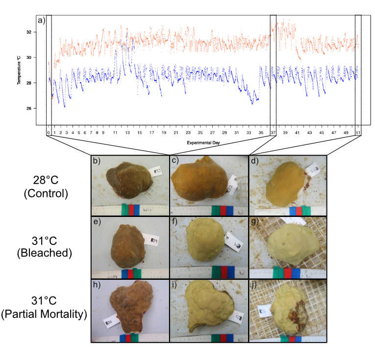

```{r setup, include=FALSE}
knitr::opts_chunk$set(echo = TRUE)
```

## Overview

This markdown includes data, code, figures, and statstics for the physiology analysis of the Porites Rim Bleaching experiment. 



[Air brushing Protocol](https://kevinhwong1.github.io/KevinHWong_Notebook/Airbrushing-Protocol-for-Porites-July-Bleaching-Project/)

[Symbiont density Protocol](https://github.com/urol-e5/protocols/blob/master/2020-01-07-Cell_Density-Protocol.md)

[Chlorophyll Protocol](https://github.com/urol-e5/protocols/blob/master/2020-01-01-Chlorophyll-Protocol.md)

[Total Protein Protocol](https://kevinhwong1.github.io/KevinHWong_Notebook/20210629-Total-Protein-Testing/)

[Carbohydrate Protocol](https://github.com/Putnam-Lab/Lab_Management/tree/master/Lab_Resourses/Physiology_Protocols/Carbohydrates/Bove_Baumann_96well_Protocol)

## Loading libraries and metadata files

```{r Metadata, echo=TRUE, warning=FALSE, message=FALSE}
# load packages
library(dplyr)
library(tidyverse)
library(readr)
library(stringr)
library(gridExtra)
library(grid)
library(ggplot2)
library(lattice)
library(Rmisc)
library(ggpubr)
library(lsmeans)
library("reshape")
library("arsenal")
library(RColorBrewer)
library(lme4)
library(lmerTest)
library(car)
library(effects)
library(ggfortify)
library(cowplot)
library(vegan)
library(corrr)
library(ggcorrplot)
library(GGally)
library(broom)
library(cowplot)
library(RVAideMemoire)
library(mixOmics)
library(factoextra)
library("segmented")
library("plotrix")
library("lubridate")
library(lsmeans)

# Load metadata
vial.meta <- read.csv("../data/Physiology/Vial_Metadata.csv")
frag.meta <- read.csv("../data/Physiology/Airbrush_Metadata.csv")

vial.meta$coral.tp <- paste(vial.meta$Fragment.ID, vial.meta$Timepoint, sep = "-")
frag.meta$coral.tp <- paste(frag.meta$Fragment.ID, frag.meta$Timepoint, sep = "-")

master.meta <- merge(vial.meta, frag.meta, by = "coral.tp")

```


## Endosymbiont Density

```{r Symdensity, echo=TRUE, warning=FALSE, message=FALSE}

#Import Data
Zoox <- read.csv("../data/Physiology/Symbiont_Counts/Symbiont_Counts.csv")

#Calculating cells/Larvae from cells/count
Zoox$Average <- rowMeans(Zoox[ ,3:8]) #averaging counts
Zoox$Cells.mL <- (Zoox$Average/Zoox$Num.Squares)/0.0001 #number of cells per mL - volume of haemocytometer

# Merging metadata

zoox.meta <- merge(Zoox, master.meta, by = "Vial")

#Accounting for homogenate volume 
zoox.meta$Cells.mL.vol <- zoox.meta$Cells.mL * zoox.meta$Homogenate_Vol.mL

#Normalizing to fragment surface area
zoox.meta$Cells.cm2 <- zoox.meta$Cells.mL.vol/zoox.meta$Surface_Area_cm2
zoox.meta$Cells.cm2.x6 <- zoox.meta$Cells.cm2 / 1000000

#Removing metadata columns
zoox.final <- zoox.meta %>%
  dplyr::select("Fragment.ID.y","Day", "Group", "Group", "Cells.cm2.x6")
zoox.final$Day <- as.factor(zoox.final$Day)
zoox.final$Group <- as.factor(zoox.final$Group)
names(zoox.final)[1] <- "Fragment.ID"
write.csv(zoox.final, "../output/Physiology/Zoox.Calc.csv")

```

## Chlorophyll a and c2

```{r chl, echo=TRUE, warning=FALSE, message=FALSE}

# Import data 
chla.raw.0708 <- read.csv("../data/Physiology/Chlorophyll/20210708_Chl.csv")
chla.raw.0716 <- read.csv("../data/Physiology/Chlorophyll/20210716_Chl.csv")

chla.meta <- read.csv("../data/Physiology/Chlorophyll/Chlorophyll_Meta.csv")


# Adding Run number to datasets
chla.raw.0708$Date <- 20210708
chla.raw.0716$Date <- 20210716

# Make a unique column 
chla.raw.0708$date.well <- paste(chla.raw.0708$Date, chla.raw.0708$Well, sep = "-")
chla.raw.0716$date.well <- paste(chla.raw.0716$Date, chla.raw.0716$Well, sep = "-")

chla.meta$date.well <- paste(chla.meta$Date, chla.meta$Well, sep = "-")

# Attaching vial metadata
chla.data.0708 <- merge(chla.raw.0708, chla.meta, by = "date.well")
chla.data.0716 <- merge(chla.raw.0716, chla.meta, by = "date.well")

# Blank 750nm correction for each run separately
Blank.0708 <- chla.data.0708 %>% 
  filter(Sample.Type == "Blank") %>%
  summarise(blk.avg = mean(Chl.750))

Blank.0716 <- chla.data.0716 %>% 
  filter(Sample.Type == "Blank") %>%
  summarise(blk.avg = mean(Chl.750))

# Subtracting 750 (blank) from 630 and 633 values, and accounting for path length (0.584 cm)
chla.data.0708$abs.630.corr <- (chla.data.0708$`Chl.630` - Blank.0708$blk.avg) / 0.584
chla.data.0708$abs.663.corr <- (chla.data.0708$`Chl.663` - Blank.0708$`blk.avg`) / 0.584

chla.data.0716$abs.630.corr <- (chla.data.0716$`Chl.630` - Blank.0716$blk.avg) / 0.584
chla.data.0716$abs.663.corr <- (chla.data.0716$`Chl.663` - Blank.0716$`blk.avg`) / 0.584

# Combining Datasets
chla.data.all <- rbind(chla.data.0708, chla.data.0716)

# Chlorp0hyll A concentration equation 
chla.data.all$chlA.ug.sample <- 11.43*chla.data.all$abs.663.corr - 0.64*chla.data.all$abs.630.corr

# Chlorophyll C2 concentration equation 
chla.data.all$chlC2.ug.sample <- 27.09*chla.data.all$abs.630.corr - 3.63*chla.data.all$abs.663.corr

# Attaching colony metadata
Chla.data.meta <- merge(chla.data.all, master.meta, by = "Vial")

# Standardization
Chla.data.meta$ChlA.ugcm2 <- (Chla.data.meta$chlA.ug.sample * Chla.data.meta$Homogenate_Vol.mL)/Chla.data.meta$Surface_Area_cm2 #Calculating concentration

Chla.data.meta$ChlC2.ugcm2 <- (Chla.data.meta$chlC2.ug.sample * Chla.data.meta$Homogenate_Vol.mL)/Chla.data.meta$Surface_Area_cm2 #Calculating concentration

# Removing well A9-20210716 because of pipette error
Chla.data.meta.clean <- Chla.data.meta %>%
  filter(date.well != "20210716-A9")

# Summarize per vial 
Chla.sum <- summarySE(Chla.data.meta.clean, measurevar="ChlA.ugcm2", groupvars=c("Vial", "Fragment.ID.y", "Day", "Group"))
Chla.sum2 <- Chla.sum %>%
  dplyr::select(Fragment.ID.y, Day, Group, ChlA.ugcm2)

ChlC2.sum <- summarySE(Chla.data.meta.clean, measurevar="ChlC2.ugcm2", groupvars=c("Vial", "Fragment.ID.y", "Day", "Group"))
ChlC2.sum2 <- ChlC2.sum %>%
  dplyr::select(Fragment.ID.y, Day, Group, ChlC2.ugcm2)

Chl.final <- merge(Chla.sum2, ChlC2.sum2, by = c("Fragment.ID.y", "Day", "Group"))

Chl.final$Day <- as.factor(Chl.final$Day)
Chl.final$Group <- as.factor(Chl.final$Group)
names(Chl.final)[1] <- "Fragment.ID"
write.csv(Chl.final, "../output/Physiology/Chl.Calc.csv")

```

## Total Protein

```{r Protein, echo=TRUE, warning=FALSE, message=FALSE}

TP.well.meta <- read.csv("../data/Physiology/Protein/Protein_Well_Meta.csv")

raw_20210701 <- read.csv("../data/Physiology/Protein/20210701_Protein.csv")
raw_20210702 <- read.csv("../data/Physiology/Protein/20210702_Protein.csv")
raw_20210706 <- read.csv("../data/Physiology/Protein/20210706_Protein.csv")
raw_20210707 <- read.csv("../data/Physiology/Protein/20210707_Protein.csv")

# Adding Run numbers into datasets
raw_20210701$run <- "20210701"
raw_20210702$run <- "20210702"
raw_20210706$run <- "20210706"
raw_20210707$run <- "20210707"

# Make a unique column for merging
raw_20210701$run.well <- paste(raw_20210701$run, raw_20210701$Well, sep = "-")
raw_20210702$run.well <- paste(raw_20210702$run, raw_20210702$Well, sep = "-")
raw_20210706$run.well <- paste(raw_20210706$run, raw_20210706$Well, sep = "-")
raw_20210707$run.well <- paste(raw_20210707$run, raw_20210707$Well, sep = "-")

TP.well.meta$run.well <- paste(TP.well.meta$Date, TP.well.meta$Well, sep = "-")

# Merge with metadata
TP.20210701 <- merge(raw_20210701, TP.well.meta, by = "run.well")
TP.20210702 <- merge(raw_20210702, TP.well.meta, by = "run.well")
TP.20210706 <- merge(raw_20210706, TP.well.meta, by = "run.well")
TP.20210707 <- merge(raw_20210707, TP.well.meta, by = "run.well")

# Subtract blanks means for each run 
TP.standardblank.01 <- TP.20210701 %>% 
  filter(Sample.Type == "Blank") %>%
  summarise(blk.avg = mean(X562))
TP.20210701$abs.corr <- TP.20210701$X562 - TP.standardblank.01$blk.avg

TP.standardblank.02 <- TP.20210702 %>% 
  filter(Sample.Type == "Blank") %>%
  summarise(blk.avg = mean(X562))
TP.20210702$abs.corr <- TP.20210702$X562 - TP.standardblank.02$blk.avg

TP.standardblank.06 <- TP.20210706 %>% 
  filter(Sample.Type == "Blank") %>%
  summarise(blk.avg = mean(X562))
TP.20210706$abs.corr <- TP.20210706$X562 - TP.standardblank.06$blk.avg

TP.standardblank.07 <- TP.20210707 %>% 
  filter(Sample.Type == "Blank") %>%
  summarise(blk.avg = mean(X562))
TP.20210707$abs.corr <- TP.20210707$X562 - TP.standardblank.07$blk.avg

# Run standards
TP.standard.01 <- TP.20210701 %>% 
  filter(Sample.Type == "Standard") 

TP.plot.S1<- ggplot(data = TP.standard.01, aes(x=Concentration, y=abs.corr))+
  ylab("Absorbance (nm)")+ xlab("Concentration") + 
  geom_point()+
  geom_smooth(method = "lm") +
  stat_regline_equation(label.y = 2.0, aes(label = ..eq.label..)) +
  stat_regline_equation(label.y = 1.75, aes(label = ..rr.label..)) +
  theme_bw() + theme(panel.border = element_blank(), panel.grid.major = element_blank(),
                     panel.grid.minor = element_blank(), axis.line = element_line(colour = "black")) +
  theme(axis.text.x = element_text(angle = 45, hjust = 1))
TP.plot.S1

TP.lmstandard.01 <- lm (Concentration ~ abs.corr, data = TP.standard.01)
TP.lmsummary.01 <- summary(TP.lmstandard.01)


TP.standard.02 <- TP.20210702 %>% 
  filter(Sample.Type == "Standard") 

TP.plot.S2<- ggplot(data = TP.standard.02, aes(x=Concentration, y=abs.corr))+
  ylab("Absorbance (nm)")+ xlab("Concentration") + 
  geom_point()+
  geom_smooth(method = "lm") +
  stat_regline_equation(label.y = 2.0, aes(label = ..eq.label..)) +
  stat_regline_equation(label.y = 1.75, aes(label = ..rr.label..)) +
  theme_bw() + theme(panel.border = element_blank(), panel.grid.major = element_blank(),
                     panel.grid.minor = element_blank(), axis.line = element_line(colour = "black")) +
  theme(axis.text.x = element_text(angle = 45, hjust = 1))
TP.plot.S2

TP.lmstandard.02 <- lm (Concentration ~ abs.corr, data = TP.standard.02)
TP.lmsummary.02 <- summary(TP.lmstandard.02)

TP.standard.06 <- TP.20210706 %>% 
  filter(Sample.Type == "Standard") 

TP.plot.S6<- ggplot(data = TP.standard.06, aes(x=Concentration, y=abs.corr))+
  ylab("Absorbance (nm)")+ xlab("Concentration") + 
  geom_point()+
  geom_smooth(method = "lm") +
  stat_regline_equation(label.y = 2.0, aes(label = ..eq.label..)) +
  stat_regline_equation(label.y = 1.75, aes(label = ..rr.label..)) +
  theme_bw() + theme(panel.border = element_blank(), panel.grid.major = element_blank(),
                     panel.grid.minor = element_blank(), axis.line = element_line(colour = "black")) +
  theme(axis.text.x = element_text(angle = 45, hjust = 1))
TP.plot.S6

TP.lmstandard.06 <- lm (Concentration ~ abs.corr, data = TP.standard.06)
TP.lmsummary.06 <- summary(TP.lmstandard.06)


TP.standard.07 <- TP.20210707 %>% 
  filter(Sample.Type == "Standard") 

TP.plot.S7<- ggplot(data = TP.standard.07, aes(x=Concentration, y=abs.corr))+
  ylab("Absorbance (nm)")+ xlab("Concentration") + 
  geom_point()+
  geom_smooth(method = "lm") +
  stat_regline_equation(label.y = 2.0, aes(label = ..eq.label..)) +
  stat_regline_equation(label.y = 1.75, aes(label = ..rr.label..)) +
  theme_bw() + theme(panel.border = element_blank(), panel.grid.major = element_blank(),
                     panel.grid.minor = element_blank(), axis.line = element_line(colour = "black")) +
  theme(axis.text.x = element_text(angle = 45, hjust = 1))
TP.plot.S7

TP.lmstandard.07 <- lm (Concentration ~ abs.corr, data = TP.standard.07)
TP.lmsummary.07 <- summary(TP.lmstandard.07)


# Extrapolate concentration values

TP.Sample.01 <- TP.20210701 %>% #subsetting Samples
  filter(Sample.Type == "Sample") 
TP.Sample.01$ConcentrationS <- predict(TP.lmstandard.01, newdata = TP.Sample.01) #using model to get concentration

TP.Sample.02 <- TP.20210702 %>% #subsetting Samples
  filter(Sample.Type == "Sample") 
TP.Sample.02$ConcentrationS <- predict(TP.lmstandard.02, newdata = TP.Sample.02) #using model to get concentration

TP.Sample.06 <- TP.20210706 %>% #subsetting Samples
  filter(Sample.Type == "Sample") 
TP.Sample.06$ConcentrationS <- predict(TP.lmstandard.06, newdata = TP.Sample.06) #using model to get concentration

TP.Sample.07 <- TP.20210707 %>% #subsetting Samples
  filter(Sample.Type == "Sample") 
TP.Sample.07$ConcentrationS <- predict(TP.lmstandard.07, newdata = TP.Sample.07) #using model to get concentration

# Row Bind DFs together
TP.all <- rbind(TP.Sample.01, TP.Sample.02, TP.Sample.06, TP.Sample.07)

# Adding metadata
TP.all.meta <- merge(TP.all, master.meta, by = "Vial")

# Standardization 
TP.all.meta$Total.Protein.ugcm2 <- (TP.all.meta$ConcentrationS * TP.all.meta$Homogenate_Vol.mL*1.45)/TP.all.meta$Surface_Area_cm2 #Calculating concentration. 1.45 = Dilution factor of acid+base in sample
TP.all.meta$Total.Protein.mgcm2 <- TP.all.meta$Total.Protein.ugcm2/1000 

# Summarize per vial 
TP.sum <- summarySE(TP.all.meta, measurevar="Total.Protein.mgcm2", groupvars=c("Vial", "Fragment.ID.y", "Day", "Group", "Type"))
TP.sum2 <- TP.sum %>%
  dplyr::select(Fragment.ID.y, Day, Group, Type, Total.Protein.mgcm2)

# Converting long to wide format
TP.final<- TP.sum2 %>% 
  pivot_wider(names_from = Type, values_from = Total.Protein.mgcm2)

# Calculating Host to Symbiont Ratio
TP.final$HostSymRatioProtein <- TP.final$Coral / TP.final$Symbiont

# Renaming columns 

TP.final2 <- TP.final %>%
  dplyr::rename(Coral_Protein_mgcm2 = Coral, 
         Symbiont_Protein_mgcm2 = Symbiont)

TP.final2$Day <- as.factor(TP.final2$Day)
TP.final2$Group <- as.factor(TP.final2$Group)
names(TP.final2)[1] <- "Fragment.ID"
write.csv(TP.final2, "../output/Physiology/Protein.Calc.csv")

```

## Carbohydrate

```{r Carbs, echo=TRUE, warning=FALSE, message=FALSE}

# Read in datafiles

carb.data.0715 <- read.csv("../data/Physiology/Carbohydrate/20210715_Carb.csv")
carb.data.0716 <- read.csv("../data/Physiology/Carbohydrate/20210716_Carb.csv")
carb.data.0719_1 <- read.csv("../data/Physiology/Carbohydrate/20210719-1_Carb.csv")
carb.data.0719_2 <- read.csv("../data/Physiology/Carbohydrate/20210719-2_Carb.csv")

carb.meta <- read.csv("../data/Physiology/Carbohydrate/Carb_Meta.csv")

# Adding a date column

carb.data.0715$Date <- "20210715"
carb.data.0716$Date <- "20210716"
carb.data.0719_1$Date <- "20210719-1"
carb.data.0719_2$Date <- "20210719-2"
  
# Making unique columns by date/well

carb.data.0715$date.well <- paste(carb.data.0715$Date, carb.data.0715$Well, sep = "-")
carb.data.0716$date.well <- paste(carb.data.0716$Date, carb.data.0716$Well, sep = "-")
carb.data.0719_1$date.well <- paste(carb.data.0719_1$Date, carb.data.0719_1$Well, sep = "-")
carb.data.0719_2$date.well <- paste(carb.data.0719_2$Date, carb.data.0719_2$Well, sep = "-")

carb.meta$date.well <- paste(carb.meta$Date, carb.meta$Well, sep = "-")

# Merging Metadata 

carb.data.meta.0715 <- merge(carb.data.0715, carb.meta, by = "date.well") #has standard
carb.data.meta.0716 <- merge(carb.data.0716, carb.meta, by = "date.well") #use 0715 standard
carb.data.meta.0719_1 <- merge(carb.data.0719_1, carb.meta, by = "date.well") #has standard
carb.data.meta.0719_2 <- merge(carb.data.0719_2, carb.meta, by = "date.well") #use 0719-1 standard

# Blank correction for each corresponding run 

Blank.0715 <- carb.data.meta.0715 %>% 
  filter(Sample.Type == "Blank") %>%
  summarise(blk.avg = mean(X485))

carb.data.meta.0715$abs.corr <- carb.data.meta.0715$X485 - Blank.0715$blk.avg
carb.data.meta.0716$abs.corr <- carb.data.meta.0716$X485 - Blank.0715$blk.avg

Blank.0719 <- carb.data.meta.0719_1 %>% 
  filter(Sample.Type == "Blank") %>%
  summarise(blk.avg = mean(X485))

carb.data.meta.0719_1$abs.corr <- carb.data.meta.0719_1$X485 - Blank.0719$blk.avg
carb.data.meta.0719_2$abs.corr <- carb.data.meta.0719_2$X485 - Blank.0719$blk.avg


# Standard curve 

Standard.0715 <- carb.data.meta.0715 %>% 
  filter(Sample.Type == "Standard") 

Standard.0715.plot <- ggplot(data = Standard.0715, aes(x=Concentration, y=abs.corr))+
  ylab("Absorbance (nm)")+ xlab("Carbohydrate (mg/mL)") + 
  geom_point()+
  geom_smooth(method = "lm") +
  stat_regline_equation(label.y = 1.0, aes(label = ..eq.label..)) +
  stat_regline_equation(label.y = 0.75, aes(label = ..rr.label..)) +
  theme_bw() + theme(panel.border = element_blank(), panel.grid.major = element_blank(),
                     panel.grid.minor = element_blank(), axis.line = element_line(colour = "black")) +
  theme(axis.text.x = element_text(angle = 45, hjust = 1))
Standard.0715.plot

lmstandard.0715 <- lm (Concentration ~ abs.corr, data = Standard.0715)
lmsummary.0715 <- summary(lmstandard.0715) 


Standard.0719 <- carb.data.meta.0719_1 %>% 
  filter(Sample.Type == "Standard") 

Standard.0719.plot <- ggplot(data = Standard.0719, aes(x=Concentration, y=abs.corr))+
  ylab("Absorbance (nm)")+ xlab("Carbohydrate (mg/mL)") + 
  geom_point()+
  geom_smooth(method = "lm") +
  stat_regline_equation(label.y = 1.0, aes(label = ..eq.label..)) +
  stat_regline_equation(label.y = 0.75, aes(label = ..rr.label..)) +
  theme_bw() + theme(panel.border = element_blank(), panel.grid.major = element_blank(),
                     panel.grid.minor = element_blank(), axis.line = element_line(colour = "black")) +
  theme(axis.text.x = element_text(angle = 45, hjust = 1))
Standard.0719.plot

lmstandard.0719 <- lm (Concentration ~ abs.corr, data = Standard.0719)
lmsummary.0719 <- summary(lmstandard.0719) 

# Obtaining concentration values from standard curve

Samples.0715 <- carb.data.meta.0715 %>% #subsetting Samples
  filter(Sample.Type == "Sample") 
Samples.0715$Concentration <- predict(lmstandard.0715, newdata = Samples.0715) #using model to get concentration

Samples.0716 <- carb.data.meta.0716 %>% #subsetting Samples
  filter(Sample.Type == "Sample") 
Samples.0716$Concentration <- predict(lmstandard.0715, newdata = Samples.0716) #using model to get concentration

Samples.0719_1 <- carb.data.meta.0719_1 %>% #subsetting Samples
  filter(Sample.Type == "Sample") 
Samples.0719_1$Concentration <- predict(lmstandard.0719, newdata = Samples.0719_1) #using model to get concentration

Samples.0719_2 <- carb.data.meta.0719_2 %>% #subsetting Samples
  filter(Sample.Type == "Sample") 
Samples.0719_2$Concentration <- predict(lmstandard.0719, newdata = Samples.0719_2) #using model to get concentration

# Merging metadata 

Samples.carb.all <- rbind(Samples.0715, Samples.0716, Samples.0719_1, Samples.0719_2)

samples.carb.meta <- merge(Samples.carb.all, master.meta, by = "Vial")

# Accounting for dilution factor (1000/10) and Normalizing to homogenate volume and surface area

samples.carb.meta$Carb.mgcm2 <- (samples.carb.meta$Concentration * samples.carb.meta$Homogenate_Vol.mL * 10)/samples.carb.meta$Surface_Area_cm2 

#Summarize per vial 
carb.sum <- summarySE(samples.carb.meta, measurevar="Carb.mgcm2", groupvars=c("Vial", "Fragment.ID.y", "Day", "Group", "Type"))
carb.sum2 <- carb.sum %>%
  dplyr::select(Fragment.ID.y, Day, Group, Type, Carb.mgcm2)

# Converting long to wide format
Carb.final<- carb.sum2 %>% 
  pivot_wider(names_from = Type, values_from = Carb.mgcm2)

# Calculating Host to Symbiont Ratio
Carb.final$HostSymRatioCarb <- Carb.final$Coral / Carb.final$Symbiont

# Renaming columns 

Carb.final2 <- Carb.final %>%
  dplyr::rename(Coral_Carb_mgcm2 = Coral, 
                Symbiont_Carb_mgcm2 = Symbiont)

Carb.final2$Day <- as.factor(Carb.final2$Day)
Carb.final2$Group <- as.factor(Carb.final2$Group)
names(Carb.final2)[1] <- "Fragment.ID"
write.csv(Carb.final2, "../output/Physiology/Carb.Calc.csv")

```

## Master Datasheet and Normalizations

```{r Mastersheet, echo=TRUE, warning=FALSE, message=FALSE}

resp_dataset <- read.csv("../output/Physiology/Resp.Calc.csv")
carb_dataset <- read.csv("../output/Physiology/Carb.Calc.csv")
prot_dataset <- read.csv("../output/Physiology/Protein.Calc.csv")
sym_dataset <- read.csv("../output/Physiology/Zoox.Calc.csv")
chl_dataset <- read.csv("../output/Physiology/Chl.Calc.csv")
frag.meta <- read.csv("../data/Physiology/Airbrush_Metadata.csv")

#selecting SA column 

frag.sa <- frag.meta %>%
  dplyr::select(Fragment.ID, Day, Group, Surface_Area_cm2)

# Joining datasets

dfs <- list(resp_dataset,
            carb_dataset,
            prot_dataset,
            sym_dataset,
            chl_dataset, 
            frag.sa)

master <- join_all(dfs, by=c("Fragment.ID", "Day", "Group")) %>%
  dplyr::select(-ends_with("X"))

# Normalization to per sym cell 

master$Cells <- master$Cells.cm2.x6 * master$Surface_Area_cm2 * 1000000 # getting absolute number of cells 
master$ChlA.ugcell <- ((master$ChlA.ugcm2*master$Surface_Area_cm2) / (master$Cells)) 
master$ChlC2.ugcell <- ((master$ChlC2.ugcm2*master$Surface_Area_cm2) / (master$Cells))
master$Carb.mgcell <- ((master$Symbiont_Carb_mgcm2*master$Surface_Area_cm2) / (master$Cells))
master$Protein.mgcell <- ((master$Symbiont_Protein_mgcm2*master$Surface_Area_cm2) / (master$Cells))

  
master$Day <- as.factor(master$Day)
master$Group <- as.factor(master$Group)
master$Fragment.ID <- as.factor(master$Fragment.ID)

master
```

## Boxplots and statistics

```{r BoxplotStat, echo=TRUE, warning=FALSE, message=FALSE}

###############################

TP_Coral_Box <- ggplot(master, aes(x=Day, y=Coral_Protein_mgcm2, fill = Group)) +
  geom_boxplot(width=.5, outlier.shape= NA, position = position_dodge(width = 0.5)) +
  stat_summary(fun=mean, geom="line", aes(group=Group, color = Group), position = position_dodge(width = 0.5))  + 
  #  stat_summary(fun=mean, geom="point")
  geom_point(pch = 21, position=position_jitterdodge(dodge.width=0.5)) +
  #  ylim(0,0.5) +
  scale_fill_manual(values=c("#E7B800", "#00AFBB", "#FC4E07")) +
  scale_color_manual(values=c("#E7B800", "#00AFBB", "#FC4E07")) + 
  scale_x_discrete(labels=c("0" = "Day 0", "37" = "Day 37", "52" = "Day 52")) +
  xlab("Timepoint") +  ylab(expression("Total Protein " (mg~cm^{-2}))) + #Axis titles
  theme_bw() + theme(panel.border = element_rect(color="black", fill=NA, size=0.75), panel.grid.major = element_blank(), #Makes background theme white
                     panel.grid.minor = element_blank(), axis.line = element_blank()) +
  theme(axis.text = element_text(size = 15, color = "black"),
        axis.title = element_text(size = 18, color = "black")) + ggtitle("Coral Total Protein")
TP_Coral_Box

TP_Coral_lmer <- lmer(Coral_Protein_mgcm2~Group*Day+(1|Fragment.ID), data = master)
# qqnorm(resid(TP_Coral_lmer))
# qqline(resid(TP_Coral_lmer))
# 
# boxplot(resid(TP_Coral_lmer)~master$Group)
# boxplot(resid(TP_Coral_lmer)~master$Day)
anova(TP_Coral_lmer, type="II")

#capture.output(anova(TP_Coral_lmer, type="II"), file = "../output/Statistics/TP_Coral_lmer.csv")

###############################

TP_Sym_SA_Box <- ggplot(master, aes(x=Day, y=Symbiont_Protein_mgcm2, fill = Group)) +
  geom_boxplot(width=.5, outlier.shape= NA, position = position_dodge(width = 0.5)) +
  stat_summary(fun=mean, geom="line", aes(group=Group, color = Group), position = position_dodge(width = 0.5))  + 
  #  stat_summary(fun=mean, geom="point")
  geom_point(pch = 21, position=position_jitterdodge(dodge.width=0.5)) +
  #  ylim(0,0.5) +
  scale_fill_manual(values=c("#E7B800", "#00AFBB", "#FC4E07")) +
  scale_color_manual(values=c("#E7B800", "#00AFBB", "#FC4E07")) + 
  scale_x_discrete(labels=c("0" = "Day 0", "37" = "Day 37", "52" = "Day 52")) +
  xlab("Timepoint") +  ylab(expression("Total Protein " (mg~cm^{-2}))) + #Axis titles
  theme_bw() + theme(panel.border = element_rect(color="black", fill=NA, size=0.75), panel.grid.major = element_blank(), #Makes background theme white
                     panel.grid.minor = element_blank(), axis.line = element_blank()) +
  theme(axis.text = element_text(size = 15, color = "black"),
        axis.title = element_text(size = 18, color = "black")) + ggtitle("Symbiont Total Protein (per cm2)")
TP_Sym_SA_Box

TP_Sym_lmer <- lmer(Symbiont_Protein_mgcm2~Group*Day+(1|Fragment.ID), data = master)
# qqnorm(resid(TP_Sym_lmer))
# qqline(resid(TP_Sym_lmer))
# 
# boxplot(resid(TP_Sym_lmer)~master$Group)
# boxplot(resid(TP_Sym_lmer)~master$Day)
anova(TP_Sym_lmer, type="II")

#capture.output(anova(TP_Sym_lmer, type="II"), file = "../output/Statistics/TP_Sym_lmer.csv")

###############################

TP_Sym_Cell_Box <- ggplot(master, aes(x=Day, y=Protein.mgcell, fill = Group)) +
  geom_boxplot(width=.5, outlier.shape= NA, position = position_dodge(width = 0.5)) +
  stat_summary(fun=mean, geom="line", aes(group=Group, color = Group), position = position_dodge(width = 0.5))  + 
  #  stat_summary(fun=mean, geom="point")
  geom_point(pch = 21, position=position_jitterdodge(dodge.width=0.5)) +
  #  ylim(0,0.5) +
  scale_fill_manual(values=c("#E7B800", "#00AFBB", "#FC4E07")) +
  scale_color_manual(values=c("#E7B800", "#00AFBB", "#FC4E07")) + 
  scale_x_discrete(labels=c("0" = "Day 0", "37" = "Day 37", "52" = "Day 52")) +
  xlab("Timepoint") +  ylab(expression("Total Protein " (mg~cell^{-1}))) + #Axis titles
  theme_bw() + theme(panel.border = element_rect(color="black", fill=NA, size=0.75), panel.grid.major = element_blank(), #Makes background theme white
                     panel.grid.minor = element_blank(), axis.line = element_blank()) +
  theme(axis.text = element_text(size = 15, color = "black"),
        axis.title = element_text(size = 18, color = "black")) + ggtitle("Symbiont Total Protein (per cell)")
TP_Sym_Cell_Box

TP_Sym_lmer <- lmer(Symbiont_Protein_mgcm2~Group*Day+(1|Fragment.ID), data = master)
# qqnorm(resid(TP_Sym_lmer))
# qqline(resid(TP_Sym_lmer))
# 
# boxplot(resid(TP_Sym_lmer)~master$Group)
# boxplot(resid(TP_Sym_lmer)~master$Day)
anova(TP_Sym_lmer, type="II")

#capture.output(anova(TP_Sym_lmer, type="II"), file = "../output/Statistics/TP_Sym_lmer.csv")

###############################

TP_CS_Box <- ggplot(master, aes(x=Day, y=HostSymRatioProtein, fill = Group)) +
  geom_boxplot(width=.5, outlier.shape= NA, position = position_dodge(width = 0.5)) +
  stat_summary(fun=mean, geom="line", aes(group=Group, color = Group), position = position_dodge(width = 0.5))  + 
  #  stat_summary(fun=mean, geom="point")
  geom_point(pch = 21, position=position_jitterdodge(dodge.width=0.5)) +
  #  ylim(0,0.5) +
  scale_fill_manual(values=c("#E7B800", "#00AFBB", "#FC4E07")) +
  scale_color_manual(values=c("#E7B800", "#00AFBB", "#FC4E07")) + 
  scale_x_discrete(labels=c("0" = "Day 0", "37" = "Day 37", "52" = "Day 52")) +
  xlab("Timepoint") +  ylab("Coral to Symbiont Ratio (Total Protein)") + #Axis titles
  theme_bw() + theme(panel.border = element_rect(color="black", fill=NA, size=0.75), panel.grid.major = element_blank(), #Makes background theme white
                     panel.grid.minor = element_blank(), axis.line = element_blank()) +
  theme(axis.text = element_text(size = 15, color = "black"),
        axis.title = element_text(size = 18, color = "black")) + ggtitle("Host to Symbiont Ratio of Total Protein")
TP_CS_Box

TP_CS_lmer <- lmer(HostSymRatioProtein~Group*Day+(1|Fragment.ID), data = master)
# qqnorm(resid(TP_CS_lmer))
# qqline(resid(TP_CS_lmer))
# 
# boxplot(resid(TP_CS_lmer)~master$Group)
# boxplot(resid(TP_CS_lmer)~master$Day)
anova(TP_CS_lmer, type="II")

#capture.output(anova(TP_CS_lmer, type="II"), file = "../output/Statistics/TP_CS_lmer.csv")

###############################

Sym_Box <- ggplot(master, aes(x=Day, y=Cells.cm2.x6, fill = Group)) +
  geom_boxplot(width=.5, outlier.shape= NA, position = position_dodge(width = 0.5)) +
  stat_summary(fun=mean, geom="line", aes(group=Group, color = Group), position = position_dodge(width = 0.5))  + 
  #  stat_summary(fun=mean, geom="point")
  geom_point(pch = 21, position=position_jitterdodge(dodge.width=0.5)) +
  #  ylim(0,0.5) +
  scale_fill_manual(values=c("#E7B800", "#00AFBB", "#FC4E07")) +
  scale_color_manual(values=c("#E7B800", "#00AFBB", "#FC4E07")) + 
  scale_x_discrete(labels=c("0" = "Day 0", "37" = "Day 37", "52" = "Day 52")) +
  xlab("Timepoint") +  ylab(expression("Cell Density " (10^{6} ~ cm^{-2})))+ #label y axis + #Axis titles
  theme_bw() + theme(panel.border = element_rect(color="black", fill=NA, size=0.75), panel.grid.major = element_blank(), #Makes background theme white
                     panel.grid.minor = element_blank(), axis.line = element_blank()) +
  theme(axis.text = element_text(size = 15, color = "black"),
        axis.title = element_text(size = 18, color = "black"))+ ggtitle("Endosymbiont Cell Density (x10^6)")
Sym_Box

Sym_lmer <- lmer(Cells.cm2.x6~Group*Day+(1|Fragment.ID), data = master)
# qqnorm(resid(Sym_lmer))
# qqline(resid(Sym_lmer))
# 
# boxplot(resid(Sym_lmer)~master$Group)
# boxplot(resid(Sym_lmer)~master$Day)
anova(Sym_lmer, type="II")

#capture.output(anova(Sym_lmer, type="II"), file = "../output/Statistics/Sym_lmer.csv")

#################################

Chla_SA_Box <- ggplot(master, aes(x=Day, y=ChlA.ugcm2, fill = Group)) +
  geom_boxplot(width=.5, outlier.shape= NA, position = position_dodge(width = 0.5)) +
  stat_summary(fun=mean, geom="line", aes(group=Group, color = Group), position = position_dodge(width = 0.5))  + 
  #  stat_summary(fun=mean, geom="point")
  geom_point(pch = 21, position=position_jitterdodge(dodge.width=0.5)) +
  #  ylim(0,0.5) +
  scale_fill_manual(values=c("#E7B800", "#00AFBB", "#FC4E07")) +
  scale_color_manual(values=c("#E7B800", "#00AFBB", "#FC4E07")) + 
  scale_x_discrete(labels=c("0" = "Day 0", "37" = "Day 37", "52" = "Day 52")) +
  xlab("Timepoint") +  ylab(expression("Chlorophyll a " (ug ~ cm^{-2})))+ #label y axis + #Axis titles
  theme_bw() + theme(panel.border = element_rect(color="black", fill=NA, size=0.75), panel.grid.major = element_blank(), #Makes background theme white
                     panel.grid.minor = element_blank(), axis.line = element_blank()) +
  theme(axis.text = element_text(size = 15, color = "black"),
        axis.title = element_text(size = 18, color = "black")) + ggtitle("Chlorophyll a (per cm2)")
Chla_SA_Box

Chla_SA_lmer <- lmer(ChlA.ugcm2~Group*Day+(1|Fragment.ID), data = master)
# qqnorm(resid(Chla_SA_lmer))
# qqline(resid(Chla_SA_lmer)) # double check normality
# 
# boxplot(resid(Chla_SA_lmer)~master$Group)
# boxplot(resid(Chla_SA_lmer)~master$Day)
anova(Chla_SA_lmer, type="II")

#capture.output(anova(Chla_SA_lmer, type="II"), file = "../output/Statistics/Chla_SA_lmer.csv")

#################################

ChlC2_SA_Box <- ggplot(master, aes(x=Day, y=ChlC2.ugcm2, fill = Group)) +
  geom_boxplot(width=.5, outlier.shape= NA, position = position_dodge(width = 0.5)) +
  stat_summary(fun=mean, geom="line", aes(group=Group, color = Group), position = position_dodge(width = 0.5))  + 
  #  stat_summary(fun=mean, geom="point")
  geom_point(pch = 21, position=position_jitterdodge(dodge.width=0.5)) +
  #  ylim(0,0.5) +
  scale_fill_manual(values=c("#E7B800", "#00AFBB", "#FC4E07")) +
  scale_color_manual(values=c("#E7B800", "#00AFBB", "#FC4E07")) + 
  scale_x_discrete(labels=c("0" = "Day 0", "37" = "Day 37", "52" = "Day 52")) +
  xlab("Timepoint") +  ylab(expression("Chlorophyll c2 " (ug ~ cm^{-2})))+ #label y axis + #Axis titles
  theme_bw() + theme(panel.border = element_rect(color="black", fill=NA, size=0.75), panel.grid.major = element_blank(), #Makes background theme white
                     panel.grid.minor = element_blank(), axis.line = element_blank()) +
  theme(axis.text = element_text(size = 15, color = "black"),
        axis.title = element_text(size = 18, color = "black")) + ggtitle("Chlorophyll c2 (per cm2)")
ChlC2_SA_Box

ChlC2_SA_lmer <- lmer(ChlC2.ugcm2~Group*Day+(1|Fragment.ID), data = master)
# qqnorm(resid(ChlC2_SA_lmer))
# qqline(resid(ChlC2_SA_lmer)) # double check normality
# 
# boxplot(resid(ChlC2_SA_lmer)~master$Group)
# boxplot(resid(ChlC2_SA_lmer)~master$Day)
anova(ChlC2_SA_lmer, type="II")

#capture.output(anova(ChlC2_SA_lmer, type="II"), file = "../output/Statistics/ChlC2_SA_lmer.csv")

#################################

Chla_cell_Box <- ggplot(master, aes(x=Day, y=ChlA.ugcell, fill = Group)) +
  geom_boxplot(width=.5, outlier.shape= NA, position = position_dodge(width = 0.5)) +
  stat_summary(fun=mean, geom="line", aes(group=Group, color = Group), position = position_dodge(width = 0.5))  + 
  #  stat_summary(fun=mean, geom="point")
  geom_point(pch = 21, position=position_jitterdodge(dodge.width=0.5)) +
  #  ylim(0,0.5) +
  scale_fill_manual(values=c("#E7B800", "#00AFBB", "#FC4E07")) +
  scale_color_manual(values=c("#E7B800", "#00AFBB", "#FC4E07")) + 
  scale_x_discrete(labels=c("0" = "Day 0", "37" = "Day 37", "52" = "Day 52")) +
  xlab("Timepoint") +  ylab(expression("Chlorophyll a " (ug ~ cell^{-1})))+ #label y axis + #Axis titles
  theme_bw() + theme(panel.border = element_rect(color="black", fill=NA, size=0.75), panel.grid.major = element_blank(), #Makes background theme white
                     panel.grid.minor = element_blank(), axis.line = element_blank()) +
  theme(axis.text = element_text(size = 15, color = "black"),
        axis.title = element_text(size = 18, color = "black")) + ggtitle("Chlorophyll a (per cell)")
Chla_cell_Box

Chla_cell_lmer <- lmer(ChlA.ugcell~Group*Day+(1|Fragment.ID), data = master)
# qqnorm(resid(Chla_cell_lmer))
# qqline(resid(Chla_cell_lmer)) # double check normality
# 
# boxplot(resid(Chla_cell_lmer)~master$Group)
# boxplot(resid(Chla_cell_lmer)~master$Day)
anova(Chla_cell_lmer, type="II")

#capture.output(anova(Chla_cell_lmer, type="II"), file = "../output/Statistics/Chla_cell_lmer.csv")

#################################

ChlC2_cell_Box <- ggplot(master, aes(x=Day, y=ChlC2.ugcell, fill = Group)) +
  geom_boxplot(width=.5, outlier.shape= NA, position = position_dodge(width = 0.5)) +
  stat_summary(fun=mean, geom="line", aes(group=Group, color = Group), position = position_dodge(width = 0.5))  + 
  #  stat_summary(fun=mean, geom="point")
  geom_point(pch = 21, position=position_jitterdodge(dodge.width=0.5)) +
  #  ylim(0,0.5) +
  scale_fill_manual(values=c("#E7B800", "#00AFBB", "#FC4E07")) +
  scale_color_manual(values=c("#E7B800", "#00AFBB", "#FC4E07")) + 
  scale_x_discrete(labels=c("0" = "Day 0", "37" = "Day 37", "52" = "Day 52")) +
  xlab("Timepoint") +  ylab(expression("Chlorophyll c2 " (ug ~ cell^{-1})))+ #label y axis + #Axis titles
  theme_bw() + theme(panel.border = element_rect(color="black", fill=NA, size=0.75), panel.grid.major = element_blank(), #Makes background theme white
                     panel.grid.minor = element_blank(), axis.line = element_blank()) +
  theme(axis.text = element_text(size = 15, color = "black"),
        axis.title = element_text(size = 18, color = "black")) + ggtitle("Chlorophyll C2 (per cell)")
ChlC2_cell_Box

ChlC2_cell_lmer <- lmer(ChlC2.ugcell~Group*Day+(1|Fragment.ID), data = master)
# qqnorm(resid(ChlC2_cell_lmer))
# qqline(resid(ChlC2_cell_lmer)) # double check normality
# 
# boxplot(resid(ChlC2_cell_lmer)~master$Group)
# boxplot(resid(ChlC2_cell_lmer)~master$Day)
anova(ChlC2_cell_lmer, type="II")

#capture.output(anova(ChlC2_cell_lmer, type="II"), file = "../output/Statistics/ChlC2_cell_lmer.csv")

#################################

Carb_Coral_Box <- ggplot(master, aes(x=Day, y=Coral_Carb_mgcm2, fill = Group)) +
  geom_boxplot(width=.5, outlier.shape= NA, position = position_dodge(width = 0.5)) +
  stat_summary(fun=mean, geom="line", aes(group=Group, color = Group), position = position_dodge(width = 0.5))  + 
  #  stat_summary(fun=mean, geom="point")
  geom_point(pch = 21, position=position_jitterdodge(dodge.width=0.5)) +
  #  ylim(0,0.5) +
  scale_fill_manual(values=c("#E7B800", "#00AFBB", "#FC4E07")) +
  scale_color_manual(values=c("#E7B800", "#00AFBB", "#FC4E07")) + 
  scale_x_discrete(labels=c("0" = "Day 0", "37" = "Day 37", "52" = "Day 52")) +
  xlab("Timepoint") +  ylab(expression("Total Carbohydrate " (mg~cm^{-2}))) + #Axis titles
  theme_bw() + theme(panel.border = element_rect(color="black", fill=NA, size=0.75), panel.grid.major = element_blank(), #Makes background theme white
                     panel.grid.minor = element_blank(), axis.line = element_blank()) +
  theme(axis.text = element_text(size = 15, color = "black"),
        axis.title = element_text(size = 18, color = "black")) + ggtitle("Coral Total Carbohydrate (per cm2)")
Carb_Coral_Box

Carb_Coral_lmer <- lmer(Coral_Carb_mgcm2~Group*Day+(1|Fragment.ID), data = master)
# qqnorm(resid(Carb_Coral_lmer))
# qqline(resid(Carb_Coral_lmer)) # double check normality
# 
# boxplot(resid(Carb_Coral_lmer)~master$Group)
# boxplot(resid(Carb_Coral_lmer)~master$Day)
anova(Carb_Coral_lmer, type="II")

#capture.output(anova(Carb_Coral_lmer, type="II"), file = "../output/Statistics/Carb_Coral_lmer.csv")

#################################

Carb_Sym_SA_Box <- ggplot(master, aes(x=Day, y=Symbiont_Carb_mgcm2, fill = Group)) +
  geom_boxplot(width=.5, outlier.shape= NA, position = position_dodge(width = 0.5)) +
  stat_summary(fun=mean, geom="line", aes(group=Group, color = Group), position = position_dodge(width = 0.5))  + 
  #  stat_summary(fun=mean, geom="point")
  geom_point(pch = 21, position=position_jitterdodge(dodge.width=0.5)) +
  #  ylim(0,0.5) +
  scale_fill_manual(values=c("#E7B800", "#00AFBB", "#FC4E07")) +
  scale_color_manual(values=c("#E7B800", "#00AFBB", "#FC4E07")) + 
  scale_x_discrete(labels=c("0" = "Day 0", "37" = "Day 37", "52" = "Day 52")) +
  xlab("Timepoint") +  ylab(expression("Total Carbohydrate " (mg~cm^{-2}))) + #Axis titles
  theme_bw() + theme(panel.border = element_rect(color="black", fill=NA, size=0.75), panel.grid.major = element_blank(), #Makes background theme white
                     panel.grid.minor = element_blank(), axis.line = element_blank()) +
  theme(axis.text = element_text(size = 15, color = "black"),
        axis.title = element_text(size = 18, color = "black"))  + ggtitle("Symbiont Total Carbohydrate (per cm2)")
Carb_Sym_SA_Box

Carb_Sym_SA_lmer <- lmer(Symbiont_Carb_mgcm2~Group*Day+(1|Fragment.ID), data = master)
# qqnorm(resid(Carb_Sym_SA_lmer))
# qqline(resid(Carb_Sym_SA_lmer)) # double check normality
# 
# boxplot(resid(Carb_Sym_SA_lmer)~master$Group)
# boxplot(resid(Carb_Sym_SA_lmer)~master$Day)
anova(Carb_Sym_SA_lmer, type="II")

#capture.output(anova(Carb_Sym_SA_lmer, type="II"), file = "../output/Statistics/Carb_Sym_SA_lmer.csv")

#################################

Carb_Sym_Cell_Box <- ggplot(master, aes(x=Day, y=Carb.mgcell, fill = Group)) +
  geom_boxplot(width=.5, outlier.shape= NA, position = position_dodge(width = 0.5)) +
  stat_summary(fun=mean, geom="line", aes(group=Group, color = Group), position = position_dodge(width = 0.5))  + 
  #  stat_summary(fun=mean, geom="point")
  geom_point(pch = 21, position=position_jitterdodge(dodge.width=0.5)) +
  #  ylim(0,0.5) +
  scale_fill_manual(values=c("#E7B800", "#00AFBB", "#FC4E07")) +
  scale_color_manual(values=c("#E7B800", "#00AFBB", "#FC4E07")) + 
  scale_x_discrete(labels=c("0" = "Day 0", "37" = "Day 37", "52" = "Day 52")) +
  xlab("Timepoint") +  ylab(expression("Total Carbohydrate " (mg~cm^{-2}))) + #Axis titles
  theme_bw() + theme(panel.border = element_rect(color="black", fill=NA, size=0.75), panel.grid.major = element_blank(), #Makes background theme white
                     panel.grid.minor = element_blank(), axis.line = element_blank()) +
  theme(axis.text = element_text(size = 15, color = "black"),
        axis.title = element_text(size = 18, color = "black"))  + ggtitle("Symbiont Total Carbohydrate (per cell)")
Carb_Sym_Cell_Box

Carb_Sym_Cell_lmer <- lmer(Carb.mgcell~Group*Day+(1|Fragment.ID), data = master)
# qqnorm(resid(Carb_Sym_Cell_lmer))
# qqline(resid(Carb_Sym_Cell_lmer)) # double check normality
# 
# boxplot(resid(Carb_Sym_Cell_lmer)~master$Group)
# boxplot(resid(Carb_Sym_Cell_lmer)~master$Day)
anova(Carb_Sym_Cell_lmer, type="II")

#capture.output(anova(Carb_Sym_Cell_lmer, type="II"), file = "../output/Statistics/Carb_Sym_Cell_lmer.csv")

#################################

Carb_CS_Box <- ggplot(master, aes(x=Day, y=HostSymRatioCarb, fill = Group)) +
  geom_boxplot(width=.5, outlier.shape= NA, position = position_dodge(width = 0.5)) +
  stat_summary(fun=mean, geom="line", aes(group=Group, color = Group), position = position_dodge(width = 0.5))  + 
  #  stat_summary(fun=mean, geom="point")
  geom_point(pch = 21, position=position_jitterdodge(dodge.width=0.5)) +
  #  ylim(0,0.5) +
  scale_fill_manual(values=c("#E7B800", "#00AFBB", "#FC4E07")) +
  scale_color_manual(values=c("#E7B800", "#00AFBB", "#FC4E07")) + 
  scale_x_discrete(labels=c("0" = "Day 0", "37" = "Day 37", "52" = "Day 52")) +
  xlab("Timepoint") +  ylab("Coral to Symbiont Ratio (Total Carbohydrate)")  + #Axis titles
  theme_bw() + theme(panel.border = element_rect(color="black", fill=NA, size=0.75), panel.grid.major = element_blank(), #Makes background theme white
                     panel.grid.minor = element_blank(), axis.line = element_blank()) +
  theme(axis.text = element_text(size = 15, color = "black"),
        axis.title = element_text(size = 18, color = "black")) + ggtitle("Host to Symbiont Total Carbohydrate")
Carb_CS_Box

Carb_CS_lmer <- lmer(HostSymRatioCarb~Group*Day+(1|Fragment.ID), data = master)
# qqnorm(resid(Carb_CS_lmer))
# qqline(resid(Carb_CS_lmer)) # double check normality
# 
# boxplot(resid(Carb_CS_lmer)~master$Group)
# boxplot(resid(Carb_CS_lmer)~master$Day)
anova(Carb_CS_lmer, type="II")

#capture.output(anova(Carb_CS_lmer, type="II"), file = "../output/Statistics/Carb_CS_lmer.csv")

#################################

PG_Box <- ggplot(master, aes(x=Day, y=Pgross_umol.cm2.hr, fill = Group)) +
  geom_boxplot(width=.5, outlier.shape= NA, position = position_dodge(width = 0.5)) +
  stat_summary(fun=mean, geom="line", aes(group=Group, color = Group), position = position_dodge(width = 0.5))  + 
#  stat_summary(fun=mean, geom="point")
  geom_point(pch = 21, position=position_jitterdodge(dodge.width=0.5), outlier.shape= NA) +
#  ylim(0,0.5) +
  scale_fill_manual(values=c("#E7B800", "#00AFBB", "#FC4E07")) +
  scale_color_manual(values=c("#E7B800", "#00AFBB", "#FC4E07")) + 
  scale_x_discrete(labels=c("T1" = "Day 0", "T2" = "Day 37", "T3" = "Day 52")) +
  xlab("Timepoint") +  ylab(expression("Gross Photosynthetic Rate " (mu*mol ~ cm^{-2} ~ h^{-1}))) + #label y axis + #Axis titles
  theme_bw() + theme(panel.border = element_rect(color="black", fill=NA, size=0.75), panel.grid.major = element_blank(), #Makes background theme white
                     panel.grid.minor = element_blank(), axis.line = element_blank()) +
  theme(axis.text = element_text(size = 15, color = "black"),
        axis.title = element_text(size = 18, color = "black")) + ggtitle("Gross Photosynthetic Rate")
PG_Box

PG_lmer <- lmer(Pgross_umol.cm2.hr~Group*Day+(1|Fragment.ID), data = master)
# qqnorm(resid(PG_lmer))
# qqline(resid(PG_lmer)) # double check normality
# 
# boxplot(resid(PG_lmer)~master$Group)
# boxplot(resid(PG_lmer)~master$Day)
anova(PG_lmer, type="II")

#capture.output(anova(PG_lmer, type="II"), file = "../output/Statistics/PG_lmer.csv")

#################################

Resp_Box <- ggplot(master, aes(x=Day, y=abs.Rdark_umol.cm2.hr, fill = Group)) +
  geom_boxplot(width=.5, outlier.shape= NA, position = position_dodge(width = 0.5)) +
  stat_summary(fun=mean, geom="line", aes(group=Group, color = Group), position = position_dodge(width = 0.5))  + 
  #  stat_summary(fun=mean, geom="point")
  geom_point(pch = 21, position=position_jitterdodge(dodge.width=0.5), outlier.shape= NA) +
  #  ylim(0,0.5) +
  scale_fill_manual(values=c("#E7B800", "#00AFBB", "#FC4E07")) +
  scale_color_manual(values=c("#E7B800", "#00AFBB", "#FC4E07")) + 
  scale_x_discrete(labels=c("T1" = "Day 0", "T2" = "Day 37", "T3" = "Day 52")) +
  xlab("Timepoint") +  ylab(expression("Respiration Rate " (mu*mol ~ cm^{-2} ~ h^{-1}))) + #label y axis + #Axis titles
  theme_bw() + theme(panel.border = element_rect(color="black", fill=NA, size=0.75), panel.grid.major = element_blank(), #Makes background theme white
                     panel.grid.minor = element_blank(), axis.line = element_blank()) +
  theme(axis.text = element_text(size = 15, color = "black"),
        axis.title = element_text(size = 18, color = "black")) + ggtitle("Light-Enhanced Respiration Rate")
Resp_Box

Resp_lmer <- lmer(abs.Rdark_umol.cm2.hr~Group*Day+(1|Fragment.ID), data = master)
# qqnorm(resid(Resp_lmer))
# qqline(resid(Resp_lmer)) # double check normality
# 
# boxplot(resid(Resp_lmer)~master$Group)
# boxplot(resid(Resp_lmer)~master$Day)
anova(Resp_lmer, type="II")

#capture.output(anova(Resp_lmer, type="II"), file = "../output/Statistics/Resp_lmer.csv")

#################################

PR_Box <- ggplot(master, aes(x=Day, y=PR, fill = Group)) +
  geom_boxplot(width=.5, outlier.shape= NA, position = position_dodge(width = 0.5)) +
  stat_summary(fun=mean, geom="line", aes(group=Group, color = Group), position = position_dodge(width = 0.5))  + 
  #  stat_summary(fun=mean, geom="point")
  geom_point(pch = 21, position=position_jitterdodge(dodge.width=0.5), outlier.shape= NA) +
  #  ylim(0,0.5) +
  scale_fill_manual(values=c("#E7B800", "#00AFBB", "#FC4E07")) +
  scale_color_manual(values=c("#E7B800", "#00AFBB", "#FC4E07")) + 
  scale_x_discrete(labels=c("T1" = "Day 0", "T2" = "Day 37", "T3" = "Day 52")) +
  xlab("Timepoint") +  ylab("P:R") + #label y axis + #Axis titles
  theme_bw() + theme(panel.border = element_rect(color="black", fill=NA, size=0.75), panel.grid.major = element_blank(), #Makes background theme white
                     panel.grid.minor = element_blank(), axis.line = element_blank()) +
  theme(axis.text = element_text(size = 15, color = "black"),
        axis.title = element_text(size = 18, color = "black")) + ggtitle("Photosyntheis to Respiration Ratio")
PR_Box

PR_lmer <- lmer(PR~Group*Day+(1|Fragment.ID), data = master)
# qqnorm(resid(PR_lmer))
# qqline(resid(PR_lmer)) # double check normality
# 
# boxplot(resid(PR_lmer)~master$Group)
# boxplot(resid(PR_lmer)~master$Day)
anova(PR_lmer, type="II")

#capture.output(anova(PR_lmer, type="II"), file = "../output/Statistics/PR_lmer.csv")

#################################

```


## PCA

```{r PCA, echo=TRUE, warning=FALSE, message=FALSE}

master.pca <- master %>%
  dplyr::select(-(Surface_Area_cm2)) 

scaled_pca <-prcomp(master.pca[c(4:20)], scale=TRUE, center=TRUE)
fviz_eig(scaled_pca)

coral_info<-master.pca[c(2,3)]

pca_data<- scaled_pca%>%
  augment(coral_info)%>%
  group_by(Day, Group)%>%
  mutate(PC1.mean = mean(.fittedPC1),
         PC2.mean = mean(.fittedPC2))

pca.centroids<- pca_data%>% 
  dplyr::select(Day, Group, PC1.mean, PC2.mean)%>%
  dplyr::group_by(Day, Group)%>%
  dplyr::summarise(PC1.mean = mean(PC1.mean),
                   PC2.mean = mean(PC2.mean))

#Examine PERMANOVA results.  

# scale data
vegan <- scale(master.pca[c(4:20)])

# PerMANOVA 
permanova<-adonis(vegan ~ Day*Group, data = master.pca, method='eu')
z_pca<-permanova$aov.tab
z_pca

#Assemble plot with background points

#1. make plot with dots

#adding percentages on axis

names(pca_data)[4] <- "PCA1"
names(pca_data)[5] <- "PCA2"
percentage <- round((scaled_pca$sdev^2) / sum((scaled_pca$sdev^2)) * 100, 2)
percentage <- paste( colnames(pca_data[4:20]), "(", paste(as.character(percentage), "%", ")", sep="") )

#setting up data to add polygons
pca_data$Day.Group <- paste(pca_data$Day, pca_data$Group)
find_hull <- function(pca_data) pca_data[chull(pca_data$PCA1, pca_data$PCA2), ]
hulls <- ddply(pca_data, "Day.Group", find_hull)

PCA<-ggplot(pca_data, aes(PCA1, PCA2, color=Group)) + 
  geom_point(size = 4, alpha=0.2, aes(shape = Day))+
  scale_colour_manual(values=c("#46008B", "#8B0046", "#468B00")) +
  scale_fill_manual(values=c("#46008B", "#8B0046", "#468B00")) + 
  scale_shape_manual(values=c(15, 17, 19)) +
  theme_classic()+
  ylim(-7,12)+
  xlim(-6,6)+
  ylab(percentage[2])+
  xlab(percentage[1])+
  geom_text(x=4.5, y=-4.75, label=paste("p(Day)=", z_pca$`Pr(>F)`[1]), size=4, color=ifelse(z_pca$`Pr(>F)`[1] < 0.05, "black", "darkgray")) + 
  geom_text(x=4.5, y=-5.5, label=paste("p(Group)=", z_pca$`Pr(>F)`[2]), size=4, color=ifelse(z_pca$`Pr(>F)`[2] < 0.05, "black", "darkgray")) + 
  geom_text(x=4.5, y=-6.25, label=paste("p(Day x Group)=", z_pca$`Pr(>F)`[3]), size=4, color=ifelse(z_pca$`Pr(>F)`[3] < 0.05, "black", "darkgray")) + 
  theme(legend.text = element_text(size=8), 
        legend.position="none",
        plot.background = element_blank(),
        legend.title = element_text(size=10), 
        plot.margin = margin(1, 1, 1, 1, "cm"),
        axis.text = element_text(size=18), 
        title = element_text(size=25, face="bold"), 
        axis.title = element_text(size=18))

#Add centroids  

#2. add centroids 
PCAcen<-PCA +  geom_polygon(data = hulls, alpha = 0.2, aes(color = Group, fill = Group, lty = Day)) +
  geom_point(aes(x=PC1.mean, y=PC2.mean,color=Group, shape = Day), data=pca.centroids, size=4, show.legend=FALSE) + 
  scale_linetype_manual(values = c("solid", "dashed", "dotted")) +
  scale_colour_manual(values=c("#46008B", "#8B0046", "#468B00"), breaks = c("Control","Bleached", "Mortality"), labels = c("Control", "Bleached", "Partial Mortality")) +
  scale_fill_manual(values=c("#46008B", "#8B0046", "#468B00"), breaks = c("Control","Bleached", "Mortality"), labels = c("Control", "Bleached", "Partial Mortality")) + 
  scale_shape_manual(values=c(15, 17, 19)) +
  theme(legend.text = element_text(size=8), 
        legend.position=c(0.95,0.85),
        plot.background = element_blank(),
        legend.title = element_text(size=10), 
        plot.margin = margin(1, 1, 1, 1, "cm"),
        axis.text = element_text(size=18), 
        title = element_text(size=25, face="bold"), 
        axis.title = element_text(size=18))

#Add segments

#3. add segments
segpoints<-pca.centroids%>%
  gather(variable, value, -(Day:Group)) %>%
  unite(temp, Day, variable) %>%
  spread(temp, value) 
  
names(segpoints)[2] <- "Day0_PC1.mean"
names(segpoints)[3] <- "Day0_PC2.mean"
names(segpoints)[4] <- "Day37_PC1.mean"
names(segpoints)[5] <- "Day37_PC2.mean"
names(segpoints)[6] <- "Day52_PC1.mean"
names(segpoints)[7] <- "Day52_PC2.mean"

PCAfull<-PCAcen + 
  geom_segment(aes(x = Day0_PC1.mean, y = Day0_PC2.mean, xend = Day37_PC1.mean, yend = Day37_PC2.mean, colour = Group), data = segpoints, size=2, show.legend=FALSE) +
  geom_segment(aes(x = Day37_PC1.mean, y = Day37_PC2.mean, xend = Day52_PC1.mean, yend = Day52_PC2.mean, colour = Group), data = segpoints, size=2, arrow = arrow(length=unit(0.5,"cm")), show.legend=FALSE); PCAfull


#Add bi plot with loadings  

#1. make plot with dots
biplotArrows<-ggplot2::autoplot(scaled_pca, data=master.pca, loadings=TRUE,  colour="Group", loadings.label.colour="black", loadings.colour="black", loadings.label=TRUE, frame=FALSE, loadings.label.size=3.5, loadings.label.vjust=0.5, loadings.label.hjust=-0.1, loadings.label.repel=FALSE, size=4, alpha=0.0) + 
  #scale_colour_manual(values=c("blue4", "darkgray", "springgreen4")) +
  #scale_fill_manual(values=c("blue4", "darkgray", "springgreen4")) + 
  theme_classic()+
  #xlim(-.3,.6)+
  #ylim(-.3, .3)+
  theme(legend.text = element_text(size=18), 
        legend.position="none",
        axis.text.x=element_blank(),
        axis.text.y=element_blank(),
        plot.background = element_blank(),
        legend.title = element_blank(), 
        plot.margin = margin(1, 1, 1, 1, "cm"),
        axis.text = element_text(size=18), 
        title = element_text(size=25, face="bold"),
        axis.title = element_blank());biplotArrows

FinalFullPCA<-ggdraw(PCAfull) + #theme_half_open(12)) +
  draw_plot(biplotArrows, .05, .6, .4, .4); FinalFullPCA #x, y, w, h

ggsave(filename="../output/Physiology/FullPCA_phys.pdf", plot=FinalFullPCA, dpi=300, width=12, height=10, units="in")

```
